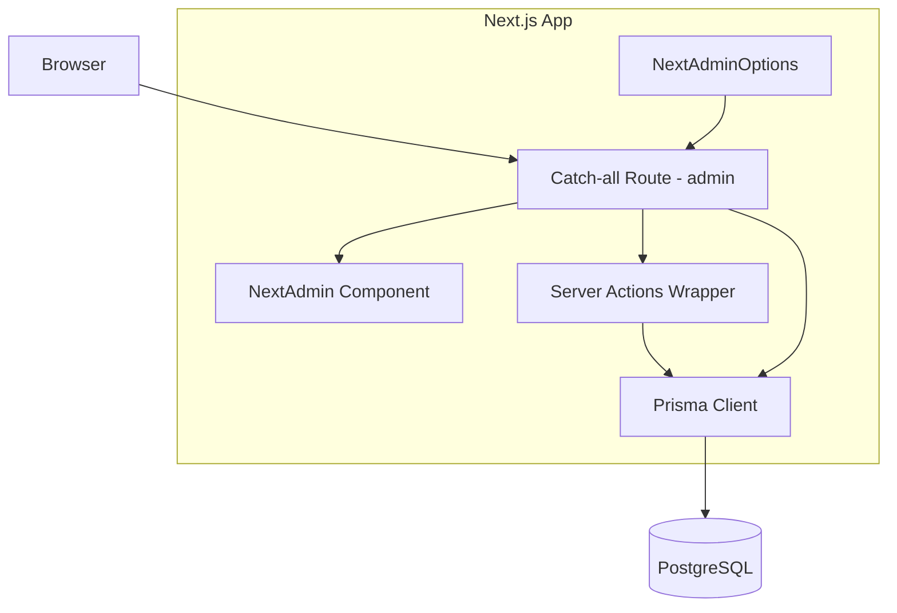
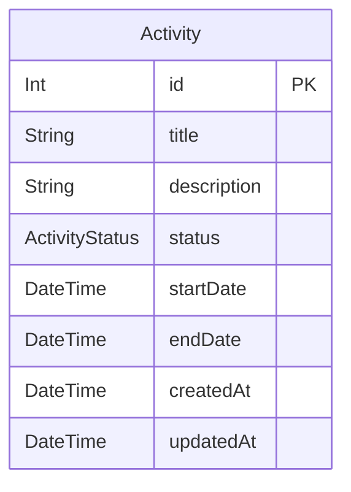

# Design Document

## Overview

**Purpose**: アクティビティ管理（Activity Admin）機能は、管理者がアクティビティ（イベント・活動）の CRUD 操作とステータス管理を行うための管理画面を提供する。next-admin を活用し、Prisma スキーマから CRUD UI を自動生成する。

**Users**: 管理者がアクティビティの作成・閲覧・編集・削除・ステータス変更のワークフローで利用する。

**Impact**: グリーンフィールドプロジェクトへの新規機能追加。next-admin と TailwindCSS の導入を含む。

### Goals
- next-admin による Prisma モデルベースの管理画面自動生成
- ステータス（下書き・公開中・終了）による進行状況管理
- キーワード検索・ステータスフィルタ・ページネーションによる一覧操作
- `NextAdminOptions` による宣言的な UI カスタマイズ

### Non-Goals
- 認証・認可（ログイン機能）は本スコープ外
- アクティビティの公開向けフロントエンド表示
- ファイルアップロード・画像管理
- next-admin のカスタムコンポーネントによる UI オーバーライド

## Architecture

### Architecture Pattern & Boundary Map



**Architecture Integration**:
- Selected pattern: next-admin による Prisma スキーマ駆動の管理画面自動生成。CRUD UI・検索・フィルタ・ページネーションを組み込みで提供
- Domain/feature boundaries: `src/app/admin/[[...nextadmin]]/` にキャッチオールルート、`src/app/admin/` 配下にオプション定義とアクション定義を集約
- New components rationale: next-admin が UI を自動生成するため、自前コンポーネントは不要。設定ファイル（options, actions）のみ新規作成
- Steering compliance: Next.js 15 App Router、TypeScript strict、Prisma 7、kebab-case ファイル命名に準拠

### Technology Stack

| Layer | Choice / Version | Role in Feature | Notes |
|-------|------------------|-----------------|-------|
| Frontend | React 19 + Next.js 15 (App Router) | ページ描画基盤 | Server Components をデフォルト使用 |
| Admin UI | @premieroctet/next-admin v8 | Prisma モデルベースの CRUD 管理画面自動生成 | 一覧・作成・編集・削除・検索・フィルタ・ページネーション組み込み |
| Styling | TailwindCSS | next-admin のスタイリング基盤 | next-admin preset を使用 |
| Serialization | next-superjson-plugin + superjson | Server/Client 間データシリアライゼーション | DateTime 等の型保持 |
| Schema | prisma-json-schema-generator | Prisma → JSON Schema 変換 | next-admin の UI 生成に使用 |
| Data | Prisma 7 + PostgreSQL | データアクセス・スキーマ管理 | `src/generated/prisma/` に型生成 |

## Requirements Traceability

| Requirement | Summary | Components | Interfaces | Flows |
|-------------|---------|------------|------------|-------|
| 1.1 | 一覧テーブル表示 | AdminPage, NextAdminOptions | getPropsFromParams | - |
| 1.2 | タイトル・ステータス・日付表示 | NextAdminOptions (list.display) | - | - |
| 1.3 | 空状態メッセージ | NextAdmin (組み込み) | - | - |
| 1.4 | 作成日降順デフォルト | NextAdminOptions (list.defaultSort) | - | - |
| 2.1 | 新規作成フォーム表示 | NextAdmin (組み込み) | - | - |
| 2.2 | 入力フィールド提供 | NextAdminOptions (edit.display) | - | - |
| 2.3 | フォーム送信・保存 | ServerActionsWrapper | submitForm | - |
| 2.4 | 必須フィールドバリデーション | Prisma Schema (non-nullable) + NextAdminOptions | - | - |
| 2.5 | 日付バリデーション | NextAdminOptions (edit.hooks.beforeDb) | - | - |
| 2.6 | 成功時リダイレクト | NextAdmin (組み込み) | - | - |
| 3.1 | 詳細画面表示 | NextAdmin (組み込み) | getPropsFromParams | - |
| 3.2 | 全フィールド表示 | NextAdminOptions (edit.display) | - | - |
| 3.3 | 404 エラー | NextAdmin (組み込み) | - | - |
| 4.1 | 編集フォーム表示 | NextAdmin (組み込み) | getPropsFromParams | - |
| 4.2 | 編集送信・更新 | ServerActionsWrapper | submitForm | - |
| 4.3 | 編集バリデーションエラー | NextAdmin (組み込み) | - | - |
| 4.4 | 更新成功リダイレクト | NextAdmin (組み込み) | - | - |
| 5.1 | 削除確認ダイアログ | NextAdmin (組み込み) | - | - |
| 5.2 | 削除実行 | ServerActionsWrapper | deleteResourceItems | - |
| 5.3 | 削除成功リダイレクト | NextAdmin (組み込み) | - | - |
| 5.4 | 削除エラーハンドリング | NextAdmin (組み込み) | - | - |
| 6.1 | ステータス定義 | Prisma Schema | ActivityStatus enum | - |
| 6.2 | デフォルトステータス | Prisma Schema (@default) | - | - |
| 6.3 | ステータス変更 | NextAdmin (組み込み edit form) | submitForm | - |
| 7.1 | キーワード検索フィールド | NextAdminOptions (list.search) | - | - |
| 7.2 | タイトル部分一致検索 | NextAdminOptions (list.search) | searchPaginatedResource | - |
| 7.3 | ステータスフィルタ | NextAdminOptions (list.filters) | - | - |
| 7.4 | ステータスフィルタ適用 | NextAdminOptions (list.filters) | - | - |
| 7.5 | 検索結果0件メッセージ | NextAdmin (組み込み) | - | - |
| 7.6 | URLクエリパラメータ保持 | NextAdmin (組み込み) | - | - |
| 8.1 | 1ページ20件表示 | NextAdminOptions (list.defaultListSize) | - | - |
| 8.2 | ページナビゲーション表示 | NextAdmin (組み込み) | - | - |
| 8.3 | ページ番号・総ページ数表示 | NextAdmin (組み込み) | - | - |
| 8.4 | ページURLパラメータ保持 | NextAdmin (組み込み) | - | - |
| 8.5 | フィルタ維持ページネーション | NextAdmin (組み込み) | - | - |

## Components and Interfaces

| Component | Domain/Layer | Intent | Req Coverage | Key Dependencies | Contracts |
|-----------|-------------|--------|--------------|------------------|-----------|
| AdminPage | UI/Page | next-admin キャッチオールルート | 全要件 | NextAdmin (P0), Prisma Client (P0) | - |
| NextAdminOptions | Config | Activity モデルの表示・編集・検索設定 | 1.1-1.4, 2.2, 2.4, 2.5, 7.1-7.4, 8.1 | - | - |
| ServerActionsWrapper | Backend/Action | next-admin Server Actions のラップ | 2.3, 2.6, 4.2, 4.4, 5.2, 5.3, 6.3 | Prisma Client (P0) | Service |
| Prisma Schema | Data/Model | Activity データモデル定義 | 6.1, 6.2 | PostgreSQL (P0) | - |

### UI Layer

#### AdminPage

| Field | Detail |
|-------|--------|
| Intent | next-admin のキャッチオールルートとして、全管理画面ページを描画する Server Component |
| Requirements | 全要件（next-admin に委譲） |

**Responsibilities & Constraints**
- `[[...nextadmin]]` キャッチオールルートで `/admin` 配下の全パスをハンドル
- `getPropsFromParams()` で Prisma Client・JSON Schema・オプション・アクションから props を生成
- 生成された props を `<NextAdmin>` コンポーネントに渡す
- Server Component（`"use client"` 不使用）

**Dependencies**
- Outbound: @premieroctet/next-admin — NextAdmin コンポーネント・getPropsFromParams (P0)
- Outbound: Prisma Client — データ取得 (P0)
- Outbound: NextAdminOptions — UI カスタマイズ設定 (P0)
- Outbound: ServerActionsWrapper — CRUD アクション (P0)
- Outbound: prisma/json-schema — JSON Schema ファイル (P0)

**Contracts**: -

**Implementation Notes**
- ルート: `src/app/admin/[[...nextadmin]]/page.tsx`
- `getPropsFromParams` に `params`, `searchParams`, `options`, `prisma`, `schema`, `action`, `deleteAction`, `searchPaginatedResourceAction` を渡す
- `<NextAdmin {...props} />` で描画

### Config Layer

#### NextAdminOptions

| Field | Detail |
|-------|--------|
| Intent | Activity モデルの一覧表示・編集フォーム・検索・フィルタの設定を定義する |
| Requirements | 1.1, 1.2, 1.4, 2.2, 2.4, 2.5, 7.1, 7.2, 7.3, 7.4, 8.1 |

**Responsibilities & Constraints**
- `basePath: "/admin"` で管理画面のベースパスを設定
- Activity モデルの一覧表示フィールド・検索対象・フィルタ・ソート・ページサイズを定義
- 編集フォームの表示フィールド・必須チェック・日付バリデーションを定義
- ステータスフィルタを Prisma where 句で定義

**Contracts**: -

```typescript
import { NextAdminOptions } from "@premieroctet/next-admin";

const options: NextAdminOptions = {
  basePath: "/admin",
  title: "Arcana Admin",
  model: {
    Activity: {
      toString: (activity) => activity.title,
      title: "アクティビティ",
      list: {
        display: ["id", "title", "status", "startDate", "endDate"],
        search: ["title"],
        defaultSort: { field: "createdAt", direction: "desc" },
        defaultListSize: 20,
        filters: [
          {
            name: "すべて",
            active: true,
            value: {},
          },
          {
            name: "下書き",
            active: false,
            value: { status: "DRAFT" },
            group: "status",
          },
          {
            name: "公開中",
            active: false,
            value: { status: "PUBLISHED" },
            group: "status",
          },
          {
            name: "終了",
            active: false,
            value: { status: "CLOSED" },
            group: "status",
          },
        ],
      },
      edit: {
        display: ["title", "description", "status", "startDate", "endDate"],
        fields: {
          title: { required: true },
          description: { required: true },
          startDate: { required: true },
        },
      },
      aliases: {
        id: "ID",
        title: "タイトル",
        description: "説明",
        status: "ステータス",
        startDate: "開始日",
        endDate: "終了日",
        createdAt: "作成日",
        updatedAt: "更新日",
      },
    },
  },
};
```

**Implementation Notes**
- ルート: `src/app/admin/options.ts`
- 日付バリデーション（endDate >= startDate）: `edit.hooks.beforeDb` で実装
- ステータスフィルタは radio group で排他選択

### Backend Layer

#### ServerActionsWrapper

| Field | Detail |
|-------|--------|
| Intent | next-admin の Server Actions を Prisma Client・オプションと紐付けてラップする |
| Requirements | 2.3, 2.6, 4.2, 4.4, 5.2, 5.3, 6.3 |

**Responsibilities & Constraints**
- `"use server"` ディレクティブを付与
- next-admin の `submitForm`, `deleteResourceItems`, `searchPaginatedResource` をラップ
- Prisma Client インスタンスとオプションを注入

**Dependencies**
- Outbound: @premieroctet/next-admin/dist/actions — submitForm, deleteResourceItems, searchPaginatedResource (P0)
- Outbound: Prisma Client — データ操作 (P0)

**Contracts**: Service [x]

##### Service Interface

```typescript
"use server";

import { ActionParams, ModelName } from "@premieroctet/next-admin";
import {
  SearchPaginatedResourceParams,
  deleteResourceItems,
  searchPaginatedResource,
  submitForm,
} from "@premieroctet/next-admin/dist/actions";
import { options } from "@/app/admin/options";
import { prisma } from "@/lib/prisma";

async function submitFormAction(
  params: ActionParams,
  formData: FormData
): Promise<ReturnType<typeof submitForm>>;

async function deleteItem(
  model: ModelName,
  ids: string[] | number[]
): Promise<void>;

async function searchResource(
  actionParams: ActionParams,
  params: SearchPaginatedResourceParams
): Promise<ReturnType<typeof searchPaginatedResource>>;
```

- Preconditions: Prisma Client が初期化済みであること
- Postconditions: next-admin 内部で DB 操作・キャッシュ無効化・リダイレクトが実行される
- Invariants: next-admin のバリデーション・エラーハンドリングに準拠

**Implementation Notes**
- ルート: `src/app/admin/actions.ts`
- 各関数は next-admin の対応関数に `prisma` と `options` を注入して呼び出すだけ

### Data Layer

#### Prisma Schema

| Field | Detail |
|-------|--------|
| Intent | Activity データモデルと JSON Schema ジェネレータを定義する |
| Requirements | 6.1, 6.2 |

**Implementation Notes**
- `prisma-json-schema-generator` ジェネレータを追加（next-admin 必須）
- `prisma generate` で JSON Schema が `prisma/json-schema/json-schema.json` に生成される

## Data Models

### Domain Model



- **Aggregate**: Activity（単独のアグリゲートルート）
- **Value Object**: ActivityStatus（DRAFT, PUBLISHED, CLOSED）
- **Business Rules**:
  - title は必須（空文字不可）
  - description は必須（空文字不可）
  - startDate は必須
  - endDate が指定される場合、endDate >= startDate
  - 新規作成時のデフォルトステータスは DRAFT

### Physical Data Model

```prisma
generator jsonSchema {
  provider              = "prisma-json-schema-generator"
  includeRequiredFields = "true"
}

enum ActivityStatus {
  DRAFT
  PUBLISHED
  CLOSED
}

model Activity {
  id          Int            @id @default(autoincrement())
  title       String
  description String
  status      ActivityStatus @default(DRAFT)
  startDate   DateTime
  endDate     DateTime?
  createdAt   DateTime       @default(now())
  updatedAt   DateTime       @updatedAt

  @@map("activities")
}
```

- **Primary Key**: `id`（Integer、autoincrement）
- **Indexes**: `createdAt` の降順インデックス（一覧表示のデフォルトソート用、必要に応じて追加）
- **Nullable**: `endDate`（任意入力のため）

## Error Handling

### Error Strategy
next-admin の組み込みエラーハンドリングに準拠する。カスタムバリデーション（日付整合性チェック）は `edit.hooks.beforeDb` で実装し、`HookError` をスローする。

### Error Categories and Responses
- **User Errors (4xx)**: 必須フィールド未入力 → next-admin が Prisma スキーマに基づき自動バリデーション。日付不整合 → `beforeDb` フックで `HookError` をスロー
- **System Errors (5xx)**: Prisma/DB エラー → next-admin が汎用エラーメッセージを表示
- **Business Logic Errors (422)**: 存在しないアクティビティの操作 → next-admin が 404 ページを表示

## Testing Strategy

### Integration Tests
- next-admin の `getPropsFromParams` が Activity モデルの一覧データを正しく返却すること
- `submitFormAction` 経由でアクティビティの作成・更新が DB に反映されること
- `deleteItem` 経由でアクティビティが削除されること
- `beforeDb` フックで終了日 < 開始日のバリデーションエラーが発生すること

### E2E Tests
- `/admin` にアクセスし、アクティビティ一覧が表示されること
- 新規作成 → 一覧確認 → 編集 → 削除の一連のフロー
- 必須フィールド未入力時のバリデーションエラー表示
- キーワード検索による一覧絞り込み
- ステータスフィルタ + ページネーションの連携動作
