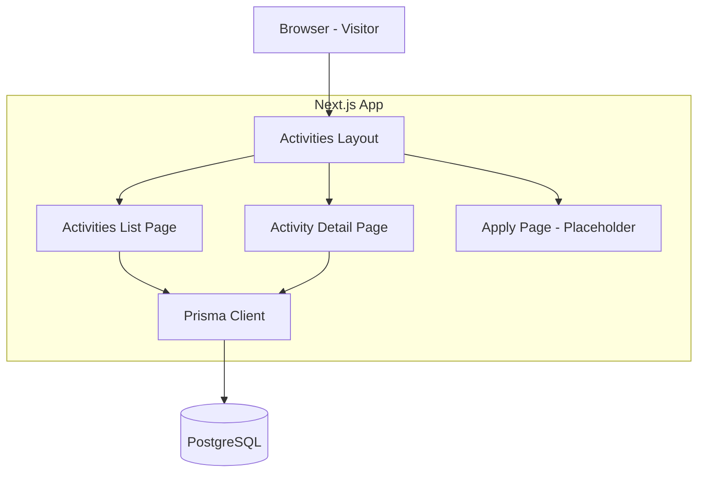
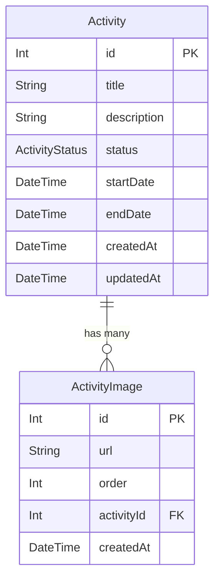

# Design Document

## Overview

**Purpose**: 交流コンテンツ フロントエンド（Activity Front）は、新庄村の訪問者が交流コンテンツ（体験メニュー）を閲覧し、参加への導線を提供する訪問者向け画面群を構築する。

**Users**: 新庄村の訪問者が、一覧画面で交流コンテンツを発見し、詳細画面で内容を確認し、参加申込ページへ遷移するワークフローで利用する。

**Impact**: 既存の Activity モデルに画像リレーションを追加し、訪問者向けフロントエンド（一覧・詳細）を新規構築する。管理画面（Activity Admin）には影響しない。

### Goals
- 公開中（PUBLISHED）・終了（CLOSED）のアクティビティを訪問者向けに一覧・詳細表示
- アクティビティに複数画像を関連付けて表示（一覧はサムネイル、詳細は全画像）
- 申込ページへの導線確保（実装は将来スコープ）
- WCAG AA 準拠のアクセシブルな UI

### Non-Goals
- 申込フォームの実装（導線のみ）
- 訪問者の認証・ログイン
- 画像ファイルのアップロード基盤（α版は URL 直接入力）
- 管理画面の変更（ActivityImage の管理画面対応は別スコープ）

## Architecture

### Architecture Pattern & Boundary Map



**Architecture Integration**:
- Selected pattern: Next.js App Router Server Components によるデータ取得・描画。API Route を介さず Prisma Client から直接データ取得
- Domain/feature boundaries: `src/app/activities/` 配下に訪問者向けページを集約。管理画面（`src/app/admin/`）とは完全に独立
- Existing patterns preserved: Server Component デフォルト、Prisma Client シングルトン（`@/lib/prisma`）、kebab-case ファイル命名
- New components rationale: 訪問者向け UI はゼロから構築が必要。ページコンポーネント + カードコンポーネントを新規作成
- Steering compliance: Next.js 15 App Router、TypeScript strict、Prisma 7、TailwindCSS に準拠

### Technology Stack

| Layer | Choice / Version | Role in Feature | Notes |
|-------|------------------|-----------------|-------|
| Frontend | React 19 + Next.js 15 (App Router) | Server Component によるページ描画 | 追加ライブラリ不要 |
| Styling | TailwindCSS 3 | ユーティリティクラスによるスタイリング | 既存設定を活用 |
| Image | next/image (組み込み) | 画像の最適化表示 | `remotePatterns` 設定が必要 |
| Data | Prisma 7 + PostgreSQL | データアクセス | ActivityImage モデル追加 |

## Requirements Traceability

| Requirement | Summary | Components | Interfaces | Flows |
|-------------|---------|------------|------------|-------|
| 1.1 | PUBLISHED + CLOSED 一覧表示 | ActivitiesPage | getPublishedActivities | - |
| 1.2 | DRAFT 非表示 | ActivitiesPage | getPublishedActivities | - |
| 1.3 | カードにサムネイル・タイトル・抜粋・開始日 | ActivityCard | ActivityCardProps | - |
| 1.4 | 開始日降順 | ActivitiesPage | getPublishedActivities | - |
| 1.5 | 終了済み視覚的区別 | ActivityCard | ActivityCardProps | - |
| 1.6 | 空状態メッセージ | ActivitiesPage | - | - |
| 1.7 | レスポンシブレイアウト | ActivitiesPage, ActivityCard | - | - |
| 2.1 | カードタップで詳細遷移 | ActivityCard | - | - |
| 2.2 | 詳細ページに全情報表示 | ActivityDetailPage | getActivityById | - |
| 2.3 | PUBLISHED 時「参加してみる」表示 | ActivityDetailPage | - | - |
| 2.4 | CLOSED 時ボタン非表示・終了表示 | ActivityDetailPage | - | - |
| 2.5 | 申込ページ遷移 | ActivityDetailPage | - | - |
| 2.6 | 存在しない/DRAFT は 404 | ActivityDetailPage | getActivityById | - |
| 2.7 | 一覧への戻る導線 | ActivityDetailPage | - | - |
| 3.1 | 複数画像関連付け | ActivityImage (Prisma) | - | - |
| 3.2 | 一覧カードに先頭画像サムネイル | ActivityCard | ActivityCardProps | - |
| 3.3 | 詳細ページに全画像表示 | ActivityDetailPage | getActivityById | - |
| 3.4 | 画像なし時プレースホルダー | ActivityCard, ActivityDetailPage | - | - |
| 3.5 | 画像 alt テキスト | ActivityCard, ActivityDetailPage | - | - |
| 4.1 | PUBLISHED 時申込導線表示 | ActivityDetailPage | - | - |
| 4.2 | 申込ページ遷移 | ActivityDetailPage | - | - |
| 4.3 | 申込ルーティングパス確保 | ApplyPlaceholder | - | - |
| 5.1 | コントラスト比 4.5:1 | 全コンポーネント | - | - |
| 5.2 | 最小フォント 14px・行間 1.5 | ActivitiesLayout | - | - |
| 5.3 | キーボード操作 | ActivityCard, ActivityDetailPage | - | - |
| 5.4 | 画像 alt テキスト | ActivityCard, ActivityDetailPage | - | - |
| 5.5 | フォーカス管理 | 全コンポーネント | - | - |

## Components and Interfaces

| Component | Domain/Layer | Intent | Req Coverage | Key Dependencies | Contracts |
|-----------|-------------|--------|--------------|------------------|-----------|
| ActivitiesLayout | UI/Layout | 訪問者向けページ共通レイアウト | 5.1, 5.2 | - | - |
| ActivitiesPage | UI/Page | 一覧ページ（Server Component） | 1.1-1.7 | Prisma Client (P0) | Service |
| ActivityFilterClient | UI/Component | フィルターUI + カード描画（Client Component） | 6.1-6.5 | ActivityCard (P0) | - |
| ActivityDetailPage | UI/Page | 詳細ページ（Server Component） | 2.1-2.7, 3.3, 4.1, 4.2 | Prisma Client (P0) | Service |
| ActivityCard | UI/Component | アクティビティカード表示 | 1.3, 1.5, 2.1, 3.2, 3.4, 3.5 | Badge, JoinButton | - |
| Badge | UI/Component | ステータスバッジ | 1.5 | - | - |
| JoinButton | UI/Component | 詳しく見る／参加してみるボタン | 2.1, 4.1, 4.2 | - | - |
| ApplyPlaceholder | UI/Page | 申込ページプレースホルダー | 4.3 | - | - |
| ActivityImage | Data/Model | 画像データモデル | 3.1 | Activity (P0) | - |

### UI Layer

#### ActivitiesLayout

| Field | Detail |
|-------|--------|
| Intent | 訪問者向け activities ページ共通のレイアウトを提供する Server Component |
| Requirements | 5.1, 5.2 |

**Responsibilities & Constraints**
- `src/app/activities/layout.tsx` に配置
- ページタイトル（メタデータ）の設定
- 共通のヘッダー・ページコンテナを提供
- ヘッダーの共通コンポーネント `AppHeader` を使用し、ロゴはルートページ（`/`、ランディングページ）への導線とする（サイト全体で「ロゴ＝トップへ戻る」を統一。`AppHeader` の `homeHref` は未指定時 `/` がデフォルト）
- 最小フォントサイズ 14px・行間 1.5 を基本スタイルとして適用
- Server Component（`"use client"` 不使用）

**Implementation Notes**
- TailwindCSS で `text-base leading-relaxed` をベーススタイルに設定
- `<main>` タグでコンテンツを囲み、セマンティック HTML を確保

#### ActivitiesPage

| Field | Detail |
|-------|--------|
| Intent | 公開中・終了済みのアクティビティを一覧表示する Server Component |
| Requirements | 1.1, 1.2, 1.3, 1.4, 1.5, 1.6, 1.7 |

**Responsibilities & Constraints**
- `src/app/activities/page.tsx` に配置（Server Component）
- Prisma Client で PUBLISHED + CLOSED のアクティビティを取得（DRAFT 除外）
- 開始日降順でソート
- ActivityImage リレーションを include（先頭画像のみ取得）
- 見出し「交流する！」・サブテキスト・ActivityFilterClient（フィルター UI）を描画
- ActivityFilterClient に全アクティビティを渡し、クライアントサイドでフィルタリング・カード描画を委譲
- 0 件の場合は空状態メッセージを表示
- レイアウトは 1 カラム（カード間 gap-6）

**Dependencies**
- Outbound: Prisma Client — データ取得 (P0)
- Outbound: ActivityCard — カード描画 (P0)

**Contracts**: Service [x]

##### Service Interface

```typescript
type ActivityWithThumbnail = {
  id: number;
  title: string;
  description: string;
  status: ActivityStatus;
  startDate: Date;
  endDate: Date | null;
  images: { id: number; url: string; order: number }[];
};

/** PUBLISHED + CLOSED のアクティビティを開始日降順で取得 */
function getPublishedActivities(): Promise<ActivityWithThumbnail[]>;
```

- Preconditions: データベース接続が有効であること
- Postconditions: DRAFT ステータスのレコードが含まれないこと
- Invariants: 返却結果は startDate 降順

#### ActivityDetailPage

| Field | Detail |
|-------|--------|
| Intent | 個別アクティビティの詳細情報を表示する Server Component |
| Requirements | 2.1, 2.2, 2.3, 2.4, 2.5, 2.6, 2.7, 3.3, 3.4, 3.5, 4.1, 4.2 |

**Responsibilities & Constraints**
- `src/app/activities/[id]/page.tsx` に配置
- URL パラメータ `id` からアクティビティを取得
- DRAFT または存在しない場合は `notFound()` を呼び出し
- ActivityImage リレーションを include（全画像取得、order 順）
- PUBLISHED 時: 「参加してみる」ボタン表示（`/activities/[id]/apply` へのリンク）
- CLOSED 時: ボタン非表示、終了済みバッジ表示
- 一覧ページへの戻るリンクを表示
- Server Component（`"use client"` 不使用）

**Dependencies**
- Outbound: Prisma Client — データ取得 (P0)

**Contracts**: Service [x]

##### Service Interface

```typescript
type ActivityDetail = {
  id: number;
  title: string;
  description: string;
  status: ActivityStatus;
  startDate: Date;
  endDate: Date | null;
  images: { id: number; url: string; order: number }[];
};

/** ID で PUBLISHED or CLOSED のアクティビティを取得。DRAFT or 存在しない場合 null */
function getActivityById(id: number): Promise<ActivityDetail | null>;
```

- Preconditions: `id` が正の整数であること
- Postconditions: DRAFT ステータスのレコードは返却しない
- Invariants: images は order 昇順

#### ActivityCard

| Field | Detail |
|-------|--------|
| Intent | 一覧ページで使用するアクティビティカードの表示コンポーネント |
| Requirements | 1.3, 1.5, 2.1, 3.2, 3.4, 3.5, 5.3 |

**Responsibilities & Constraints**
- サムネイル画像（先頭画像 or プレースホルダー）・タイトル・開始〜終了日時・説明抜粋を表示
- ステータスを Badge コンポーネントでサムネイル右上に重ねて表示
- 「詳しく見る」ボタン（outline）を常に表示、「参加してみる」ボタン（solid）は PUBLISHED 時のみ表示
- `<article>` 要素でセマンティック構造を確保
- キーボードフォーカスはボタン単位で当たる

**Implementation Notes**
- `src/app/activities/_components/activity-card.tsx` に配置
- 説明は先頭 80 文字程度で切り詰め
- 画像なし時はプレースホルダー背景を表示
- Badge・JoinButton コンポーネントを `@/app/_components/` からインポートして使用
- TailwindCSS でカードスタイリング（グリーンの 3px ボーダー `border-3`、角丸 `rounded-3xl`、`shadow-yellow`）

```typescript
type ActivityCardProps = {
  id: number;
  title: string;
  description: string;
  status: ActivityStatus;
  startDate: string;
  endDate: string | null;
  thumbnailUrl: string | null;
};
```

#### ApplyPlaceholder

| Field | Detail |
|-------|--------|
| Intent | 申込ページのルーティングパスを確保するプレースホルダー |
| Requirements | 4.3 |

**Implementation Notes**
- `src/app/activities/[id]/apply/page.tsx` に配置
- 「準備中です」等のメッセージを表示
- 一覧ページへの導線を提供

### Data Layer

#### ActivityImage (Prisma Model)

| Field | Detail |
|-------|--------|
| Intent | アクティビティに関連する画像の URL と表示順を管理する |
| Requirements | 3.1 |

**Responsibilities & Constraints**
- Activity と 1:N リレーション（Activity has many ActivityImage）
- `order` フィールドで表示順序を管理
- `url` フィールドに画像の外部 URL を格納
- Activity 削除時にカスケード削除

## Data Models

### Domain Model



- **Aggregate**: Activity（ActivityImage を含むアグリゲートルート）
- **Value Object**: ActivityStatus（DRAFT, PUBLISHED, CLOSED）
- **Business Rules**:
  - 訪問者向け表示は PUBLISHED + CLOSED のみ（DRAFT 除外）
  - 画像の表示順は `order` フィールドで制御
  - 先頭画像（order 最小）をサムネイルとして使用

### Physical Data Model

```prisma
model ActivityImage {
  id         Int      @id @default(autoincrement())
  url        String
  order      Int      @default(0)
  activityId Int
  activity   Activity @relation(fields: [activityId], references: [id], onDelete: Cascade)
  createdAt  DateTime @default(now())

  @@map("activity_images")
}

model Activity {
  id          Int              @id @default(autoincrement())
  title       String
  description String
  status      ActivityStatus   @default(DRAFT)
  startDate   DateTime
  endDate     DateTime?
  createdAt   DateTime         @default(now())
  updatedAt   DateTime         @updatedAt
  images      ActivityImage[]

  @@map("activities")
}
```

- **Primary Key**: `id`（Integer、autoincrement）
- **Foreign Key**: `activityId` → `activities.id`（カスケード削除）
- **Indexes**: `activityId` + `order` の複合インデックス（必要に応じて追加）

## Error Handling

### Error Strategy
Next.js App Router の組み込みエラーハンドリングに準拠する。

### Error Categories and Responses
- **User Errors (4xx)**: 存在しない/DRAFT アクティビティへのアクセス → `notFound()` で 404 ページ表示
- **System Errors (5xx)**: Prisma/DB 接続エラー → Next.js のデフォルトエラーページ
- **Invalid URL Parameters**: `id` が数値でない場合 → `notFound()` で 404 ページ表示

## Testing Strategy

### Integration Tests
- `getPublishedActivities` が PUBLISHED + CLOSED のみを返却し、DRAFT を除外すること
- `getPublishedActivities` が startDate 降順で返却すること
- `getActivityById` が存在する PUBLISHED アクティビティを画像付きで返却すること
- `getActivityById` が DRAFT アクティビティに対して null を返却すること

### E2E Tests
- `/activities` にアクセスし、公開中・終了済みアクティビティが一覧表示されること
- 終了済みアクティビティが視覚的に区別されていること
- カードタップで `/activities/[id]` に遷移し、詳細が表示されること
- PUBLISHED アクティビティの詳細に「参加してみる」ボタンが表示されること
- CLOSED アクティビティの詳細に「参加してみる」ボタンが表示されないこと
