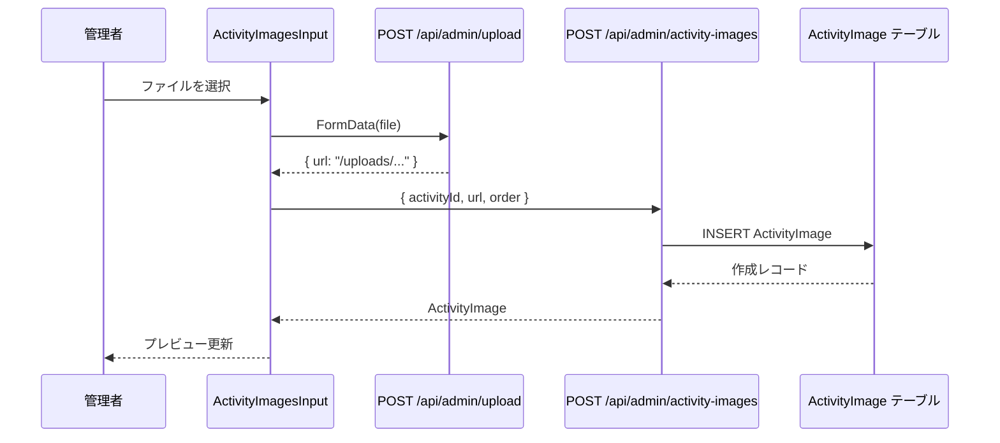
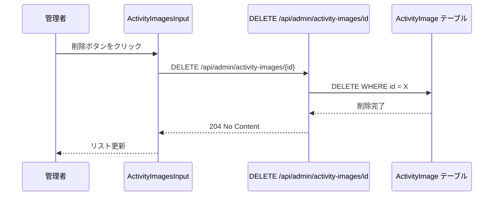

# 技術設計書: activity-image-upload

## Overview

本機能は管理者がアクティビティ編集画面から複数枚の画像をアップロード・管理できるようにし、訪問者がアクティビティ一覧・詳細ページで画像を閲覧できるようにする。

**Purpose**: アクティビティコンテンツに視覚情報を付加し、訪問者の体験理解と申込判断を支援する。  
**Users**: 管理者はコンテンツ管理画面で画像を管理し、訪問者はアクティビティページで閲覧する。  
**Impact**: admin画面に画像管理UIを追加する。DBスキーマ・ユーザー向けページは変更不要（既に実装済み）。

### Goals

- 管理者がアクティビティ編集画面で複数画像のアップロード・削除・並び替えを行える
- 既存の `/api/admin/upload` および `public/uploads/` ストレージを再利用する
- ユーザー向けページ（一覧・詳細）への変更を最小化する（実質ゼロ）

### Non-Goals

- 新規アクティビティ作成時の同時画像アップロード（V1では保存後に追加）
- ドラッグ&ドロップによる並び替え（V1は上下ボタン方式）
- クラウドストレージ（S3等）への移行（既存Spot画像と同様にローカル保存）
- 画像の自動リサイズ・最適化

---

## Architecture

### Existing Architecture Analysis

- **既存パターン**: `ImageUploadInput` コンポーネントが `CustomInputProps` を受け取り、`/api/admin/upload` に即時アップロード後 URL を `onChange` に渡す
- **`ActivityImage` モデル**: スキーマに定義済み (`url`, `order`, `activityId`, `createdAt`)。`Activity` との `onDelete: Cascade` 設定済み
- **ユーザー向けページ**: `activities/page.tsx` と `activities/[id]/page.tsx` は既に `images` をクエリ・描画している
- **制約**: next-admin `CustomInputProps` は単一値向けで、1:many リレーション管理には非標準の実装が必要

### Architecture Pattern & Boundary Map

```mermaid
graph TB
    subgraph Admin_UI
        EditPage[Activity 編集ページ next-admin]
        ImagesInput[ActivityImagesInput コンポーネント]
    end

    subgraph API
        UploadAPI[POST /api/admin/upload 既存]
        ImagesAPI[/api/admin/activity-images/ 新規]
    end

    subgraph Storage
        LocalFS[public/uploads/ ローカルFS]
        DB[(PostgreSQL ActivityImage テーブル)]
    end

    subgraph User_Pages
        ListPage[/activities/ 一覧 変更なし]
        DetailPage[/activities/id/ 詳細 変更なし]
    end

    EditPage --> ImagesInput
    ImagesInput -->|ファイルアップロード| UploadAPI
    ImagesInput -->|CRUD| ImagesAPI
    UploadAPI --> LocalFS
    ImagesAPI --> DB
    ListPage --> DB
    DetailPage --> DB
```

**Architecture Integration**:
- 採用パターン: 自立型カスタムコンポーネント（immediate-persist）
- `ActivityImagesInput` は next-admin の form lifecycle に依存せず、自身で API を呼んで即時永続化する
- 既存の `ImageUploadInput` パターンを拡張し、1:many 管理に対応
- ユーザー向けページには変更なし（既実装）

### Technology Stack

| Layer | 選択 / バージョン | 本機能での役割 | 備考 |
|-------|------------------|--------------|------|
| Frontend | React 19, TailwindCSS v3 | `ActivityImagesInput` コンポーネント | `"use client"` 宣言 |
| Admin Framework | next-admin ^8.4.2 | フィールドのカスタム input として組み込み | `CustomInputProps` パターン |
| Backend | Next.js 15 Route Handler | `ActivityImage` CRUD API | 新規 3 エンドポイント |
| ORM | Prisma 7 | `ActivityImage` テーブル操作 | スキーマ変更なし |
| Storage | Node.js fs, public/uploads/ | 画像ファイル保存 | `src/lib/storage.ts` 再利用 |

---

## System Flows

### 画像アップロードフロー



### 画像削除フロー



---

## Requirements Traceability

| 要件 | 概要 | コンポーネント | インターフェース | フロー |
|------|------|--------------|----------------|--------|
| 1.1 | アップロードとActivityImage作成 | ActivityImagesInput, POST /api/admin/activity-images | ActivityImageCreateRequest | アップロードフロー |
| 1.2 | ファイル形式・サイズ制限 | POST /api/admin/upload（既存）| validateImageFile | — |
| 1.3 | バリデーションエラー表示 | ActivityImagesInput | — | — |
| 1.4 | アップロード後プレビュー表示 | ActivityImagesInput | — | — |
| 1.5 | 複数画像対応 | ActivityImagesInput, GET /api/admin/activity-images | ActivityImage[] | — |
| 2.1 | 画像削除 | ActivityImagesInput, DELETE /api/admin/activity-images/[id] | — | 削除フロー |
| 2.2 | order昇順表示 | ActivityImagesInput, GET /api/admin/activity-images | ActivityImage[] | — |
| 2.3 | 並び替え | ActivityImagesInput, PATCH /api/admin/activity-images/[id] | ActivityImageUpdateRequest | — |
| 3.1 | 一覧サムネイル | activities/page.tsx（変更なし）| — | — |
| 3.2 | プレースホルダー | ActivityCard（変更なし）| — | — |
| 4.1 | 詳細全画像表示 | activities/[id]/page.tsx（変更なし）| — | — |
| 4.2 | プレースホルダー | activities/[id]/page.tsx（変更なし）| — | — |
| 4.3 | アクセシビリティ (alt) | activities/[id]/page.tsx（変更なし）| — | — |

---

## Components and Interfaces

### コンポーネントサマリー

| コンポーネント | ドメイン | 役割 | 要件カバレッジ | 主な依存 | 契約 |
|--------------|---------|------|--------------|---------|------|
| ActivityImagesInput | Admin UI | 画像の表示・アップロード・削除・並び替え | 1.1–1.5, 2.1–2.3 | POST /upload (P0), /activity-images (P0) | State |
| GET /api/admin/activity-images | Admin API | 指定activityIdの画像一覧取得 | 1.5, 2.2 | Prisma (P0) | API |
| POST /api/admin/activity-images | Admin API | ActivityImage レコード作成 | 1.1 | Prisma (P0) | API |
| DELETE /api/admin/activity-images/[id] | Admin API | ActivityImage レコード削除 | 2.1 | Prisma (P0) | API |
| PATCH /api/admin/activity-images/[id] | Admin API | order 更新 | 2.3 | Prisma (P0) | API |
| option.tsx (Activity 設定更新) | Admin Config | images フィールドを編集displayに追加 | 1.1–2.3 | ActivityImagesInput (P0) | — |

---

### Admin UI レイヤー

#### ActivityImagesInput

| Field | Detail |
|-------|--------|
| Intent | アクティビティ編集画面に埋め込まれる自立型の複数画像管理コンポーネント |
| Requirements | 1.1, 1.2, 1.3, 1.4, 1.5, 2.1, 2.2, 2.3 |

**Responsibilities & Constraints**
- URLから activityId を抽出し（`/Activity\/(\d+)/` パターン）、存在しない場合は非活性状態を表示する
- マウント時に `GET /api/admin/activity-images?activityId=X` を呼び、既存画像を取得する
- 画像追加: `POST /api/admin/upload` → URL取得 → `POST /api/admin/activity-images` の順で実行し、成功後にリストを更新する
- 画像削除: `DELETE /api/admin/activity-images/[id]` を呼び、成功後にリストを更新する
- 並び替え: ↑/↓ ボタンで隣接画像の `order` を入れ替え、`PATCH /api/admin/activity-images/[id]` を2回呼ぶ
- ローカルの UI 状態（`ActivityImage[]`）をコンポーネント内で管理し、各API呼び出しが成功するたびに更新する

**Dependencies**
- Inbound: next-admin `CustomInputProps` — フィールドマウントポイントとして使用（Criticality: P1）
- Outbound: `POST /api/admin/upload` — ファイルアップロード（Criticality: P0）
- Outbound: `/api/admin/activity-images/` CRUD — 画像レコード管理（Criticality: P0）

**Contracts**: State [x]

##### State Management

- 状態モデル:
  ```typescript
  type ActivityImagesState = {
    images: ActivityImageRecord[];
    uploading: boolean;
    error: string | null;
  };

  type ActivityImageRecord = {
    id: number;
    url: string;
    order: number;
  };
  ```
- 永続化: 各操作（追加・削除・並び替え）は即時 API 呼び出しで DB に反映される。ローカル state は API 成功後に更新される。
- エラー時: API 失敗の場合は `error` state にメッセージをセットし、ローカル state は変更しない（楽観的更新なし）

**Implementation Notes**
- Integration: next-admin の `option.tsx` で `images: { input: <ActivityImagesInput /> }` として登録する。`CustomInputProps` の `value`/`onChange` は使用しない
- Validation: ファイル形式・サイズのバリデーションは `/api/admin/upload` 既存ロジックに委ねる
- Risks: activityId の URL 抽出は next-admin のルーティング変更に脆弱。現 v8 系では安定

---

### Admin API レイヤー

#### GET /api/admin/activity-images

| Field | Detail |
|-------|--------|
| Intent | 指定された activityId に紐付く ActivityImage 一覧を order 昇順で返す |
| Requirements | 1.5, 2.2 |

**Contracts**: API [x]

##### API Contract

| Method | Endpoint | Request | Response | Errors |
|--------|----------|---------|----------|--------|
| GET | /api/admin/activity-images?activityId={id} | Query: `activityId: number` | `ActivityImageRecord[]` | 400 (activityId missing/invalid) |

```typescript
type ActivityImageRecord = {
  id: number;
  url: string;
  order: number;
  createdAt: string; // ISO 8601
};
```

---

#### POST /api/admin/activity-images

| Field | Detail |
|-------|--------|
| Intent | ActivityImage レコードを新規作成する |
| Requirements | 1.1 |

**Contracts**: API [x]

##### API Contract

| Method | Endpoint | Request | Response | Errors |
|--------|----------|---------|----------|--------|
| POST | /api/admin/activity-images | `ActivityImageCreateRequest` | `ActivityImageRecord` | 400 (バリデーション), 404 (Activity未存在) |

```typescript
type ActivityImageCreateRequest = {
  activityId: number;
  url: string;
  order: number;
};
```

**Implementation Notes**
- `activityId` の Activity 存在確認を行い、存在しない場合は 404 を返す
- `url` は空文字・空白のみを拒否する

---

#### DELETE /api/admin/activity-images/[id]

| Field | Detail |
|-------|--------|
| Intent | 指定 ID の ActivityImage レコードを削除する |
| Requirements | 2.1 |

**Contracts**: API [x]

##### API Contract

| Method | Endpoint | Request | Response | Errors |
|--------|----------|---------|----------|--------|
| DELETE | /api/admin/activity-images/{id} | Path: `id: number` | 204 No Content | 404 (レコード未存在) |

**Implementation Notes**
- ファイルシステム上の画像ファイル (`public/uploads/`) は削除しない（既存Spotと同様の方針）

---

#### PATCH /api/admin/activity-images/[id]

| Field | Detail |
|-------|--------|
| Intent | ActivityImage の order フィールドを更新する |
| Requirements | 2.3 |

**Contracts**: API [x]

##### API Contract

| Method | Endpoint | Request | Response | Errors |
|--------|----------|---------|----------|--------|
| PATCH | /api/admin/activity-images/{id} | `ActivityImageUpdateRequest` | `ActivityImageRecord` | 400, 404 |

```typescript
type ActivityImageUpdateRequest = {
  order: number;
};
```

---

### Admin Config レイヤー

#### option.tsx (Activity 設定更新)

**変更内容**:
1. `aliases` に `images: "画像"` を追加
2. `edit.display` に画像セクションヘッダーと `"images"` を追加:
   ```typescript
   { title: "画像", id: "images", description: "アクティビティの画像を管理してください" },
   "images"
   ```
3. `edit.fields` に `images` カスタム input を追加:
   ```typescript
   images: { input: <ActivityImagesInput /> }
   ```

---

## Data Models

### Domain Model

- `Activity` (集約ルート) は `ActivityImage[]` を保持する
- `ActivityImage` は独立した値を持たず、Activity に従属する
- `Activity` 削除時に全 `ActivityImage` が CASCADE 削除される（既定義）

### Logical Data Model

既存スキーマから変更なし:

```
ActivityImage
  id         Int      (PK)
  url        String   (画像パス, 例: /uploads/xxx.jpg)
  order      Int      (表示順, 0始まり)
  activityId Int      (FK → Activity.id, CASCADE DELETE)
  createdAt  DateTime
```

**Cardinality**: Activity 1 — 0..N ActivityImage

### Physical Data Model

既存テーブル `activity_images` を使用。スキーマ変更・マイグレーション不要。

---

## Error Handling

### Error Strategy

| エラー種別 | 発生箇所 | 対処 |
|-----------|---------|------|
| ファイル形式・サイズ違反 | `POST /api/admin/upload` | 400 + エラーメッセージ → コンポーネントがフォーム内に表示 |
| ネットワークエラー | `ActivityImagesInput` fetch | `error` state にメッセージをセット、ローカル state は変更しない |
| Activity 未存在 | `POST /api/admin/activity-images` | 404 → コンポーネントがエラーメッセージを表示 |
| 画像レコード未存在 | `DELETE / PATCH` | 404 → コンポーネントがエラーメッセージを表示 |

### Monitoring

既存システムにログ基盤がないため、console.error でのサーバーサイドログに留める（既存APIと同様）。

---

## Testing Strategy

### Unit Tests

- `ActivityImagesInput`: activityId URL抽出ロジック（正常・新規作成時・不正URL）
- `ActivityImagesInput`: ↑/↓ ボタンによる order 入れ替えロジック

### Integration Tests

- `POST /api/admin/activity-images`: Activity存在確認、レコード作成、バリデーション
- `DELETE /api/admin/activity-images/[id]`: 削除とCASCADE挙動
- `PATCH /api/admin/activity-images/[id]`: order 更新

### E2E Tests

- アクティビティ編集 → 画像アップロード → 一覧・詳細ページで表示確認
- アップロード後の削除・並び替え操作

---

## Security Considerations

管理画面に認証が存在しない（既存の全adminルートと同様）。新規APIエンドポイントも同じ前提を踏襲する。認証追加は全admin画面の横断的改善として別途対応する。
