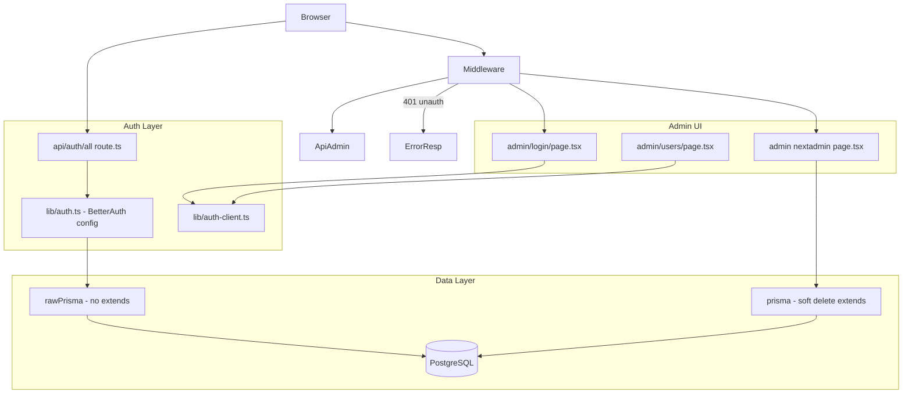
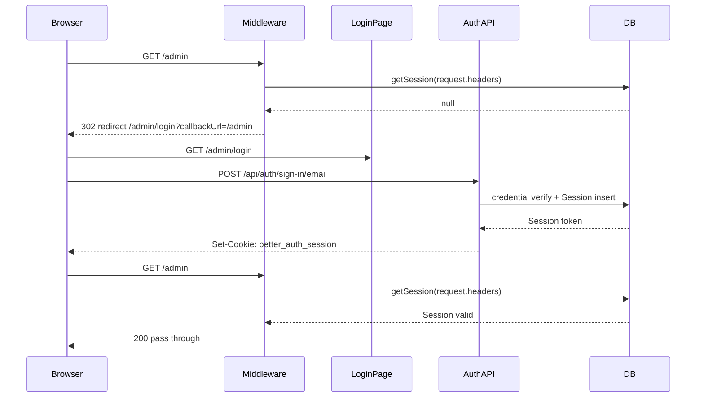
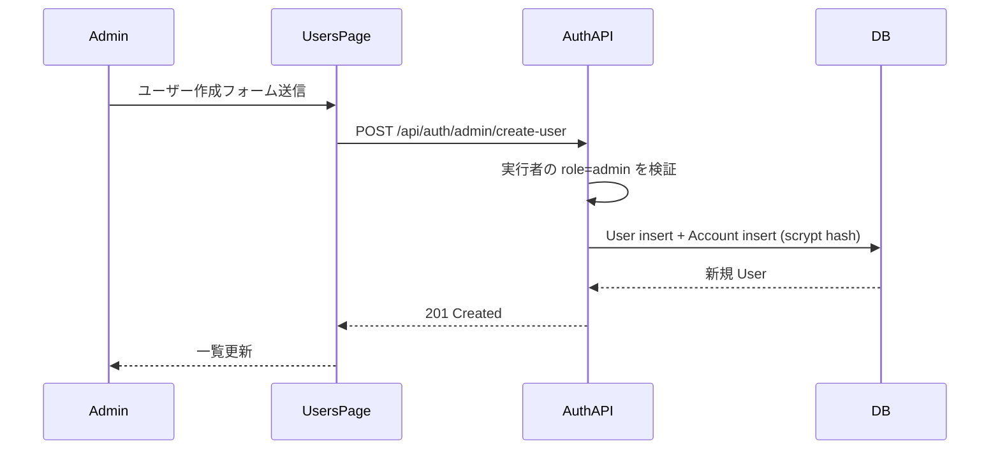
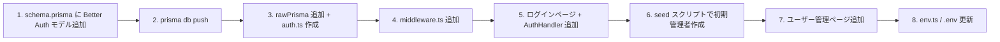

# 技術設計: admin-token-auth

## Overview

本機能は Arcana 管理画面（`/admin`）に ID/パスワード認証を導入する。現在すべての管理ルートが認証なしで公開されている状態を解消し、WESEEK メンバーおよび新庄村担当者のみがアクセスできる状態にする。

Better Auth v1.6 を認証基盤として採用する。`emailAndPassword` 認証と `admin` プラグインにより、ログイン・セッション管理・ユーザー管理（作成・削除・一覧）を最小の実装量で実現する。

**重要な制約**: 既存の `prisma.ts` は `$extends` により返り値型が `ReturnType<typeof createPrismaClient>`（拡張型）になっており、Better Auth の `prismaAdapter` が期待する `PrismaClient` 型と TypeScript 上で非互換になる。このため、Better Auth 専用の `$extends` なし `rawPrisma` インスタンスを分離して使用する。

### Goals

- `/admin/*` および `/api/admin/*` を認証保護する
- 管理者が管理画面からユーザーアカウントを作成・削除・一覧できる
- 初回導入時にシードスクリプトで初期管理者を作成できる
- 固定トークン方式から移行し、セキュリティを向上させる

### Non-Goals

- 訪問者向けのアカウント登録・ログイン
- OAuth / SNS ログイン
- パスワードリセットメール（α版スコープ外）
- 2FA / MFA
- メール認証（アカウント作成は管理者操作のみのため不要。`emailVerified` フラグは使用しない）

---

## Boundary Commitments

### This Spec Owns

- Better Auth の設定・初期化（`src/lib/auth.ts`, `src/lib/auth-client.ts`）
- `/api/auth/*` エンドポイント（Better Auth ハンドラー）
- `/admin/login` ページ（ログイン UI）
- `/admin/users` ページ（ユーザー管理 UI）
- `middleware.ts`（`/admin/*` および `/api/admin/*` の認証保護）
- Prisma スキーマへの Better Auth モデル追加（`User`, `Session`, `Account`, `Verification`）
- 初期管理者シードスクリプト（`prisma/seed.ts`）
- 環境変数スキーマの拡張（`BETTER_AUTH_SECRET`, `BETTER_AUTH_URL`）

### Out of Boundary

- 既存の next-admin CRUD 機能（変更なし。保護のみ追加）
- 訪問者向けルートの認証（`/api/auth/*` 以外の public ルートはすべて対象外）
- メール送信・パスワードリセットフロー
- ロールベースのアクセス制御（全管理者が同一権限。ロール拡張は将来スコープ）

### Allowed Dependencies

- `better-auth` v1.6（emailAndPassword + admin plugin）
- 既存 `prisma.ts`（アプリ側 CRUD では引き続き soft delete 拡張付きを使用）
- `@prisma/adapter-pg`（rawPrisma インスタンスに使用）
- `@t3-oss/env-nextjs` + Zod（環境変数スキーマ拡張）
- Next.js middleware API

### Revalidation Triggers

- `User` / `Session` モデルのスキーマ変更（他スペックがこれらを参照する場合）
- middleware のパスマッチング変更（新しい admin ルート追加時）
- Better Auth メジャーバージョンアップ

---

## Architecture

### Existing Architecture Analysis

- **認証**: 現状ゼロ。`middleware.ts` 未存在、すべての `/admin` ルートが公開状態
- **Prisma**: `src/lib/prisma.ts` が soft delete `$extends` 付き singleton を提供。Better Auth に渡すと `session.delete()` が soft delete になりセキュリティ上の問題が発生するため、Better Auth 専用の拡張なしインスタンス `rawPrisma` を同ファイルに追加する
- **next-admin**: `/admin/[[...nextadmin]]` キャッチオールルートを使用。Next.js の specificity ルールにより、より具体的なルート（`/admin/login`, `/admin/users`）がキャッチオールより優先されるため、競合なし

### Architecture Pattern



**依存方向**: `types` → `lib/auth.ts` → `api/auth/` → `middleware` → UI
各レイヤーは右側（UI）から左側（data）へのみ依存可。逆方向は禁止。

### Technology Stack

| Layer | 選択 / バージョン | 役割 |
|-------|-----------------|------|
| 認証ライブラリ | better-auth v1.6 | セッション管理・emailAndPassword 認証・admin plugin |
| DB adapter | better-auth/adapters/prisma | Prisma 経由で User/Session/Account/Verification を管理 |
| Admin plugin | @better-auth/admin（better-auth 同梱） | ユーザー作成・削除・一覧 API |
| Runtime | Next.js 15 middleware | `/admin/*`, `/api/admin/*` の保護 |
| パスワードハッシュ | scrypt（node:crypto via better-auth/crypto） | パスワード保存・検証 |

---

## File Structure Plan

### Directory Structure

```
src/
├── lib/
│   ├── prisma.ts           # 既存: rawPrisma エクスポートを追加
│   ├── auth.ts             # 新規: Better Auth 設定（rawPrisma 使用）
│   └── auth-client.ts      # 新規: クライアントサイド authClient
├── app/
│   ├── api/
│   │   └── auth/
│   │       └── [...all]/
│   │           └── route.ts  # 新規: Better Auth API ハンドラー
│   └── admin/
│       ├── layout.tsx            # 新規: 全 admin ページ共通レイアウト（ログアウトバー）
│       ├── login/
│       │   └── page.tsx          # 新規: ログインフォーム（Client Component）
│       ├── users/
│       │   └── page.tsx          # 新規: ユーザー管理画面（Client Component）
│       └── _components/
│           └── logout-button.tsx # 新規: ログアウトボタン（Client Component）
├── env.ts                    # 既存: BETTER_AUTH_SECRET, BETTER_AUTH_URL を追加
└── middleware.ts             # 新規: /admin/* と /api/admin/* を保護
prisma/
├── schema.prisma             # 既存: User, Session, Account, Verification モデルを追加
└── seed.ts                   # 新規: 初期管理者作成シードスクリプト
.env.example                  # 既存: 新規環境変数キーを追加
```

### Modified Files

- `src/lib/prisma.ts` — `rawPrisma`（`$extends` なし）エクスポートを追加。既存の `prisma` export は変更なし
- `prisma/schema.prisma` — `User`, `Session`, `Account`, `Verification` モデルを末尾に追加
- `src/env.ts` — `BETTER_AUTH_SECRET`（必須）、`BETTER_AUTH_URL`（必須）を server スキーマに追加
- `.env.example` — 上記の環境変数キーとサンプル値を追加

---

## System Flows

### ログインフロー



### ユーザー管理フロー（管理者がユーザーを作成）



---

## Requirements Traceability

| 要件 | 概要 | コンポーネント | インターフェース |
|------|------|----------------|----------------|
| 1.1 | 未認証アクセス → ログインへリダイレクト | Middleware | `auth.api.getSession()` |
| 1.2 | 正しい認証情報でログイン → セッション発行 | AuthHandler, LoginPage | `POST /api/auth/sign-in/email` |
| 1.3 | 誤認証 → エラーメッセージ | LoginPage, AuthHandler | Better Auth エラーレスポンス |
| 1.4 | パスワード平文保存禁止 | AuthConfig | scrypt ハッシュ（better-auth 内部） |
| 2.1 | 有効セッション中は継続利用 | Middleware | `getSession()` cookie cache |
| 2.2 | セッション期限切れ → リダイレクト | Middleware | `getSession()` null 判定 |
| 2.3 | サーバー再起動後もセッション維持 | AuthConfig + DB | Prisma DB セッション |
| 3.1 | `/admin/*` を認証保護 | Middleware | matcher: `/admin/((?!login).*)` |
| 3.2 | `/api/admin/*` を認証保護 | Middleware | matcher: `/api/admin/:path*` |
| 3.3 | 未認証 API リクエスト → 401 | Middleware | `NextResponse({ status: 401 })` |
| 4.1 | ユーザー作成 | UsersPage, AuthHandler | `POST /api/auth/admin/create-user` |
| 4.2 | ユーザー削除 | UsersPage, AuthHandler | `POST /api/auth/admin/remove-user` |
| 4.3 | ユーザー一覧 | UsersPage, AuthHandler | `GET /api/auth/admin/list-users` |
| 4.4 | 重複メール → エラー | AuthHandler | Better Auth 409 エラー |
| 4.5 | 最後の1名削除不可 | AuthConfig hook | `before:remove-user` hook |
| 5.1 | ログアウト → セッション無効化 | AdminLayout, LogoutButton | `POST /api/auth/sign-out` |
| 6.1 | 初期管理者作成手段 | SeedScript | `prisma/seed.ts` |
| 6.2 | 管理者0件時のメッセージ | LoginPage | 管理者不在検出ロジック |

---

## Components and Interfaces

| コンポーネント | Layer | Intent | 要件 | Key Dependencies |
|---------------|-------|--------|------|-----------------|
| AuthConfig | lib | Better Auth 設定・admin plugin・最終管理者保護 hook | 1.4, 2.3, 4.1–4.5 | rawPrisma (P0) |
| AuthClient | lib | クライアントサイド auth 操作 | 1.2, 1.3, 5.1, 4.1–4.3 | AuthConfig (P0) |
| AuthHandler | api/auth | Better Auth API エンドポイント公開 | 1.2, 2.1, 4.1–4.3, 5.1 | AuthConfig (P0) |
| Middleware | root | 全 admin ルート認証ゲート | 1.1, 2.2, 3.1, 3.2, 3.3 | AuthConfig (P0) |
| AdminLayout | admin/layout | 全 admin ページ共通レイアウト（ログアウトバー） | 5.1 | LogoutButton (P0) |
| LogoutButton | admin/_components | ログアウト操作 Client Component | 5.1 | AuthClient (P0) |
| LoginPage | admin/login | ログインフォーム UI | 1.2, 1.3, 6.2 | AuthClient (P0) |
| UsersPage | admin/users | ユーザー管理 UI（一覧・作成・削除） | 4.1, 4.2, 4.3, 4.4, 4.5 | AuthClient (P0) |
| rawPrisma | lib/prisma | $extends なし PrismaClient（Better Auth 専用） | 1.4, 2.3 | @prisma/adapter-pg (P0) |
| SeedScript | prisma | 初期管理者作成シード | 6.1 | better-auth/crypto (P0) |

---

### lib 層

#### AuthConfig (`src/lib/auth.ts`)

| Field | Detail |
|-------|--------|
| Intent | Better Auth の設定・初期化。rawPrisma を Prisma adapter に渡し、emailAndPassword と admin plugin を有効化する |
| Requirements | 1.4, 2.3, 4.1, 4.2, 4.4, 4.5 |

**Responsibilities & Constraints**

- `emailAndPassword.enabled: true`, `disableSignUp: true`（管理者のみがユーザーを作成できる）
- `emailAndPassword.requireEmailVerification: false`（メール認証不要。管理者経由でのみアカウント作成するため）
- `admin()` プラグインを組み込み、ユーザー管理 API を有効化する
- `before:remove-user` hook で管理者が1名のみの場合に削除を拒否する（4.5）
- `rawPrisma`（`$extends` なし）を Prisma adapter に渡す。soft delete 拡張付きの `prisma` を渡すとセッション削除が正常に動作しない

**Contracts**: Service [x]

##### Service Interface

```typescript
import type { BetterAuthOptions } from "better-auth";

// export される主要な値
export const auth: ReturnType<typeof betterAuth>;

// Better Auth が公開するサーバーサイド API（主要なもの）
// auth.api.getSession(options)       → Session | null
// auth.api.signOut(options)          → void
// auth.api.createUser(options)       → User   ※admin plugin
// auth.api.listUsers(options)        → User[] ※admin plugin
// auth.api.removeUser(options)       → void   ※admin plugin（1名保護 hook 付き）
```

- Preconditions: `rawPrisma` が接続可能であること、`BETTER_AUTH_SECRET` が設定されていること
- Postconditions: auth.api.* が利用可能な状態で export される
- Invariants: 管理者アカウントが1件以上存在する場合のみ remove-user が成功する

**Implementation Notes**

- `rawPrisma` は `prisma.ts` から import する別インスタンス（soft delete `$extends` なし）
- `BETTER_AUTH_SECRET` は最低32文字のランダム文字列。`env.ts` 経由で参照する
- Prisma adapter に `provider: "postgresql"` を明示する（adapter-pg 使用時必須）

---

#### AuthClient (`src/lib/auth-client.ts`)

| Field | Detail |
|-------|--------|
| Intent | クライアントサイド（ブラウザ）から Better Auth API を呼び出す型安全なクライアント |
| Requirements | 1.2, 1.3, 5.1, 4.1, 4.2, 4.3 |

**Contracts**: Service [x]

##### Service Interface

```typescript
// export される主要な値
export const authClient: ReturnType<typeof createAuthClient>;

// 主要操作
// authClient.signIn.email({ email, password })   → { data, error }
// authClient.signOut()                            → void
// authClient.admin.createUser({ email, password, name, role }) → { data, error }
// authClient.admin.listUsers()                   → { data: { users }, error }
// authClient.admin.removeUser({ userId })         → { data, error }
```

- `adminClient()` プラグインを組み込む

---

### api 層

#### AuthHandler (`src/app/api/auth/[...all]/route.ts`)

| Field | Detail |
|-------|--------|
| Intent | Better Auth の全 API エンドポイント（サインイン・サインアウト・セッション・admin 操作）を Next.js Route Handler として公開する |
| Requirements | 1.2, 2.1, 4.1, 4.2, 4.3, 5.1 |

**Contracts**: API [x]

##### API Contract

| Method | Endpoint | Request | Response | Errors |
|--------|----------|---------|----------|--------|
| POST | /api/auth/sign-in/email | `{ email, password }` | Session + Set-Cookie | 401 |
| POST | /api/auth/sign-out | — | void | — |
| GET | /api/auth/session | — | Session \| null | — |
| POST | /api/auth/admin/create-user | `{ email, password, name, role }` | User | 401, 409 |
| GET | /api/auth/admin/list-users | `?limit&offset` | `{ users, total }` | 401 |
| POST | /api/auth/admin/remove-user | `{ userId }` | void | 401, 403, 400 |

※ 400 for remove-user = 最後の管理者削除試行時（hook による拒否）

---

### Middleware (`src/middleware.ts`)

| Field | Detail |
|-------|--------|
| Intent | `/admin/*`（`/admin/login` 除く）および `/api/admin/*` へのリクエストに対してセッションを検証し、未認証を遮断する |
| Requirements | 1.1, 2.2, 3.1, 3.2, 3.3 |

**Contracts**: Service [x]

##### Service Interface

```typescript
// Next.js middleware のシグネチャ
export async function middleware(request: NextRequest): Promise<NextResponse>;

export const config = {
  matcher: [
    "/admin/((?!login).*)",  // /admin/login は除外
    "/api/admin/:path*",
  ],
};
```

- ページルート（`/admin/*`）の未認証 → `/admin/login?callbackUrl=<元のパス>` へ302リダイレクト
- API ルート（`/api/admin/*`）の未認証 → `{ error: "Unauthorized" }` の 401 JSON レスポンス
- `auth.api.getSession({ headers: request.headers })` で DB セッション検証

---

### admin UI 層

#### LoginPage (`src/app/admin/login/page.tsx`)

| Field | Detail |
|-------|--------|
| Intent | メールアドレスとパスワードによるログインフォームを提供する Client Component |
| Requirements | 1.2, 1.3, 6.2 |

**Responsibilities & Constraints**

- `authClient.signIn.email()` を呼び出す
- エラー時はフォーム内にエラーメッセージを表示する（1.3）
- ログイン成功時は `callbackUrl` パラメータがあればそこへ、なければ `/admin` へルーター遷移する
- 管理者アカウントが0件の場合（seed 未実施）の案内メッセージを表示する（6.2）

**Implementation Notes**

- `/admin` の catchall ルートと競合しない（Next.js App Router の specificity ルールで `/admin/login` が優先される）
- ログイン済みユーザーがアクセスした場合は `/admin` へリダイレクトする

---

#### UsersPage (`src/app/admin/users/page.tsx`)

| Field | Detail |
|-------|--------|
| Intent | 管理者がユーザーアカウントを一覧・作成・削除できる管理画面ページ |
| Requirements | 4.1, 4.2, 4.3, 4.4, 4.5 |

**Responsibilities & Constraints**

- `authClient.admin.listUsers()` でユーザー一覧を取得・表示する（4.3）
- ユーザー作成フォームから `authClient.admin.createUser()` を呼び出す（4.1）
- 削除操作から `authClient.admin.removeUser()` を呼び出す（4.2）
- 重複メール時（409 エラー）はエラーメッセージを表示する（4.4）
- ユーザーが1名のみの場合は削除ボタンを無効化する（4.5 の UI 側制約）
  ※ サーバー側の最終保護は AuthConfig の hook が担う

---

### data 層

#### rawPrisma (`src/lib/prisma.ts` への追加)

| Field | Detail |
|-------|--------|
| Intent | soft delete `$extends` を適用しない生の PrismaClient を Better Auth 専用に提供する |
| Requirements | 1.4, 2.3 |

**Contracts**: Service [x]

```typescript
// 既存の prisma export はそのまま維持
export const prisma: PrismaClient; // soft delete $extends 付き（アプリ CRUD 用）

// 追加: Better Auth 専用（$extends なし）
export const rawPrisma: PrismaClient; // @prisma/adapter-pg 使用、extends なし
```

- Better Auth のセッション削除・ユーザー削除が soft delete に変換されることを防ぐ

---

#### SeedScript (`prisma/seed.ts`)

| Field | Detail |
|-------|--------|
| Intent | 初回導入時に初期管理者アカウントを Prisma 直接操作で作成するスクリプト |
| Requirements | 6.1 |

**Contracts**: Batch [x]

##### Batch Contract

- Trigger:
  - ローカル/手動: `pnpm prisma db seed` （`package.json` の `prisma.seed` フィールドで設定）
  - 本番: Cloud Build パイプラインの `seed` ステップ（`migrate` 後・`deploy` 前に自動実行）
- Input: 環境変数 `INITIAL_ADMIN_EMAIL`, `INITIAL_ADMIN_PASSWORD`, `INITIAL_ADMIN_NAME`
- 処理: `hashPassword`（`better-auth/crypto`）でパスワードをハッシュ化し、`user` + `account` テーブルに直接 insert
- Output: 管理者ユーザーが1件作成される
- Idempotency: メールアドレスが既に存在する場合は `upsert` でスキップし、既存ユーザーのパスワードは更新しない（毎デプロイ実行しても、管理者が変更後のパスワードを上書きで戻さない）

**Implementation Notes**

- `auth.api.createUser` は admin 権限のセッションが必要なため使えない（鶏卵問題）
- Better Auth のパスワードは `account.password` フィールドに格納。`user` テーブルだけではログインできないため、`user` と `account` 両テーブルの作成が必須
- `account.providerId: "credential"`, `account.accountId: <email>` が Better Auth の emailAndPassword 認証で要求されるフォーマット

##### 本番ブートストラップ（Cloud Build `seed` ステップ）

本番では初回デプロイ時に管理者が1名も存在しないとログイン不能になる（鶏卵問題）。これを防ぐため、`cloudbuild.yaml` に `seed` ステップを追加し、`migrate` 後・`deploy` 前に seed を冪等実行する。

- **依存の解決**: 先行する `deps` ステップで `pnpm install --frozen-lockfile` を `/workspace` に対して実行し、`migrate` / `seed` はこの `/workspace/node_modules` を共有する。Cloud Build は `/workspace` をステップ間で共有するため、依存 install は 1 回で済み、Dockerfile の builder stage と install 方式（pnpm + frozen-lockfile）が一致して CI と本番イメージで挙動が揃う。`canvas` は `pnpm.neverBuiltDependencies` 指定により native build がスキップされる。
- **client 生成**: schema には `next-admin` generator も定義されているため、`prisma generate --generator client` で Prisma client のみを生成し、next-admin generator の依存を持ち込まない。生成された Prisma client は ESM で `@prisma/client` を bare import するが、`/workspace/node_modules` が walk-up で見つかるため通常通り解決される。
- **機密管理**: `INITIAL_ADMIN_PASSWORD` は Secret Manager（`availableSecrets` → `secretEnv`）経由で注入し、`cloudbuild.yaml` に平文を書かない。`INITIAL_ADMIN_EMAIL` / `INITIAL_ADMIN_NAME` は機密でないため Cloud Build substitution（`_INITIAL_ADMIN_EMAIL` / `_INITIAL_ADMIN_NAME`）で渡す。`BETTER_AUTH_SECRET` も同じく Secret Manager 経由で Cloud Run runtime に注入する（build 時は `SKIP_ENV_VALIDATION=1` で env 検証をスキップし、runtime で検証する）。
- **前提（インフラ作業）**: GCP プロジェクト（`<GCP_PROJECT_ID>`）に `INITIAL_ADMIN_PASSWORD` / `BETTER_AUTH_SECRET` secret を作成し、Cloud Build 実行 SA（`<PROJECT_NUMBER>-compute@developer.gserviceaccount.com`）に `roles/secretmanager.secretAccessor` を付与しておく。

---

## Data Models

### Better Auth が追加する Prisma モデル

```prisma
model User {
  id            String    @id @default(cuid())
  name          String
  email         String    @unique
  emailVerified Boolean   @default(false)
  image         String?
  createdAt     DateTime  @default(now())
  updatedAt     DateTime  @updatedAt
  role          String?
  banReason     String?
  banExpires    DateTime?
  sessions      Session[]
  accounts      Account[]
}

model Session {
  id             String   @id @default(cuid())
  expiresAt      DateTime
  token          String   @unique
  createdAt      DateTime @default(now())
  updatedAt      DateTime @updatedAt
  ipAddress      String?
  userAgent      String?
  userId         String
  impersonatedBy String?
  user           User     @relation(fields: [userId], references: [id], onDelete: Cascade)
}

model Account {
  id                    String    @id @default(cuid())
  accountId             String
  providerId            String
  userId                String
  accessToken           String?
  refreshToken          String?
  idToken               String?
  accessTokenExpiresAt  DateTime?
  refreshTokenExpiresAt DateTime?
  scope                 String?
  password              String?
  createdAt             DateTime  @default(now())
  updatedAt             DateTime  @updatedAt
  user                  User      @relation(fields: [userId], references: [id], onDelete: Cascade)
}

model Verification {
  id         String    @id @default(cuid())
  identifier String
  value      String
  expiresAt  DateTime
  createdAt  DateTime  @default(now())
  updatedAt  DateTime  @updatedAt
}
```

**不変条件**:
- `User.role = "admin"` のユーザーが常に1件以上存在すること（AuthConfig hook で強制）
- `Account.password` は scrypt ハッシュで保存。平文は保存しない
- `User.emailVerified` はメール認証を行わないため常に `false` のままにする（認証ゲートとして使用しない）
- `Verification` テーブルは Better Auth のスキーマ要件で存在させるが、本実装では利用しない

---

## Error Handling

### エラーカテゴリとレスポンス

| カテゴリ | 条件 | 画面/クライアントへの応答 |
|----------|------|------------------------|
| 401 Unauthorized | セッションなし・期限切れ | ページ: `/admin/login` へリダイレクト。API: `{ error: "Unauthorized" }` |
| 401 Sign-in failed | メール/PW 不一致 | ログインページにエラーメッセージ表示（"メールアドレスまたはパスワードが正しくありません"） |
| 409 Conflict | 重複メールでユーザー作成 | ユーザー管理画面にエラーメッセージ表示 |
| 400 Bad Request | 最後の管理者削除試行 | ユーザー管理画面に禁止メッセージ表示 |

---

## Testing Strategy

### Unit Tests

- `AuthConfig` の `before:remove-user` hook: 管理者が1名のとき削除拒否することを確認
- `hashPassword` + scrypt 形式で保存された値が `verifyPassword` で検証できることを確認

### Integration Tests

- 未認証リクエストが `/admin/login` へリダイレクトされることを確認（Req 1.1）
- 未認証リクエストが `/api/admin/*` に対して 401 を返すことを確認（Req 3.3）
- 正しい認証情報でログイン後に `/admin` へアクセスできることを確認（Req 1.2, 2.1）
- 管理者がユーザーを作成・一覧・削除できることを確認（Req 4.1–4.3）
- 最後の管理者アカウントの削除が 400 で拒否されることを確認（Req 4.5）

### E2E Tests

- ログインフロー（正常系・誤認証エラー）
- ログアウト後に管理画面へのアクセスが遮断されることを確認
- ユーザー管理画面でのユーザー作成・削除操作

---

## Security Considerations

- **パスワードハッシュ**: scrypt（`node:crypto`）。Better Auth が自動適用するため実装者による手動ハッシュ化は seed スクリプトのみ
- **セッション**: DB ベース（PostgreSQL）。サーバー再起動後も有効。`onDelete: Cascade` でユーザー削除時にセッションも自動削除
- **CSRF**: Better Auth の `toNextJsHandler` が CSRF 対策を内包
- **ブルートフォース対策**: Better Auth v1.6 の `rateLimit` プラグインは本スコープ外（将来拡張）
- **`BETTER_AUTH_SECRET`**: 32文字以上のランダム文字列。本番環境では環境変数として注入し、ソースコードに含めない

---

## Migration Strategy



**本番デプロイ順序（Cloud Build）**: `build` → `push` → `migrate`（`prisma migrate deploy`）→ `seed`（初期管理者を冪等投入）→ `deploy`（Cloud Run）。`migrate` / `seed` が失敗した場合は `deploy` に進まないため、スキーマ・管理者が未整備のままサービスが公開されることはない。

**ロールバック**: `middleware.ts` の matcher を空にすれば即座に全ルートが公開状態に戻る（認証なし状態への復帰）。`seed` ステップは冪等のため、ロールバック時も再実行で副作用は生じない。
