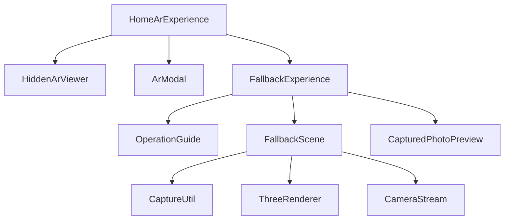
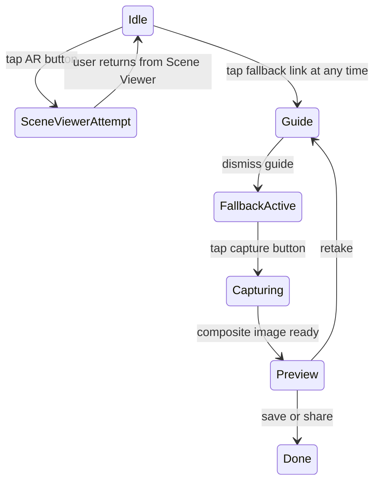

# Technical Design

## Overview
**Purpose**: 自宅撮影ページ(`/camera`)において、AndroidのScene Viewer(ネイティブAR)がARCore非対応端末で3D専用の縮退表示になり撮影できない問題に対し、ユーザー自身の申告をトリガーとした確実に動作する代替AR撮影体験を提供する。
**Users**: 自宅撮影ページを利用するAndroid端末の訪問者(幅広い年齢層を含む)。
**Impact**: `HomeArExperience.tsx`にScene Viewer起動結果を確認する導線を追加し、代替のカメラ映像合成撮影体験(新規コンポーネント)を追加する。Scene Viewerの起動ロジック自体、iOS(Quick Look)、スポット撮影ページ(`/spots/[slug]/camera`)は変更しない。

### Goals
- ユーザーが「うまく表示されなかった」といつでも申告できる、常時・控えめで体験を妨げない導線を提供する(1.1-1.4)
- 申告された場合に、`getUserMedia`+Three.jsによる固定表示のAR撮影体験へ切り替える(2.1-2.6)
- 撮影→プレビュー→保存/シェア/撮り直しを、既存のスポット撮影ページと同じUXパターンで提供する(3.1-3.5)
- 新規UIをWCAG AA相当のアクセシビリティ基準で実装する(4.1-4.4)
- ヒメッコを自動回転させず、ユーザー自身のドラッグ操作(位置)と回転ボタン操作(向き)で構図を調整できるようにする(5.1-5.7)
- ユーザー自身の2本指ピンチ操作でヒメッコの大きさを調整できるようにする(6.1-6.6)
- カメラへのアクセスを許可する前に、ヒメッコの操作方法(移動・回転・拡大縮小)を説明するガイドを表示する(7.1-7.5)

### Non-Goals
- Scene Viewerが実際に動作したかどうかを自動検知すること(技術的に不可能。`research.md`参照)。申告導線は常時表示とし、検知イベントには依存しない(設計レビューで確定)
- WebXRベースの実装(技術検証の結果不採用)
- 平面検出・床への設置などの本格的な空間認識AR
- 代替体験でのヒメッコ表示を、端末の傾き・向き(device orientation)に連動させること。スクリーン空間に固定した表示に留める(設計レビューで確定。詳細はHomeArFallbackScene参照)。この方針は変わらないが、**ユーザー自身のポインター操作(ドラッグ・ボタン・ピンチ)による位置・向き・大きさの変更は対象外の連動ではなく、本spec改訂(5.1-5.7, 6.1-6.6)で明示的にサポートする**
- 2本指ピンチ以外の拡大縮小手段(+/-ボタン等)の追加(ユーザー指定により2本指ピンチのみを対象とする)
- iOS(Quick Look)・スポット撮影ページ・`home-camera`spec全体の自前AR化への変更
- 操作ガイドの表示要否をユーザーが恒久的に設定できる機能(「次回から表示しない」等)の追加(Requirement 7 Boundary Context参照。今回は毎回表示のみを対象とする)

## Boundary Commitments

### This Spec Owns
- `HomeArExperience.tsx`内の「Scene Viewer起動結果の確認導線(申告UI)」の追加
- 新規の代替AR撮影体験(カメラ映像+ヒメッコ固定表示+撮影)
- 代替体験専用の撮影結果プレビュー・保存・シェア・撮り直しのフロー(`CapturedPhotoPreview.tsx`。当初は既存の`PhotoPreview.tsx`を再利用する計画だったが、並行して進んでいた`spot-camera-markerless`specにより`PhotoPreview.tsx`本体が削除されたため、本specの境界内に同等品として作り直した。詳細は`research.md`参照)
- 新規共有ユーティリティ`compositeCapture`(カメラ映像とWebGL描画結果をcanvasに合成する処理)
- カメラアクセス要求前に表示する操作方法ガイド(`OperationGuide.tsx`、新規)と、`HomeArFallbackExperience`側でのその表示制御(カメラアクセス要求のタイミングをガイド閉じ後まで遅らせる状態遷移)

### Out of Boundary
- Scene Viewer / Quick Lookの起動判定・呼び出しロジック(`canActivateAR` / `activateAR()`は変更しない)
- スポット撮影ページ(`/spots/[slug]/camera`)の実装(現在は`spot-camera-markerless`specにより自宅撮影と同じネイティブAR方式に統一されている。本specはこのページを変更しない)
- `home-camera`spec全体の自前マーカーレスAR化(別途検討事項)
- `HiddenArViewer.tsx` / `ArModal.tsx` / `ModelViewer.tsx`(model-viewerベースの3D表示・Scene Viewer起動導線。変更しない)

### Allowed Dependencies
- `src/lib/ar/types.ts`(`CaptureResult`型を再利用。新規に`HomeArFallbackState`型を追加)
- `three`(既存の依存関係。`spot-camera-markerless`specによる撤去後、本specが必要とするため`package.json`に復元。バージョンは変更なし)
- `src/app/_components/icons/`(共有アイコンレジストリ。`rotate-left`/`rotate-right`は既存流用。本specでは`OperationGuide`用に`open-with`・`pinch-outline`の2件を`scripts/gen-icons.mjs`のNAMESへ追加するのみで、レジストリの仕組み自体は変更しない)

### Revalidation Triggers
- `CapturedPhotoPreview.tsx`の`CaptureResult`インターフェースが変更された場合
- `three`のメジャーバージョンアップ、または`HomeArFallbackScene`側でレンダリング方式が変更された場合
- `canActivateAR` / `activateAR()`のmodel-viewer側の挙動が変わった場合(バージョンアップ等)
- `main`側で`src/lib/ar/`配下や`src/app/camera/_components/`配下が並行して変更される場合(過去に一度、他specとの並行作業でこの前提が崩れマージ衝突が発生した実績があるため、定期的な`git fetch origin main`での差分確認を推奨)
- `HomeArFallbackExperience.tsx`の撮り直し実装(`handleRetake`による`sceneKey`変更 → `HomeArFallbackScene`の強制再マウント)が変更された場合(設計レビュー Critical Issue 3対応。Requirement 5.7のリセット挙動はこの既存の再マウントの仕組みに暗黙的に依存しているため、`sceneKey`方式が廃止・変更されると5.7が気づかれずに壊れるリスクがある)
- `HomeArFallbackScene`が`useEffect`内で`getUserMedia`を呼び出すタイミング・条件が変更された場合(本改訂の「ガイドを閉じるまでは`HomeArFallbackScene`自体をマウントしない」という設計が、カメラアクセス要求の遅延[7.1, 7.4]を実現する前提になっているため)

## Architecture

### Existing Architecture Analysis
- `HomeArExperience.tsx`の`handleArClick`は`el.canActivateAR && el.activateAR()`を呼ぶのみで、起動結果を検知するロジックは無い(意図的な制約。`research.md`参照)
- 実績ある撮影技術は「`<video>`要素とWebGL canvasを2D canvasに合成し`toDataURL()`で静止画化する」手法(元は`ArScene.tsx`で実証されていたが、`spot-camera-markerless`specにより`ArScene.tsx`自体は削除された。手法自体は本specの`compositeCapture`に引き継がれている)。WebXRセッションを経由しないため確実に動作する
- `CapturedPhotoPreview.tsx`は`CaptureResult{dataUrl, capturedAt}`のみに依存し、AR実装方式に依存しない(旧`PhotoPreview.tsx`と同じ設計方針を、削除後に本specの境界内へ引き継いだもの)

### Architecture Pattern & Boundary Map



**Architecture Integration**:
- 選択パターン: 既存の「画面切り替え型ローカルステート管理」(`SpotArExperience.tsx`の`View`ユニオン型と同じ考え方)を`HomeArExperience.tsx`内に追加
- 責務分離: Scene Viewer起動判定(既存・不変) / 起動結果の申告UI(新規・`HomeArExperience.tsx`内) / 操作方法ガイド表示(新規・`OperationGuide`) / 代替AR撮影のレンダリングと撮影(新規・`FallbackScene`) / プレビューと保存共有(`CapturedPhotoPreview.tsx`)
- 既存パターン継承: `CaptureResult`型、`compositeCapture`相当の合成撮影手法、`CapturedPhotoPreview.tsx`のUI(canShare判定・共有テキストを含む)
- 新規コンポーネントの理由: `HomeArFallbackScene`はマーカー追跡が不要な固定表示AR専用であり、`ArScene.tsx`(マーカー追跡必須)とは責務が異なるため別コンポーネントとする。`OperationGuide`は状態を持たない純粋な表示専用コンポーネントであり、既に373行(2026-07-13時点)ある`HomeArFallbackExperience.tsx`にこれ以上インラインのオーバーレイを増やさないため別ファイルに分離する(`CapturedPhotoPreview.tsx`を既に別ファイル化している既存方針に倣う)
- カメラアクセス要求タイミングの制御: `HomeArFallbackState`に`guide`フェーズを追加し、`HomeArFallbackExperience`はこのフェーズの間`HomeArFallbackScene`自体をマウントしないことで、カメラアクセス要求(`HomeArFallbackScene`の`useEffect`内`getUserMedia`呼び出し)をガイド閉じ後まで遅延させる。`HomeArFallbackScene`自体の実装(カメラ取得ロジック)は変更しない
- Steering準拠: WCAG AA、14px以上/行間1.5以上、コントラスト比4.5:1以上(CLAUDE.md UI実装ルール)

### Technology Stack

| Layer | Choice / Version | Role in Feature | Notes |
|-------|------------------|------------------|-------|
| Frontend | React 19 / Next.js 15 App Router | UIコンポーネント | 既存スタックと同一、新規依存なし |
| 3Dレンダリング | three ^0.183.2 | ヒメッコモデルの固定表示レンダリング | `spot-camera-markerless`specにより一度`package.json`から撤去されたが、本specが必要とするため復元(バージョンは変更なし) |
| カメラ映像取得 | `navigator.mediaDevices.getUserMedia`(ブラウザ標準API) | ライブカメラ映像取得 | 新規依存なし。ARCore/WebXR/Scene Viewerの対応状況に依存しない |
| 撮影 | Canvas 2D API(ブラウザ標準) | カメラ映像とWebGL描画の合成・静止画化 | 削除済みの旧`ArScene.tsx`で実証済みだった手法を`compositeCapture`として再利用可能な形に抽出 |

## File Structure Plan

### Directory Structure
```
src/
├── app/camera/_components/
│   ├── HomeArExperience.tsx          # 変更: Scene Viewer起動結果の申告UIと画面切り替えを追加
│   ├── HomeArFallbackExperience.tsx  # 変更: 代替AR体験の状態管理(カメラ許可/エラー/撮影/プレビュー)に`guide`フェーズを追加
│   ├── OperationGuide.tsx            # 新規: カメラアクセス要求前の操作方法(移動/回転/拡大縮小)ガイド表示(7.1-7.5)
│   ├── HomeArFallbackScene.tsx       # 変更なし(本改訂): getUserMedia + three.js固定表示レンダリングと撮影ボタン
│   ├── CapturedPhotoPreview.tsx      # 変更なし(本改訂): 撮影結果のプレビュー・保存・シェア・撮り直しUI
│   ├── HiddenArViewer.tsx            # 変更なし
│   ├── ArModal.tsx                   # 変更なし
│   └── ModelViewer.tsx               # 変更なし
├── app/_components/icons/
│   └── material-symbols.generated.ts # 変更: `open-with`(移動)・`pinch-outline`(拡大縮小)アイコンを追加(`scripts/gen-icons.mjs`のNAMESに追加し再生成。`rotate-left`/`rotate-right`は既存流用)
└── lib/ar/
    ├── capture.ts                    # 変更なし(本改訂): compositeCapture(video, canvas) 共有ユーティリティ
    └── types.ts                      # 変更: HomeArFallbackState 型に`guide`フェーズを追加
```

### Modified Files
- `src/app/camera/_components/HomeArExperience.tsx` — 常時表示の申告リンク(イベント検知は使用しない)と、代替体験への画面切り替え(`view`状態)を追加(本改訂での変更なし)
- `src/app/camera/_components/HomeArFallbackExperience.tsx`(本改訂) — 初期状態と撮り直し時の遷移先を`guide`フェーズにし、`guide`フェーズの間は`HomeArFallbackScene`をマウントせず`OperationGuide`を表示する
- `src/app/camera/_components/OperationGuide.tsx`(本改訂・新規) — 移動(一本指ドラッグ)・拡大縮小(二本指ピンチ)・回転(画面内ボタン)の操作方法を説明する、状態を持たない表示専用コンポーネント。「はじめる」ボタン(48x48px以上・`aria-label`付き)で`onDismiss`を呼ぶ
- `scripts/gen-icons.mjs` / `src/app/_components/icons/material-symbols.generated.ts`(本改訂) — `open-with`・`pinch-outline`をNAMESに追加し再生成
- `src/lib/ar/types.ts` — `HomeArFallbackState`型(`guide` / `idle` / `camera-requesting` / `camera-denied` / `initializing` / `ready` / `capturing` / `error`)。本改訂で`guide`を追加。`spot-camera-markerless`specとのマージ時に、同ファイルから削除された`TargetConfig`/`ArSceneState`/`PageView`は利用箇所が無いことを確認の上、本specでは復元しなかった
- `package.json` / `pnpm-lock.yaml` — `spot-camera-markerless`specのマージで撤去された`three`/`@types/three`を復元(本specが`HomeArFallbackScene`で必要とするため。本改訂での変更なし)
- `next.config.ts` — 同マージで参照先(`src/lib/ar/three-shim.ts`)が削除され死んでいた`webpack.resolve.alias.three$`エイリアス設定を削除(本改訂での変更なし)

## System Flows



**フロー上の決定事項(設計レビューにより確定)**:
- 申告リンクは`SceneViewerAttempt`の発生や結果と関係なく、`Idle`状態から常時タップ可能な、控えめな表示として提供する(1.1)。イベント検知(`visibilitychange`等)には依存しない。これにより、ブラウザ/端末差によって検知イベントが発火せず申告手段そのものが失われるリスクを排除する(設計レビュー Critical Issue 1対応)
- リンクはブロッキングダイアログではなく、Scene Viewerの起動フロー(`SceneViewerAttempt`)と独立して並行に存在する(1.3)
- 申告後は必ず`Guide`状態(操作方法ガイド)を経由してから`FallbackActive`(カメラアクセス要求・`HomeArFallbackScene`表示)に進む(7.1, 7.4)。撮り直し(`Preview --> Guide`)でも同様に`Guide`を再度経由する(7.5)

## Components and Interfaces

| Component | Domain/Layer | Intent | Req Coverage | Key Dependencies (P0/P1) | Contracts |
|-----------|--------------|--------|---------------|---------------------------|-----------|
| HomeArExperience | UI | Scene Viewer起動と結果申告導線、画面切り替え | 1.1, 1.2, 1.3, 1.4 | HomeArFallbackExperience (P0) | State |
| HomeArFallbackExperience | UI | 代替AR体験の状態管理とエラーハンドリング | 2.1, 2.2, 2.5, 2.6, 3.2, 3.5, 7.1, 7.4, 7.5 | HomeArFallbackScene (P0), CapturedPhotoPreview (P0), OperationGuide (P0) | State |
| OperationGuide | UI | カメラアクセス要求前の操作方法(移動/回転/拡大縮小)ガイド表示 | 7.1, 7.2, 7.3, 4.6 | なし | — |
| HomeArFallbackScene | UI | カメラ映像取得・ヒメッコ固定表示・撮影ボタン | 2.1, 2.3, 2.4, 3.1 | compositeCapture (P0), three (P0) | State |
| compositeCapture | Utility | カメラ映像とWebGL描画の合成静止画化 | 3.1 | なし | Service |

### UI

#### HomeArExperience(変更)

| Field | Detail |
|-------|--------|
| Intent | Scene Viewer起動、起動結果の申告導線表示、代替体験への切り替え |
| Requirements | 1.1, 1.2, 1.3, 1.4 |

**Responsibilities & Constraints**
- 既存の`handleArClick`(`canActivateAR && activateAR()`呼び出し)は変更しない
- 「AR で撮影する」ボタンの近くに、申告リンク(例:「うまく表示されなかった方はこちら」)を常時・控えめに表示する。表示条件はAndroid/iOSや`canActivateAR`の値に関わらず一律であり、イベント検知には依存しない(設計レビュー Critical Issue 1対応。検知不能な`visibilitychange`頼みの実装を避けるための簡素化)
- 申告リンクがタップされた場合のみ`HomeArFallbackExperience`を表示する。それ以外は既存の画面のまま何も変化しない

**Dependencies**
- Outbound: HomeArFallbackExperience — 申告時に表示を切り替える (P0)

**Contracts**: State [x]

##### State Management
- State model: `view: "home" | "fallback"`(代替体験への切り替えのみ。申告リンクは条件分岐なしで常時レンダリングするため専用のbooleanステートは不要)
- Persistence: コンポーネントローカルstate。ページ遷移で破棄される(永続化不要)
- Concurrency: 単一ユーザー操作のみを想定し、競合状態は発生しない

**Implementation Notes**
- Integration: 申告リンクは静的なUI要素としてJSXに直接追加する。イベントリスナーや検知ロジックが無いため、既存ファイルへの追加は`view`ステートとリンクのクリックハンドラのみで済み、責務の肥大化は限定的(設計レビュー Critical Issue 3は、Critical Issue 1の簡素化によって実質的に解消)
- Validation: iOS・`canActivateAR`がfalseの既存経路を含め、すべてのケースで申告リンクが同一に表示・機能することを確認する
- Risks: なし(ブラウザイベントへの依存を排除したため、Issue 1で指摘された検知信頼性のリスクは解消)

#### HomeArFallbackExperience(変更)

| Field | Detail |
|-------|--------|
| Intent | 代替AR撮影体験の状態管理(操作ガイド・カメラ許可・エラー・撮影・プレビュー)とUI統合 |
| Requirements | 2.1, 2.2, 2.5, 2.6, 3.2, 3.5, 7.1, 7.4, 7.5 |

**Responsibilities & Constraints**
- `HomeArFallbackState`に基づき、操作ガイド・カメラ許可待ち・拒否ガイド・エラー+リトライ・`HomeArFallbackScene`表示・`CapturedPhotoPreview`表示を切り替える
- `SpotArExperience.tsx`のカメラ拒否ガイド・エラーUIパターン(コピー文言・レイアウト)を参考にするが、`SpotArExperience.tsx`自体は変更・共通化しない(Out of Boundary)
- 撮影完了時に`CaptureResult`を受け取り`CapturedPhotoPreview`へ渡す。撮り直し時は`guide`フェーズに戻す(7.5)
- **(本改訂)** `state.phase === "guide"`の間は`HomeArFallbackScene`をマウントせず`OperationGuide`を表示する。`HomeArFallbackScene`は自身の`useEffect`内でマウントと同時に`getUserMedia`を呼び出す実装(変更なし)であるため、マウント自体を遅らせることでカメラアクセス要求を「ガイドを閉じた後」まで遅延させる(7.1, 7.4)。`OperationGuide`の`onDismiss`で`phase`を`"idle"`に遷移させると`HomeArFallbackScene`がマウントされる

**Dependencies**
- Inbound: HomeArExperience — 表示切り替えのトリガー (P0)
- Outbound: OperationGuide — カメラアクセス要求前の操作方法ガイド (P0)
- Outbound: HomeArFallbackScene — カメラ映像・撮影ボタンの提供元 (P0)
- Outbound: CapturedPhotoPreview(`@/app/camera/_components/CapturedPhotoPreview`) — プレビュー・保存・シェア・撮り直しUI (P0)

**Contracts**: State [x]

##### State Management
- State model: `HomeArFallbackState`(`guide` / `idle` / `camera-requesting` / `camera-denied` / `initializing` / `ready` / `capturing` / `error`)、`captureResult: CaptureResult | null`。初期値は`{phase: "guide"}`(本改訂。従来は`{phase: "idle"}`)
- Persistence: コンポーネントローカル
- Concurrency: 単一撮影フローのみ想定

**Implementation Notes**
- Integration: 戻る操作で`HomeArExperience`の`view`を`"home"`に戻すコールバックを受け取る(2.5)。フローティング戻るボタン(`zIndex: 20`)は`guide`フェーズ中も表示を継続し(既存の`showBackButton = !showErrorRetry`条件のまま変更不要)、ガイド表示中も体験を離脱できる導線を維持する
- Integration: `handleRetake`は`sceneKey`のインクリメントに加え、`setState({phase: "idle"})`ではなく`setState({phase: "guide"})`に変更する(7.5)
- Validation: カメラ拒否時・初期化失敗時にエラーガイドとリトライボタンを表示すること(2.2, 2.6)を確認する
- Validation: 初回訪問時・撮り直し時のいずれも、カメラアクセスが要求される前に必ず`OperationGuide`が表示されることを確認する(7.1, 7.5)
- Risks: なし(既存パターンの組み合わせのみ)

#### OperationGuide(新規)

| Field | Detail |
|-------|--------|
| Intent | カメラアクセスを許可する前に、ヒメッコの操作方法(移動・拡大縮小・回転)を説明し、ユーザーの明示的な操作で先へ進める |
| Requirements | 7.1, 7.2, 7.3, 4.6 |

**Responsibilities & Constraints**
- 状態を持たない表示専用コンポーネント(`onDismiss: () => void`の1プロパティのみ)。カメラ許可状態や`HomeArFallbackState`を自身では保持・参照しない
- 一本指ドラッグでの移動(`open-with`アイコン)・二本指ピンチでの拡大縮小(`pinch-outline`アイコン)・画面内ボタンでの回転(`rotate-right`アイコン、既存流用)の3項目を、それぞれ16px以上のテキストで説明する(7.2)
- カメラ拒否ガイド・エラー画面(既存)と同じ視覚パターン(`rgba(30, 28, 25, 0.85)`背景、`zIndex: 15`、`var(--color-neutral-0)`のカード、`borderRadius: 16`)を踏襲し、新規の視覚言語を持ち込まない
- 「はじめる」ボタン(タップ領域48x48px以上、`aria-label="操作方法を確認してカメラへ進む"`)タップで`onDismiss()`を呼ぶ(7.3)

**Dependencies**
- なし(`Icon`コンポーネント以外の外部依存を持たない)

**Contracts**: —

##### Props
```typescript
export interface OperationGuideProps {
  /** ガイドを閉じ、カメラアクセス要求(HomeArFallbackSceneのマウント)へ進むためのコールバック(7.3, 7.4)。 */
  onDismiss: () => void;
}
```

**Implementation Notes**
- Integration: `HomeArFallbackExperience`は`state.phase === "guide"`の間のみ本コンポーネントを描画し、`HomeArFallbackScene`とは排他的に表示する(同時に両方をマウントしない)
- Validation: ボタンのタップ領域・アクセシブルラベル・フォントサイズ16px以上/行間1.5以上・コントラスト比4.5:1以上を確認する(4.6)
- Risks: なし(状態を持たない表示専用コンポーネントのため、既存フローへの副作用がない)

#### HomeArFallbackScene(新規)

| Field | Detail |
|-------|--------|
| Intent | `getUserMedia`によるカメラ映像取得とヒメッコの固定表示レンダリング、撮影ボタンの提供、ユーザー操作によるヒメッコの位置・向き・大きさの調整 |
| Requirements | 2.1, 2.3, 2.4, 3.1, 5.1, 5.2, 5.3, 5.4, 5.5, 5.6, 5.7, 6.1, 6.2, 6.3, 6.4, 6.5, 6.6 |

**Responsibilities & Constraints**
- `navigator.mediaDevices.getUserMedia({video: {facingMode: "environment"}})`でカメラ映像を取得し、`<video>`要素に流す
- `three`の`WebGLRenderer`(`preserveDrawingBuffer: true`, `alpha: true`)でヒメッコのGLTFモデルを表示する。**表示方式はスクリーン空間への固定表示とする**: `PerspectiveCamera`は起動時の一度だけ設定した固定視点を保持し、端末の傾き・向き(device orientation / motion)や平面検出とは一切連動させない。スマホを動かしてもヒメッコの画面上の見え方は変化しない、ステッカーを貼ったような表示になる(設計レビュー Critical Issue 2対応。3D空間内の固定距離に置いて視差でズレて見える方式は採用しない)
- **(改訂: 自動回転を廃止)** 従来`setAnimationLoop`内で`modelGroup.rotation.y`を毎フレーム加算する時間ベースの自動回転を行っていたが、ユーザーの意図しない「勝手に回転する」挙動として問題が判明したため廃止する。起動時はモデルの初期姿勢(`model.rotation`、中央位置)で静止させ、以後はユーザー操作(ドラッグ・回転ボタン)によってのみ位置・向きが変化する、on-demandレンダリング方式に変更する(5.1, 5.2)
- **ドラッグによる移動(5.3, 5.4)**: `canvas`要素にPointer Events(`onPointerDown`/`onPointerMove`/`onPointerUp`、`setPointerCapture`使用)を追加し、マウス・タッチ両対応の単一実装とする。ドラッグ中はポインターのスクリーン座標差分を、固定カメラのfovと距離から算出したワールド座標系のスケール(z=0平面上の可視幅・高さ)に変換し、`modelGroup.position.x/y`に反映する。移動範囲は暫定デフォルトとしてモデル中心が可視半幅・半高の概ね60%以内に収まるようクランプする(画面端や下部の撮影ボタン領域にヒメッコが完全に隠れないようにするための初期値。実装時に視覚確認しながら微調整して良い)
- **回転ボタンによる向き変更(5.5, 5.6)**: 左右回転ボタン(タップ領域48x48px以上、`aria-label`付き)を撮影ボタンと同じ操作レイヤーの`zIndex: 10`以上のコンテナ内に新規に表示し、タップ時に`modelGroup.rotation.y`を固定量(例: 30度 = `Math.PI / 6`)ずつ増減させる。canvasの`pointerEvents`を`auto`化した後もタップが確実にボタンへ渡るよう、回転ボタンのDOM要素は撮影ボタン(L294-322の`zIndex: 10`)と同等以上のzIndexを明示的に指定すること(設計レビュー Critical Issue 1対応)
- **2本指ピンチによる拡大縮小(6.1-6.5)**: 既存のPointer Eventsハンドラをアクティブなポインター(`pointerId`とスクリーン座標)を`Map`で管理する方式に拡張する。アクティブポインター数が2未満から2へ遷移するたび(**コンポーネント生存中に1回だけではなく、指を離して再度2本指にするたびに毎回**)、その時点の2点間の距離(`pinchStartDistance`)とモデルスケール(`pinchStartScale`)を記録し直し、進行中の1本指ドラッグ状態(`dragStateRef`)は破棄してピンチ操作へ切り替える(6.5: ピンチ開始時にドラッグ移動を併発させない。設計レビュー Critical Issue 1対応)。`pointermove`でアクティブポインターが2点以上の間、2点間の距離の変化比率(`currentDistance / pinchStartDistance`)を`pinchStartScale`に掛けた値を新しいスケールとして`modelGroup.scale.set(s, s, s)`に反映し、都度`render()`する。3本目以降の追加ポインターは無視し、常に「最初にピンチを開始した2点」の距離のみを追跡する
- **既知の制約(設計レビュー Critical Issue 2)**: 回転ボタン・撮影ボタンはcanvasより高いzIndexで手前に重なっているため、ピンチの指がこれらのボタン領域に触れた場合、その`pointerdown`はボタン側で消費されcanvasの`activePointersRef`には登録されない(2本指ピンチが成立しない)。ボタン列は画面下部の限られた領域のみで、ヒメッコ本体は画面中央付近に表示されるため実害は限定的だが、実装・実機検証時にこの制約を認識しておくこと
- **スケール範囲のクランプ(6.4)**: モデルロード時の`model.scale ?? 1`を基準スケール(`baseScaleRef`)として保持し、暫定デフォルトとして基準スケールの0.5倍〜2.5倍の範囲にクランプする(実装時に視覚確認しながら微調整可)
- 指を1本離してピンチが2点未満に戻った場合、残りの1本指で自動的にドラッグ移動を再開はしない(ピンチとドラッグの切り替え時の位置ジャンプを避けるための単純化。ユーザーは一度指を離してから再度ドラッグを開始する)
- ドラッグ・回転ボタン・ピンチ操作の結果は、`renderer.render(scene, camera)`をその場で呼び出すon-demand方式で即座に画面へ反映する(継続的な`setAnimationLoop`は使用しない)
- 撮影ボタンタップ時に`compositeCapture(video, glCanvas)`を呼び、結果を`onCapture(CaptureResult)`で親に返す
- カメラ許可拒否・初期化失敗は例外として親に伝播させ、`HomeArFallbackExperience`側でエラー表示する
- ヒメッコの位置・向き・大きさの状態はコンポーネントローカル(ref)に閉じる。`HomeArFallbackExperience`側は撮り直し時に既存の`sceneKey`による強制再マウントを行うため(既存実装済み、変更不要)、位置・向き・大きさは追加のリセット処理なしに初期状態(中央・初期姿勢・初期スケール)へ戻る(5.1, 5.7, 6.6)

**Dependencies**
- Outbound: compositeCapture — 撮影処理 (P0)
- External: `three`(GLTFLoader、WebGLRenderer) (P0)
- External: `navigator.mediaDevices.getUserMedia`(ブラウザ標準API) (P0)
- External: Pointer Events API(ブラウザ標準。`onPointerDown`/`onPointerMove`/`onPointerUp`、`setPointerCapture`) (P0)

**Contracts**: State [x]

##### State Management
- State model: `<video>`要素・Three.jsのシーン/カメラ/レンダラー/モデルグループ・ドラッグ中フラグ・アクティブポインターMap・ピンチ開始距離とスケール・基準スケールの参照を保持(Reactステートではなくrefで管理。`ArScene.tsx`と同様の方式)。撮影可否判定用の`cameraReady`/`modelReady`のみ既存通りReactステートとする
- Persistence: なし(位置・向き・大きさはコンポーネントインスタンスが生存する間のみ保持され、再マウントで初期状態に戻る)
- Concurrency: マウント中はドラッグ操作・回転ボタン操作・ピンチ操作それぞれの入力に対しon-demandで再描画する。同時に複数の描画要求が来ても`renderer.render`は同期処理のため競合しない。1本指ドラッグと2本指ピンチは排他的に扱い(6.5)、同時に両方の変換を適用しない。アンマウント時に`getUserMedia`のストリームトラックを停止する

**Implementation Notes**
- Integration: モデルのロード・ライティング設定は`ArScene.tsx`の`loadModel`と同様の実装パターンに揃える(GLTFLoader、AmbientLight、DirectionalLight)。ドラッグ・回転ボタン・ピンチのハンドラから`scene`/`camera`/`modelGroup`/`renderer`を参照できるよう、`useEffect`内のローカル変数からrefに昇格させる
- Integration: 撮影ボタンと同様、回転ボタンも`canvas`(`pointerEvents: "auto"`に変更)より前面(高いzIndex)に配置し、タップがボタンに正しく渡ることを確認する
- Integration: ピンチは既存のPointer Events(`onPointerDown`/`onPointerMove`/`onPointerUp`/`onPointerCancel`)ハンドラをそのまま拡張して実装し、新たなイベントリスナーの種類は追加しない(タッチデバイスは1本ずつの指それぞれに独立した`pointerId`を持つPointer Eventを発火するため、複数指の追跡は既存APIの範囲内で可能)
- Validation: アンマウント時に`MediaStreamTrack.stop()`を確実に呼び、カメラリソースを解放することを確認する(継続`setAnimationLoop`を廃止したため`setAnimationLoop(null)`の呼び出しは不要になるが、`renderer.dispose()`は引き続き行う)
- Validation: ドラッグでヒメッコを画面端まで動かしても、可視領域内にとどまり撮影ボタン・回転ボタン・戻るボタンの操作を妨げないことを確認する
- Validation: 2本指ピンチ中に1本指ドラッグの移動が同時発生しないこと、ピンチで基準スケールの0.5〜2.5倍の範囲を超えて拡大縮小されないことを確認する
- Risks: カメラ映像のアスペクト比とcanvasサイズの不一致(P2、`ArScene.tsx`でも同様の考慮がありCSSで吸収されている前例に倣う)
- Risks: `canvas`の`pointerEvents`を`none`から`auto`に変更することで、下の`<video>`要素へのタップは引き続き素通りする(`<video>`自体はタップ操作を持たないため実害なし)が、将来`<video>`側にタップ操作を追加する場合はヒットテストの競合に注意すること
- Risks: 3本指以上でのタッチ(意図しない誤操作、例: 手のひらの一部が触れるなど)は、最初にピンチを開始した2点のみを追跡し無視することで誤動作を抑制するが、実機でのマルチタッチ挙動の確認が必要(P2)

### Utility

#### compositeCapture(新規)

| Field | Detail |
|-------|--------|
| Intent | カメラ映像(`<video>`)とWebGL描画結果(canvas)を合成し、静止画のdata URLを生成する |
| Requirements | 3.1 |

**Contracts**: Service [x]

##### Service Interface
```typescript
function compositeCapture(
  video: HTMLVideoElement,
  renderCanvas: HTMLCanvasElement,
): string; // returns a PNG data URL
```
- Preconditions: `video`は再生中でフレームを持つこと。`renderCanvas`はレンダリング直後であること
- Postconditions: 戻り値は`image/png`形式のdata URL文字列
- Invariants: 入力の`video`/`renderCanvas`を変更しない(副作用なし)

**Implementation Notes**
- Integration: `ArScene.tsx`の`handleCapture`内で行っている「オフスクリーンcanvas生成 → video描画 → glCanvas描画 → toDataURL」の手順をそのまま関数として抽出したもの。`ArScene.tsx`自体は変更しないため、`ArScene.tsx`は引き続き自身のインライン実装を使う(重複は許容し、`ArScene.tsx`の変更はOut of Boundary)
- Validation: `HomeArFallbackScene`から渡される`video`/`renderCanvas`が期待通りの合成結果を返すことを確認する
- Risks: なし(既存の実証済みロジックの抽出)

## Data Models

### Domain Model
- 新規エンティティは無い。既存の`CaptureResult`(`dataUrl`, `capturedAt`)をそのまま利用する

### Logical Data Model
`src/lib/ar/types.ts`に追加する型:
```typescript
export type HomeArFallbackState =
  | { phase: "guide" }
  | { phase: "idle" }
  | { phase: "camera-requesting" }
  | { phase: "camera-denied" }
  | { phase: "initializing" }
  | { phase: "ready" }
  | { phase: "capturing" }
  | { phase: "error"; message: string };
```
`guide`(本改訂で追加)は操作方法ガイド表示中を表す。この間`HomeArFallbackScene`はマウントされないため、`camera-requesting`以降のフェーズには遷移しない。
永続化・データベース変更は無い(すべてクライアントサイドのローカルステートと画像data URL)。

## Error Handling

### Error Strategy
既存の`SpotArExperience.tsx`のエラー表現パターン(ガイドテキスト+リトライボタン)を、代替体験内で踏襲する。

### Error Categories and Responses
- **カメラ許可拒否**(2.2): 「カメラの許可が必要です」ガイドとブラウザ設定への案内文を表示。再試行の明示的な導線は設けず、ブラウザ設定変更後のページ再読み込みを促す(`SpotArExperience.tsx`と同一の扱い)
- **カメラ初期化失敗**(2.6): エラーメッセージ+リトライボタンを表示し、`HomeArFallbackScene`を再マウントする
- **撮影処理自体の失敗**(`compositeCapture`が例外を投げた場合): 撮影前の状態に留まり、エラーメッセージを表示する

### Monitoring
既存のプロダクトにクライアントサイドのエラー監視基盤が導入されていないため、本specでも新規のログ収集は追加しない(既存範囲を超えるためOut of Boundary)。

## Testing Strategy

- **Unit Tests**
  - `compositeCapture`: video要素とcanvas要素をモックし、`toDataURL`が呼ばれ、期待した`image/png`形式のdata URLを返すこと(3.1)
  - `HomeArFallbackState`遷移ロジック(`HomeArFallbackExperience`内): カメラ許可拒否・初期化失敗・撮影完了の各遷移が期待通りの状態になること(2.2, 2.6, 3.2)
- **Integration Tests**
  - `HomeArExperience`: 申告リンクが初期表示時から常に存在し、`activateAR()`を呼んだかどうかに関わらず同一に機能すること。申告リンクをタップせずに終えた場合は表示のみで他の挙動に影響しないこと(1.1, 1.3)
  - `HomeArFallbackExperience` → `HomeArFallbackScene` → `CapturedPhotoPreview`の一連の受け渡し: 撮影結果が正しく`CapturedPhotoPreview`に渡り、撮り直しで`HomeArFallbackScene`に戻ること(3.2, 3.5)
  - `HomeArFallbackExperience`: 申告直後は`OperationGuide`のみが表示され`HomeArFallbackScene`はマウントされない(=カメラアクセスが要求されない)こと、「はじめる」タップ後に`HomeArFallbackScene`がマウントされカメラアクセスが要求されること、撮り直し後は再度`OperationGuide`が表示されることを確認する(7.1, 7.4, 7.5)
- **E2E/UI Tests**
  - Android実機(Scene Viewer非対応端末)で、「AR で撮影する」→ Scene Viewer縮退画面 → 戻る → 申告リンク表示 → タップ → 操作方法ガイド → 「はじめる」→ カメラ許可 → ヒメッコ表示 → 撮影 → プレビュー → 保存/シェアの一連の流れが完了すること(1.1-1.4, 2.1-2.6, 3.1-3.5, 7.1-7.5)
  - Android実機(Scene Viewer対応端末)で、既存の挙動(Scene Viewerでの正常なAR撮影)に変化がないことの回帰確認(1.4)
  - アクセシビリティ: 申告リンク・撮影ボタン・プレビュー画面の各ボタン・操作方法ガイドの「はじめる」ボタンについて、タップ領域48x48px以上、aria-label付与、フォントサイズ16px以上/行間1.5以上、コントラスト比4.5:1以上を確認する(4.1-4.4, 4.6)

## Requirements Traceability

| Requirement | Summary | Components | Interfaces | Flows |
|-------------|---------|-------------|------------|-------|
| 1.1 | 申告導線を常時・控えめに表示 | HomeArExperience | State | Idle(常時表示、検知イベント不使用) |
| 1.2 | 申告時に代替体験へ切り替え | HomeArExperience, HomeArFallbackExperience | State | Idle → FallbackActive |
| 1.3 | 申告するまで体験を妨げない | HomeArExperience | State | SceneViewerAttemptと並行、非ブロッキング |
| 1.4 | Scene Viewer/Quick Look起動は不変 | HomeArExperience | — | Idle → SceneViewerAttempt |
| 2.1 | カメラ許可要求 | HomeArFallbackScene | External API | FallbackActive |
| 2.2 | カメラ拒否ガイド表示 | HomeArFallbackExperience | State | FallbackActive(エラー分岐) |
| 2.3-2.4 | ヒメッコ固定表示・撮影ボタン表示 | HomeArFallbackScene | State | FallbackActive |
| 2.5 | 戻る導線 | HomeArFallbackExperience | State | FallbackActive → Idle |
| 2.6 | 初期化失敗時のエラー+リトライ | HomeArFallbackExperience | State | FallbackActive(エラー分岐) |
| 3.1 | 合成撮影 | HomeArFallbackScene, compositeCapture | Service | Capturing |
| 3.2 | プレビュー表示 | HomeArFallbackExperience, CapturedPhotoPreview | State | Capturing → Preview |
| 3.3-3.4 | 保存/シェア | CapturedPhotoPreview | — | Preview → Done |
| 3.5 | 撮り直し | HomeArFallbackExperience | State | Preview → FallbackActive |
| 4.1-4.4 | アクセシビリティ | HomeArExperience, HomeArFallbackScene, CapturedPhotoPreview | — | 全画面 |
| 4.5 | 回転ボタンのアクセシビリティ | HomeArFallbackScene | — | FallbackActive |
| 4.6 | 操作ガイドの「はじめる」ボタンのアクセシビリティ | OperationGuide | — | Guide |
| 5.1 | 初期位置は画面中央 | HomeArFallbackScene | State | FallbackActive |
| 5.2 | 自動回転・自動移動をしない(静止) | HomeArFallbackScene | State | FallbackActive |
| 5.3-5.4 | ドラッグによる移動・可動範囲のクランプ | HomeArFallbackScene | External API(Pointer Events) | FallbackActive |
| 5.5-5.6 | 回転ボタンによる向き変更 | HomeArFallbackScene | State | FallbackActive |
| 5.7 | 撮り直し時に位置・向きをリセット | HomeArFallbackExperience, HomeArFallbackScene | State | Preview → FallbackActive(既存の`sceneKey`再マウントで実現) |
| 6.1-6.3 | 2本指ピンチによる拡大縮小 | HomeArFallbackScene | External API(Pointer Events) | FallbackActive |
| 6.4 | スケール範囲のクランプ | HomeArFallbackScene | State | FallbackActive |
| 6.5 | ピンチ中はドラッグ移動を併発させない | HomeArFallbackScene | State | FallbackActive |
| 6.6 | 撮り直し時にスケールをリセット | HomeArFallbackExperience, HomeArFallbackScene | State | Preview → FallbackActive(既存の`sceneKey`再マウントで実現) |
| 7.1 | カメラアクセス要求前に操作ガイドを表示 | HomeArFallbackExperience, OperationGuide | State | Idle → Guide |
| 7.2 | ガイドに移動・拡大縮小・回転の説明を含む | OperationGuide | — | Guide |
| 7.3 | ガイドを閉じる操作を提供 | OperationGuide | Props | Guide |
| 7.4 | ガイド表示中はカメラアクセスを要求しない | HomeArFallbackExperience | State | Guide(`HomeArFallbackScene`未マウント) |
| 7.5 | 撮り直し時にガイドを再表示 | HomeArFallbackExperience | State | Preview → Guide |
