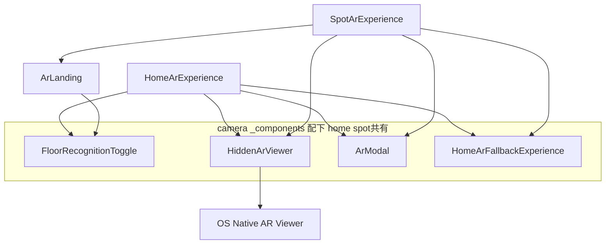
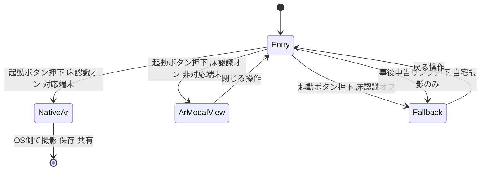

# Technical Design

## Overview

**Purpose**: 自宅撮影(`/camera`)およびスポット撮影(`/spots/[slug]/camera`)のAR撮影開始画面に、床認識のオン/オフを切り替えるトグル操作を追加する。訪問者は撮影開始前にこの状態を選択できる。

**Users**: 自宅撮影・スポット撮影のいずれかのページから記念撮影を行う訪問者(幅広い年齢層を含む)。

**Impact**: `HomeArExperience.tsx`と`SpotArExperience.tsx`の起動ロジックにトグル状態による分岐を追加する。スポット撮影ページには、既存の床検知なし代替体験(`HomeArFallbackExperience`一式)への新規結線を追加する。OS標準ARビューア(Scene Viewer/Quick Look)自体の起動ロジック・自宅撮影の既存の事後申告リンクは変更しない。

### Goals
- 両ページの撮影開始画面に、床認識のオン/オフを切り替える操作を追加する(1.1-1.4)
- オンの場合、既存のOS標準ARビューアによる起動・撮影・保存・共有の挙動を変更しない(2.1, 2.2)
- オフの場合、既存の床検知なし代替撮影体験(カメラ映像へのヒメッコ固定表示、撮影、プレビュー、保存/シェア、撮り直し)を開始する(3.1-3.6)
- スポット撮影ページに、代替撮影体験への新規結線を追加し、home同等の選択肢を提供する(4.1, 4.2)
- 新規UIをWCAG AA相当のアクセシビリティ基準で実装する(5.1-5.3)

### Non-Goals
- OS標準ARビューア(Scene Viewer/Quick Look)内部の床認識処理そのものを制御すること(技術的に不可能)
- 自宅撮影に既存する「うまく表示されなかった方はこちら」という事後申告リンク自体の変更
- 代替撮影体験内でのヒメッコの移動・回転・拡大縮小といった操作性の新規追加・改善(既存実装をそのまま利用する)
- `HomeArFallback*`系コンポーネントのリネーム(`research.md`のDesign Decisions参照)
- 自動テスト基盤の新規導入

## Boundary Commitments

### This Spec Owns
- 自宅撮影・スポット撮影の両ページの撮影開始画面への、床認識オン/オフトグルUI(新規共有コンポーネント`FloorRecognitionToggle`)の追加。
- `HomeArExperience.handleArClick`および`SpotArExperience.handleStart`への、トグル状態に基づく分岐ロジックの追加。
- スポット撮影ページへの、既存`HomeArFallbackExperience`(床検知なし代替撮影体験)の新規結線(`view`状態の追加)。
- `ArLanding.tsx`のProps拡張(トグル状態・変更コールバックの追加)。
- `scripts/gen-icons.mjs`への`toggle-on`/`toggle-off`アイコン追加と、生成物(`material-symbols.generated.ts`)の更新。

### Out of Boundary
- OS標準ARビューア(Scene Viewer/Quick Look)内部の床認識処理の実装・制御。
- 自宅撮影の既存の事後申告リンク(「うまく表示されなかった方はこちら」)自体のロジック・表示。
- `HomeArFallbackExperience`/`HomeArFallbackScene`/`OperationGuide`/`CapturedPhotoPreview`/`compositeCapture`の内部実装(ドラッグ移動・回転・ピンチ操作、撮影・保存・共有処理)。
- `HiddenArViewer`/`ArModal`/`ModelViewer`の変更(床認識オン時の起動経路)。
- 自動テスト基盤の新規導入。

### Allowed Dependencies
- `@/app/camera/_components/HomeArFallbackExperience`(既存、無改名でspot側から新規import)。
- `@/app/camera/_components/HiddenArViewer` / `ArModal` / `ModelViewer`(既存、変更なしで継続利用)。
- `@/app/_components/Icon`(`toggle-on`/`toggle-off`を新規追加)。
- `@/lib/ar/types`の`ModelConfig`(既存、変更なし)。

### Revalidation Triggers
- `HomeArFallbackExperience`/`HomeArFallbackScene`のProps契約変更(spot側も依存するため)。
- `HiddenArViewer`/`ArLanding`/`SpotArExperience`のProps契約変更。
- `android-ar-capture-fallback`spec側での事後申告リンクの仕様変更。
- `scripts/gen-icons.mjs`のNAMES一覧・生成ロジックの変更。

## Architecture

### Existing Architecture Analysis
- 自宅撮影(`HomeArExperience.tsx`)は`view: "home" | "fallback"`を保持し、`handleArClick`で`canActivateAR`判定→`activateAR()`/`ArModal`分岐、または既存の事後申告ボタンから`setView("fallback")`で代替体験に切替える。
- スポット撮影(`SpotArExperience.tsx`)は`showArModal`のみの単純な状態で、`handleStart`で同様の`canActivateAR`判定を行うが、代替体験への切替経路は存在しない。
- `HomeArFallbackExperience`/`HomeArFallbackScene`/`OperationGuide`/`CapturedPhotoPreview`は`ModelConfig`と汎用コールバックのみに依存し、home固有のデータを持たない。`spot-camera-markerless`specで確立された「`app/camera/_components`をspotが無改名で再利用する」前例に倣い、本specでも同様に再利用する。

### Architecture Pattern & Boundary Map



**Architecture Integration**:
- Selected pattern: 各ページのオーケストレーター(`HomeArExperience`/`SpotArExperience`)がトグル状態を保持し、共有の表示専用コンポーネント(`FloorRecognitionToggle`)と既存の起動先(ネイティブAR/`ArModal`/`HomeArFallbackExperience`)を条件分岐で切り替える、既存パターンの拡張。
- Domain/feature boundaries: 状態とビジネス分岐はオーケストレーターのみが持ち、`FloorRecognitionToggle`と`ArLanding`は表示とコールバック呼び出しのみを担う(既存の`onStart`パターンと同型)。
- Existing patterns preserved: `canActivateAR`/`activateAR()`分岐、`view`によるフルスクリーン体験の切替、`app/camera/_components`のhome/spot間共有。
- New components rationale: `FloorRecognitionToggle`のみ新規。トグルUIをhome/spotで重複実装しないための共有コンポーネント。
- Steering compliance: WCAG AA(16px以上・行間1.5以上・コントラスト4.5:1以上)を新規UIに適用(`frontend-design`/`baseline-ui`)。

### Technology Stack

| Layer | Choice / Version | Role in Feature | Notes |
|-------|------------------|-----------------|-------|
| Frontend | React 19 / Next.js 15 (App Router) | トグルUIと状態分岐の実装 | 既存の`"use client"`コンポーネントパターンを踏襲 |
| アイコン | `@iconify-json/material-symbols`（既存devDependency） | `toggle-on`/`toggle-off`アイコンの追加 | `scripts/gen-icons.mjs`経由で生成。新規パッケージ追加なし |

## File Structure Plan

### New Files
- `src/app/camera/_components/FloorRecognitionToggle.tsx` — 床認識オン/オフの表示専用トグルボタン。home/spot両ページから共有利用する。

### Modified Files
- `src/app/camera/_components/HomeArExperience.tsx` — `floorRecognitionEnabled`state(初期値`true`)を追加。`handleArClick`にオフ時は`setView("fallback")`する分岐を追加。カード2(「いますぐ撮影する」)内のARボタン付近に`FloorRecognitionToggle`を配置。
- `src/app/spots/[slug]/camera/_components/SpotArExperience.tsx` — `view: "landing" | "fallback"`(初期値`"landing"`)と`floorRecognitionEnabled`state(初期値`true`)を追加。`handleStart`にオフ時は`setView("fallback")`する分岐を追加。`view === "fallback"`時に`HomeArFallbackExperience`(`model`と`onBack={() => setView("landing")}`)を表示する早期returnを追加。
- `src/app/spots/[slug]/camera/_components/ArLanding.tsx` — `floorRecognitionEnabled: boolean`・`onToggleFloorRecognition: (enabled: boolean) => void`をPropsに追加し、AR起動ボタン付近に`FloorRecognitionToggle`を配置。
- `scripts/gen-icons.mjs` — `NAMES`配列に`"toggle-on"`, `"toggle-off"`を追加。
- `src/app/_components/icons/material-symbols.generated.ts` — `node scripts/gen-icons.mjs`の再実行により`toggle-on`/`toggle-off`のアイコンデータを追加生成する(直接編集しない)。

### Reused Files (無変更)
本specはこれらのファイルをimportして呼び出すのみで、内部実装は変更しない(Out of Boundary)。
- `src/app/camera/_components/HomeArFallbackExperience.tsx`
- `src/app/camera/_components/HomeArFallbackScene.tsx`
- `src/app/camera/_components/OperationGuide.tsx`
- `src/app/camera/_components/CapturedPhotoPreview.tsx`
- `src/app/camera/_components/HiddenArViewer.tsx`
- `src/app/camera/_components/ArModal.tsx`
- `src/app/camera/_components/ModelViewer.tsx`
- `src/lib/ar/capture.ts`
- `src/lib/ar/types.ts`

## System Flows

両ページの撮影開始画面における状態遷移(homeとspotで同型):



- 「Entry」画面にのみ`FloorRecognitionToggle`が表示される。ネイティブAR起動後・`ArModalView`表示中・`Fallback`体験中はトグルは表示されないため、トグルの表示状態と起動済み体験の間で不整合が生じる余地はない。
- 「事後申告リンク押下」による`Fallback`への遷移は自宅撮影のみに存在する既存経路であり、トグルの状態には影響されず動作する(Out of Boundary)。
- トグルの状態(`floorRecognitionEnabled`)は`Entry`⇄`Fallback`⇄`ArModalView`の往復で保持され、ページの新規読み込み時のみ`true`にリセットされる(`research.md`のDesign Decisions参照)。

## Requirements Traceability

| Requirement | Summary | Components | Interfaces | Flows |
|-------------|---------|------------|------------|-------|
| 1.1 | トグル操作の表示 | FloorRecognitionToggle, HomeArExperience, ArLanding | `FloorRecognitionToggleProps` | Entry表示 |
| 1.2 | 新規到達時はオン | HomeArExperience, SpotArExperience | `floorRecognitionEnabled`初期値 | Entry表示 |
| 1.3 | 状態の視覚的判別 | FloorRecognitionToggle | `FloorRecognitionToggleProps` | — |
| 1.4 | タップで状態反映 | FloorRecognitionToggle, HomeArExperience, SpotArExperience | `onChange` | — |
| 2.1 | オンでのネイティブAR起動 | HomeArExperience, SpotArExperience, HiddenArViewer | `handleArClick`/`handleStart` | Entry→NativeAr |
| 2.2 | オン時の挙動不変 | HomeArExperience, SpotArExperience | (既存ロジック不変) | Entry→NativeAr / ArModalView |
| 3.1 | オフでの代替体験開始 | HomeArExperience, SpotArExperience, HomeArFallbackExperience | `handleArClick`/`handleStart` | Entry→Fallback |
| 3.2 | カメラアクセス要求 | HomeArFallbackExperience, HomeArFallbackScene(再利用) | — | Fallback内部(既存) |
| 3.3 | カメラ拒否時の案内 | HomeArFallbackExperience(再利用) | — | Fallback内部(既存) |
| 3.4 | 撮影ボタン・戻る操作の表示 | HomeArFallbackExperience(再利用) | — | Fallback内部(既存) |
| 3.5 | 撮影・保存/シェア/撮り直し | HomeArFallbackScene, CapturedPhotoPreview(再利用) | — | Fallback内部(既存) |
| 3.6 | 初期化/撮影失敗時のエラー | HomeArFallbackExperience(再利用) | — | Fallback内部(既存) |
| 4.1 | スポットへの同一トグル提供 | ArLanding, SpotArExperience, FloorRecognitionToggle | `ArLandingProps`拡張 | Entry表示 |
| 4.2 | スポットモデルでの代替体験起動 | SpotArExperience, HomeArFallbackExperience | `HomeArFallbackExperienceProps.model` | Entry→Fallback |
| 5.1 | 48x48px タップ領域 | FloorRecognitionToggle | — | — |
| 5.2 | アクセシブルラベル | FloorRecognitionToggle | `aria-checked`/`aria-labelledby` | — |
| 5.3 | 16px/1.5/コントラスト4.5:1 | FloorRecognitionToggle | — | — |

## Components and Interfaces

| Component | Domain/Layer | Intent | Req Coverage | Key Dependencies | Contracts |
|-----------|--------------|--------|---------------|-------------------|-----------|
| FloorRecognitionToggle | UI (camera, 共有) | 床認識オン/オフの表示・切替操作 | 1.1, 1.3, 1.4, 4.1, 5.1, 5.2, 5.3 | Icon (P2) | Props |
| HomeArExperience(変更) | UI (home camera) | 自宅撮影の起動オーケストレーションとトグル状態保持 | 1.1, 1.2, 1.4, 2.1, 2.2, 3.1 | FloorRecognitionToggle (P1), HiddenArViewer (P0), HomeArFallbackExperience (P0), ArModal (P1) | State |
| SpotArExperience(変更) | UI (spot camera) | スポット撮影の起動オーケストレーションとトグル状態保持 | 1.1, 1.2, 1.4, 2.1, 2.2, 3.1, 4.1, 4.2 | ArLanding (P0), HiddenArViewer (P0), HomeArFallbackExperience (P0), ArModal (P1) | State |
| ArLanding(変更) | UI (spot camera) | スポットランディング表示とトグルUIの配置 | 1.1, 1.3, 1.4, 4.1 | FloorRecognitionToggle (P1), ModelViewer (P2) | Props |
| HomeArFallbackExperience(再利用・既存) | UI (camera, 共有) | 床認識オフ時の撮影体験全体(ガイド/カメラ/撮影/プレビュー) | 3.1, 3.2, 3.3, 3.4, 3.5, 3.6, 4.2 | HomeArFallbackScene (P0), OperationGuide (P1), CapturedPhotoPreview (P1) | State |

### camera (共有)

#### FloorRecognitionToggle

| Field | Detail |
|-------|--------|
| Intent | 床認識のオン/オフ状態を表示し、タップで切替コールバックを呼ぶ表示専用コンポーネント |
| Requirements | 1.1, 1.3, 1.4, 4.1, 5.1, 5.2, 5.3 |

**Responsibilities & Constraints**
- [shadcn/ui Switch](https://ui.shadcn.com/docs/components/base/switch)のtrack+thumb表現に倣ったスライド式スイッチ(`role="switch"`)として、現在の状態(`enabled`)をトラック色とサムの位置の両方で表示する(1.3。色のみに依存しない)。
- ラベル文言(「床認識機能を有効にする」)は状態にかかわらず固定表示する(スイッチの原則。レビュー指摘によりResearch Decisionを改訂、`research.md`のRevision参照)。状態依存の説明はラベルではなくスイッチ下のキャプション(「※ 床を自動で検出して〜」/「※ 手動でひめっこの位置を調整しながら〜」)でのみ出し分ける。
- タップ時に`onChange(!enabled)`を呼ぶのみで、状態自体は保持しない(状態は呼び出し元が保持)。
- `aria-checked={enabled}`と、固定ラベルへの`aria-labelledby`によるアクセシブルラベルを持つ(5.2)。
- 最小タップ領域48x48pxを満たす(5.1。スイッチの視覚サイズより大きい透明なヒット領域で確保する)。テキストは16px以上・行間1.5以上・コントラスト4.5:1以上を満たす(5.3)。

**Dependencies**
- Outbound: なし(アイコン非依存。トラック/サムはTailwindのユーティリティクラスのみで表現する)

**Contracts**: State [x] (Props経由の制御コンポーネント)

##### State Management
```typescript
export interface FloorRecognitionToggleProps {
  /** 現在、床認識がオンかどうか */
  enabled: boolean;
  /** タップ時に反転後の値で呼ばれる */
  onChange: (enabled: boolean) => void;
}
```
- State model: 内部stateを持たない制御コンポーネント。表示と`onChange`呼び出しのみを担う。
- 呼び出し元(`HomeArExperience`/`ArLanding`経由の`SpotArExperience`)が`floorRecognitionEnabled`を保持する。

**Implementation Notes**
- Integration: `HomeArExperience.tsx`内では直接配置。spot側は`ArLanding.tsx`のPropsから受け取って配置。
- Validation: `/baseline-ui`・`/fixing-accessibility`・`/fixing-motion-performance`(サムのスライドアニメーションを追加するため)を実装後に適用する。
- Risks: なし(新規外部依存なし、副作用なし)。`prefers-reduced-motion`は`src/app/globals.css`のグローバル定義で対応済み。

### home camera

#### HomeArExperience(変更)

| Field | Detail |
|-------|--------|
| Intent | 自宅撮影ページの起動オーケストレーション。床認識トグルの状態を保持し、起動先を分岐する |
| Requirements | 1.1, 1.2, 1.4, 2.1, 2.2, 3.1 |

**Responsibilities & Constraints**
- `floorRecognitionEnabled: boolean`(初期値`true`)を保持する(1.2)。
- `handleArClick`実行時、`floorRecognitionEnabled`が`false`なら`setView("fallback")`を呼び、既存の`canActivateAR`判定には進まない(3.1)。`true`の場合は既存ロジック(`canActivateAR`→`activateAR()`/`ArModal`)を変更せず実行する(2.1, 2.2)。
- 既存の事後申告ボタン(「うまく表示されなかった方はこちら」)の`onClick`(`setView("fallback")`)は変更しない(Out of Boundary)。

**Dependencies**
- Outbound: `FloorRecognitionToggle`(P1)— トグルUI表示
- Outbound: `HomeArFallbackExperience`(P0)— 既存、オフ時の代替体験(変更なし)
- Outbound: `HiddenArViewer` / `ArModal`(P0/P1)— 既存、オン時の起動経路(変更なし)

**Contracts**: State [x]

##### State Management
```typescript
const [floorRecognitionEnabled, setFloorRecognitionEnabled] = useState(true);
```
- State model: `view`(既存)と`floorRecognitionEnabled`(新規)は独立したstate。`floorRecognitionEnabled`は`view`が`"fallback"`へ切替わっても破棄されない(ページ再読み込みまで保持)。

**Implementation Notes**
- Integration: `handleArClick`の依存配列に`floorRecognitionEnabled`を追加する。
- Validation: 既存の`canActivateAR`分岐(2.1, 2.2)が本変更前後で同一に動作することを実機で確認する。
- Risks: 低。既存の`setView("fallback")`呼び出しを条件分岐に載せるのみで、実運用中のコードパスを再利用する。

### spot camera

#### SpotArExperience(変更)

| Field | Detail |
|-------|--------|
| Intent | スポット撮影ページの起動オーケストレーション。トグル状態を保持し、home同型の`view`状態機械を新規に持つ |
| Requirements | 1.1, 1.2, 1.4, 2.1, 2.2, 3.1, 4.1, 4.2 |

**Responsibilities & Constraints**
- `view: "landing" | "fallback"`(初期値`"landing"`)と`floorRecognitionEnabled: boolean`(初期値`true`)を新規に保持する(1.2)。
- `handleStart`実行時、`floorRecognitionEnabled`が`false`なら`setView("fallback")`を呼ぶ(3.1, 4.2)。`true`の場合は既存の`canActivateAR`判定を変更せず実行する(2.1, 2.2)。
- `view === "fallback"`の間は`HomeArFallbackExperience`に`model`(spotのGLBまたは既定モデル)と`onBack={() => setView("landing")}`を渡して表示する(4.2)。

**Dependencies**
- Outbound: `ArLanding`(P0)— ランディングUIとトグルUIの配置(Props拡張)
- Outbound: `HomeArFallbackExperience`(P0)— 既存、新規結線
- Outbound: `HiddenArViewer` / `ArModal`(P0/P1)— 既存、変更なし

**Contracts**: State [x]

##### State Management
```typescript
const [view, setView] = useState<"landing" | "fallback">("landing");
const [floorRecognitionEnabled, setFloorRecognitionEnabled] = useState(true);
```
- State model: `HomeArExperience`の`view`/トグルstateと同型。`view === "fallback"`の間は`ArLanding`(および内包する`FloorRecognitionToggle`)は表示されない。

**Implementation Notes**
- Integration: `HomeArFallbackExperience`は`@/app/camera/_components`から動的import(`dynamic(..., { ssr: false })`、既存の`HiddenArViewer`/`ArModal`と同じ方式)する。
- Validation: スポットに`arAssetUrl`が未登録の場合、`page.tsx`の`FALLBACK_MODEL`がオフ時の代替体験にも渡ることを確認する(4.2)。
- Risks: 低〜中。home側で確立済みパターンの横展開だが、spotには床検知なしモードの受け口が現状無いため新規結線が必要。

#### ArLanding(変更)

| Field | Detail |
|-------|--------|
| Intent | スポットランディング表示(名前・3Dプレビュー・説明文・ARボタン)にトグルUIを追加配置する |
| Requirements | 1.1, 1.3, 1.4, 4.1 |

**Contracts**: State [x] (Props経由)
```typescript
export interface ArLandingProps {
  spot: { name: string; himekkoDescription?: string | null; arAssetUrl?: string | null };
  onStart: () => void;
  /** 床認識が現在オンかどうか */
  floorRecognitionEnabled: boolean;
  /** トグル操作時に反転後の値で呼ばれる */
  onToggleFloorRecognition: (enabled: boolean) => void;
}
```

**Implementation Notes**
- Integration: 既存の「ARで撮影する」ボタンの直前または直後に`<FloorRecognitionToggle enabled={floorRecognitionEnabled} onChange={onToggleFloorRecognition} />`を配置する。
- Validation: 既存の16px/行間1.5/コントラスト4.5:1のパターンをトグル配置後も維持する。
- Risks: なし。表示専用コンポーネントへのProps追加のみ。

## Error Handling

### Error Strategy
- トグル自体はネットワーク/非同期処理を持たない同期的なUI操作であり、専用のエラー状態を持たない。
- オフ選択後の代替撮影体験内のエラー処理(カメラ拒否・初期化失敗・撮影失敗)は`HomeArFallbackExperience`/`HomeArFallbackScene`の既存実装をそのまま利用する(3.3, 3.6。詳細は`android-ar-capture-fallback`spec参照)。
- オン選択時、非対応端末での`ArModal`表示による縮退は既存実装をそのまま利用する(2.2)。
- 3.4「撮影ボタンと前の画面へ戻る操作を表示する」は、代替撮影体験が有効な間の全サブフェーズで両方が同時に表示されることを意味しない。既存の`HomeArFallbackExperience`の内部状態machineに従い、撮影ボタンは`ready`相当のサブフェーズ(カメラ・モデルの準備完了後)でのみ表示され、`guide`/`camera-denied`/`error`サブフェーズでは表示されない。戻る操作は全サブフェーズで提供されるが、`error`サブフェーズのみ「再試行」と対になった専用ボタンに統合される。この既存挙動は本specでは変更しない。

### Monitoring
- 追加のログ/監視は導入しない(既存の自宅撮影・スポット撮影と同等の可観測性を踏襲)。

## Testing Strategy

本プロジェクトには自動テストランナーが導入されていないため(`research.md`参照)、既存2spec(`android-ar-capture-fallback`/`spot-camera-markerless`)と同様に手動確認・実機E2E確認を中心に記述する。

### 手動確認(コンポーネント単位)
- 自宅撮影・スポット撮影の両ページで、初回表示時に床認識トグルが「オン」状態で表示されること(1.2)。
- トグルをタップするとトラック色・サムの位置・`aria-checked`が「オフ」に切り替わり、再タップで「オン」に戻ること(1.3, 1.4)。ラベル文言(「床認識機能を有効にする」)は状態にかかわらず変化しないこと。下部のキャプションのみ状態に応じて切り替わること。
- トグルがオンのまま「ARで撮影する」を押した場合、`canActivateAR`に応じてネイティブAR起動または`ArModal`表示という、本仕様導入前と同一の分岐になること(2.1, 2.2)。
- トグルがオフの状態で「ARで撮影する」を押すと、操作方法ガイド→カメラ許可要求→固定表示→撮影→プレビュー(保存/シェア/撮り直し)の代替撮影体験が開始すること(3.1-3.5)。
- カメラ許可を拒否した場合、初期化に失敗した場合にそれぞれ既存の案内・エラー表示が出ること(3.3, 3.6)。
- 自宅撮影で、既存の「うまく表示されなかった方はこちら」がトグルの状態に関わらず変更なく動作すること(Out of Boundary回帰確認)。
- 床認識をオフにした状態で代替撮影体験に入り、「戻る」操作でEntry画面に戻った際、トグルが「オフ」のまま保持され、オンに戻っていないこと(1.2の裏返し確認。`research.md`のDesign Decisions「トグル状態のライフサイクル」参照)。

### スポット撮影固有の確認
- スポットに`arAssetUrl`が設定されている場合・未設定(既定モデルへのフォールバック)の場合の両方で、オフ時の代替体験にそのモデルが反映されること(4.2)。

### アクセシビリティ確認
- トグルボタンのタップ領域が48x48px以上であること(5.1)。
- スクリーンリーダーでトグルの現在状態(オン/オフ)が`aria-checked`として読み上げられ、ラベル(「床認識機能を有効にする」)が状態にかかわらず一貫して読み上げられること(5.2)。
- トグルのテキストが16px以上・行間1.5以上・コントラスト比4.5:1以上を満たすこと(5.3)。
- サムのスライドアニメーションが`prefers-reduced-motion: reduce`環境で抑制されること(`/fixing-motion-performance`確認)。

### E2E/実機確認
- Android(Scene Viewer対応端末): オン→Scene Viewer起動→撮影→端末保存/共有。オフ→代替体験→撮影→保存/共有。
- iOS(Quick Look対応端末): 同上。
- 非対応端末(`canActivateAR=false`): オンのまま起動して`ArModal`が表示される既存動作に回帰がないこと。
