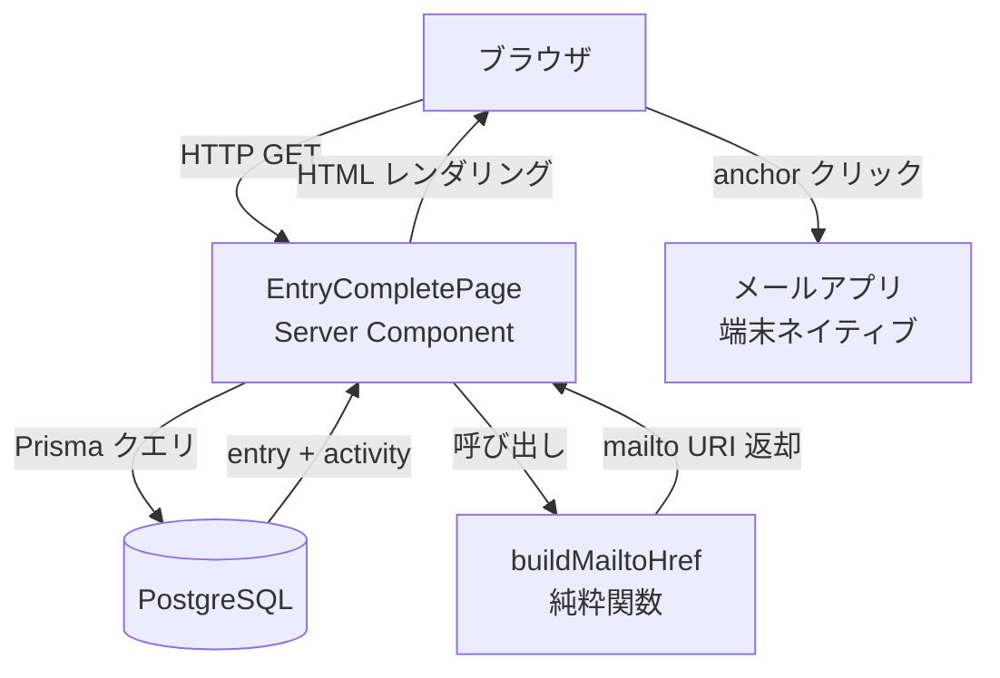

# 技術設計書

## Overview

本機能は、Arcana 申込完了画面に `mailto:` リンクによる「メールで送る」ボタンを追加する。訪問者は任意でタップすることで、予約内容（アクティビティ名・ID・日時・予約者名）が件名・本文に入力済みの状態でメールアプリを起動できる。サーバー側のメール送信・メールアドレスの保存は一切行わない。

### Goals

- 予約内容を自分のメールアドレスに残したいユーザーへのワンタップ手段を提供する
- サーバー側処理・個人情報保存なしで完結させる
- WCAG AA 準拠のアクセシブルな UI を実装する

### Non-Goals

- メールアドレスの DB 保存
- サーバー側からのメール送信（Resend 等）
- メール送信の成否トラッキング
- メールアドレスの入力フォーム追加

---

## Architecture

### Existing Architecture Analysis

- 完了画面 `src/app/entries/[cancelToken]/complete/page.tsx` は Next.js App Router の async Server Component
- `getEntryByToken()` で cancelToken を使い Entry 情報と紐づく Activity（title, id, startDate, endDate）および予約者名を取得済み
- スタイルは TailwindCSS + CSS 変数任意値（`[var(--color-xxx)]`）パターン

### Architecture Pattern & Boundary Map



**Architecture Integration**:
- 選択パターン: Server Component インライン拡張（新規ファイル・Client Component 不要）
- 既存パターン踏襲: Server Component + Prisma 直接呼び出し（Steering 準拠）
- 新規コンポーネント: なし。`page.tsx` に `buildMailtoHref` 純粋関数と `<a>` タグを追加するのみ

### Technology Stack

| Layer | Choice / Version | Role in Feature | Notes |
|-------|-----------------|-----------------|-------|
| Frontend | React 19 / Next.js 15 Server Component | mailto アンカー描画 | Client Component 変換不要 |
| URI 構築 | `encodeURIComponent`（標準組み込み） | mailto URI の日本語エンコード | 外部ライブラリ不要 |

---

## Requirements Traceability

| 要件 | 概要 | コンポーネント | インターフェース | フロー |
|------|------|---------------|-----------------|--------|
| 1.1 | ボタン表示位置 | `ApplyCompletePage` | — | 静的描画 |
| 1.2 | activity 取得成功時のみ表示 | `ApplyCompletePage` | — | 条件分岐 |
| 1.3 | activity 未取得時は非表示 | `ApplyCompletePage` | — | 条件分岐 |
| 2.1 | タップでメールアプリ起動 | `<a href>` アンカー | mailto URI | ブラウザネイティブ |
| 2.2 | 件名設定 | `buildMailtoHref` | `MailtoParams` | URI 生成 |
| 2.3 | 本文に予約内容含める | `buildMailtoHref` | `MailtoParams` | URI 生成 |
| 2.4 | `to` フィールド空 | `buildMailtoHref` | `MailtoParams` | URI 生成 |
| 2.5 | URL エンコード | `buildMailtoHref` | `MailtoParams` | `encodeURIComponent` |
| 3.1–3.4 | サーバー非関与 | アーキテクチャ全体 | — | クライアントのみで完結 |
| 4.1 | タッチターゲット 48px | `<a>` スタイル | — | `min-h-12` クラス |
| 4.2 | フォントサイズ 16px 以上 | `<a>` スタイル | — | `text-base` 以上 |
| 4.3 | コントラスト比 4.5:1 以上 | `<a>` スタイル | — | カラートークン使用 |
| 4.4 | スクリーンリーダー対応 | `<a>` 属性 | — | 視覚ラベルテキスト |
| 4.5 | 補足テキスト | 隣接テキスト描画 | — | 静的テキスト |

---

## Components and Interfaces

### コンポーネントサマリー

| Component | Domain/Layer | Intent | Req Coverage | Key Dependencies | Contracts |
|-----------|-------------|--------|--------------|-----------------|-----------|
| `buildMailtoHref` | ロジック / ユーティリティ | mailto URI を構築する純粋関数 | 2.2, 2.3, 2.4, 2.5 | `formatDateTime`（P1） | Service |
| `EntryCompletePage` (拡張) | UI / Page | ボタン表示・非表示制御と描画 | 1.1, 1.2, 1.3, 3.1–3.4, 4.1–4.5 | `buildMailtoHref`（P0） | State |

---

### ロジック / ユーティリティ

#### `buildMailtoHref`

| Field | Detail |
|-------|--------|
| Intent | 予約内容から `mailto:` URI 文字列を生成する |
| Requirements | 2.2, 2.3, 2.4, 2.5 |

**Responsibilities & Constraints**
- `MailtoParams` を受け取り `mailto:` URI 文字列を返す純粋関数
- サイドエフェクトなし・非同期処理なし
- 件名・本文の全文字列を `encodeURIComponent` でエンコードする

**Dependencies**
- Inbound: `ApplyCompletePage` — URI 生成依頼（P0）
- Outbound: `formatDateTime` — 日時フォーマット（P1）

**Contracts**: Service [x]

##### Service Interface

```typescript
interface MailtoParams {
  title: string;
  id: number;
  startDate: Date;
  endDate: Date | null;
  entryName: string | null;
}

function buildMailtoHref(params: MailtoParams): string;
```

- Preconditions: `params.title` および `params.id` は非空値
- Postconditions: 返却値は `"mailto:?subject=...&body=..."` 形式の文字列
- Invariants: `to` フィールドは常に空（宛先なし）

**件名・本文フォーマット仕様**

```
件名: 【Arcana】予約完了のお知らせ

本文:
■ 予約内容

アクティビティ名：{title}
アクティビティID：{id}
実施日時：{startDate の日本語フォーマット}[ 〜 {endDate の日本語フォーマット}]
予約者名：{entryName}（entryName が null の場合は行を省略）
```

**Implementation Notes**
- Integration: `page.tsx` 内の関数として定義。単一ファイル変更のみ
- Validation: `activity` が `null` の場合は呼び出し元で分岐し、この関数は呼ばれない
- Risks: mailto URI の最大長（OS依存）は今回の本文量（～200文字）では問題なし（research.md 参照）

---

### UI / Page

#### `ApplyCompletePage`（拡張部分）

| Field | Detail |
|-------|--------|
| Intent | activity 取得結果に応じてメール送信ボタンを条件描画する |
| Requirements | 1.1, 1.2, 1.3, 3.1–3.4, 4.1–4.5 |

**Responsibilities & Constraints**
- `activity !== null` の場合のみ `buildMailtoHref` を呼び出しボタンを描画（要件 1.2/1.3）
- スクリーンショット案内の直下にボタンを配置（要件 1.1）
- `<a>` タグをボタン様スタイルで描画。`role` 属性追加不要（`href` があるため anchor セマンティクスが適切）

**Contracts**: State [x]

##### State Management

- State model: Server Component のため状態なし。`activity` / `entryName` はサーバーサイドで解決済み
- Persistence: なし
- Concurrency strategy: 不要

**ボタン描画仕様（JSX 構造）**

```
{activity && (
  <section aria-label="メール送信">
    <a href={buildMailtoHref({...})} className="...">
      メールで送る
    </a>
    <p>メールアプリが開きます</p>
  </section>
)}
```

**スタイル要件（要件 4.1–4.3）**:
- `min-h-12`（48px タッチターゲット）
- `text-base` 以上（16px）
- 背景色: `var(--color-secondary-400)`、文字色: `var(--color-neutral-0)` — コントラスト比 4.5:1 以上を満たすこと（実装時に検証）

**Implementation Notes**
- Integration: `page.tsx` の JSX にセクション追加のみ。既存 `activity &&` パターンを踏襲
- Validation: `href` 属性は必ず文字列（`buildMailtoHref` の戻り値）。`null` にならない
- Risks: メールアプリ未設定 PC では動作しない。補足テキスト（要件 4.5）で事前告知

---

## Error Handling

### Error Strategy

本機能はサーバー側処理を持たないためシステムエラーは発生しない。ユーザー環境起因の問題のみ対処する。

### Error Categories and Responses

| ケース | 原因 | 対応 |
|--------|------|------|
| ボタン非表示 | `activity` 未取得（未公開・削除済み） | ボタンを描画しない（要件 1.3） |
| メールアプリ未起動 | PC でメールクライアント未設定 | 補足テキスト「メールアプリが開きます」で事前案内（要件 4.5） |
| 文字化け | エンコード漏れ | `encodeURIComponent` を全フィールドに適用（要件 2.5） |

---

## Testing Strategy

### Unit Tests

- `buildMailtoHref`: 正常系（entryName あり・なし、endDate あり・なし）の URI 出力検証
- `buildMailtoHref`: 日本語文字が `encodeURIComponent` で正しくエンコードされること
- `buildMailtoHref`: `to` フィールドが空であること（`mailto:?` で始まること）

### E2E / UI Tests

- 申込完了後、完了画面に「メールで送る」ボタンが表示されること
- ボタンが 48px 以上のタッチターゲットを持つこと
- 未公開アクティビティの完了画面（activity=null）でボタンが非表示であること

---

## Security Considerations

- メールアドレスはサーバーに送信されない（要件 3.1–3.4 対応）
- mailto URI に含まれる予約者名は DB から取得した値のみ（URL パラメータ由来の値は使用しない）
- `encodeURIComponent` によるエスケープでインジェクション対策済み
