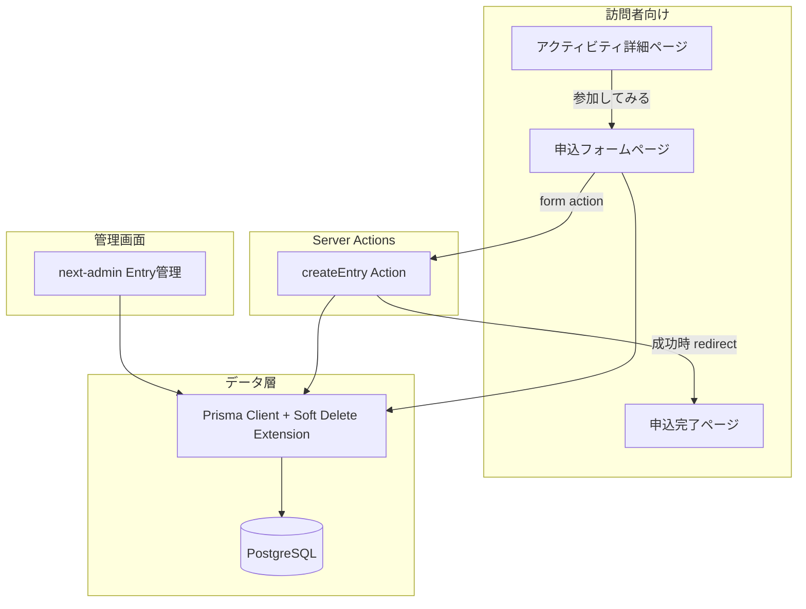
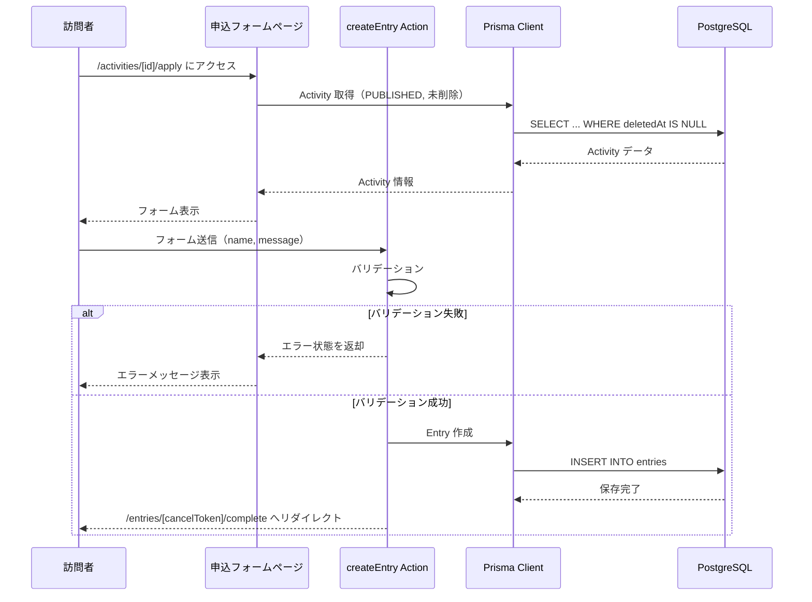
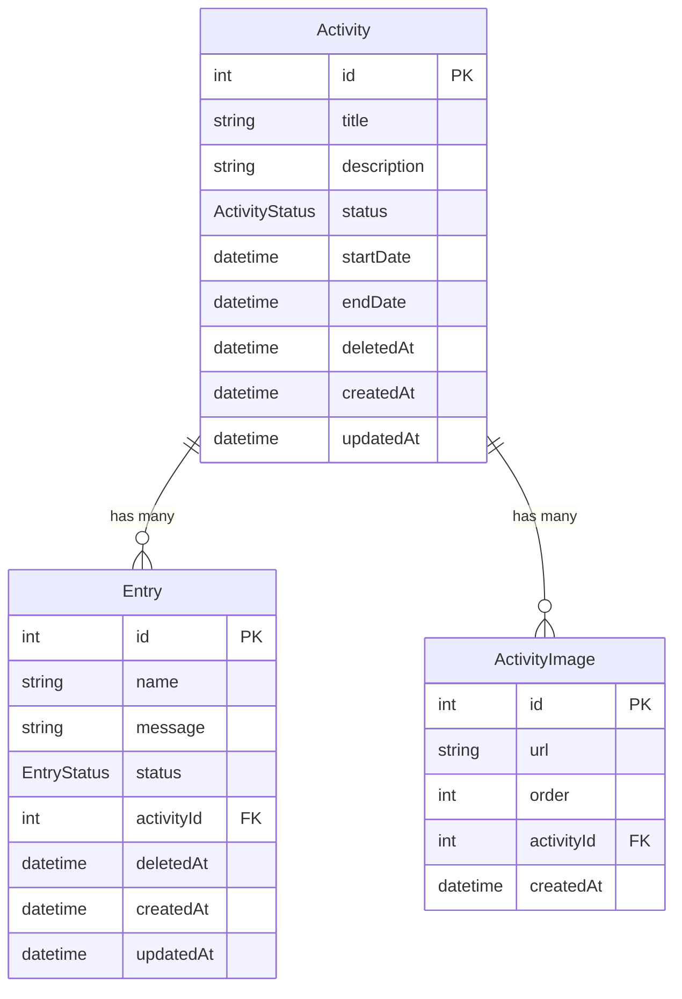

# Design Document: Entry（参加エントリー）

## Overview

**Purpose**: 訪問者が交流コンテンツへの参加意思を軽量なフォームで伝え、管理者が申込を一覧・ステータス管理する機能を提供する。併せて、Activity・Entry 両モデルに論理削除を導入し、データの整合性と追跡性を確保する。

**Users**: 訪問者は申込フォームと完了画面を利用し、管理者は next-admin ベースの管理画面で申込を確認・対応する。

**Impact**: 既存の Activity モデルに `deletedAt` フィールドとリレーション（Entry）を追加。既存の `/activities/[id]/apply` プレースホルダーページを実装で差し替え。管理画面に Entry モデルを追加。

### Goals
- 訪問者が名前とメッセージだけで参加意思を表明できる軽量フォームの提供
- 管理者が申込の一覧確認・ステータス管理を行える管理画面の提供
- Activity・Entry の論理削除による安全なデータ管理

### Non-Goals
- 訪問者のアカウント・ログイン機能
- メール通知機能（将来スコープ）
- 申込のキャンセル・編集機能（訪問者側）
- 削除済みレコードの管理画面での閲覧・復元 UI

## Architecture

### Existing Architecture Analysis

現在のシステムは Next.js 15 App Router ベースのフルスタック構成で、以下のパターンが確立されている：

- **訪問者向けページ**: `src/app/activities/` 配下に Server Components として実装。Prisma Client で直接 DB アクセス
- **管理画面**: `src/app/admin/` で next-admin を使用。`options.ts` にモデル設定を集約
- **データアクセス**: `src/lib/prisma.ts` でシングルトン Prisma Client を提供。`@prisma/adapter-pg` 使用
- **申込導線**: `/activities/[id]/apply` にプレースホルダーページが存在

### Architecture Pattern & Boundary Map



**Architecture Integration**:
- **Selected pattern**: 既存の Server Components + Prisma 直接アクセスパターンを踏襲。フォーム送信には Server Actions を使用
- **Domain boundaries**: 訪問者向け UI（`src/app/activities/`）、管理画面（`src/app/admin/`）、データアクセス（`src/lib/`）の既存境界を維持
- **New components rationale**: Server Action（フォーム処理）、Prisma 論理削除 Extension（横断的関心事）、完了ページ（UX 要件）の 3 点のみ追加

### Technology Stack

| Layer | Choice / Version | Role in Feature | Notes |
|-------|------------------|-----------------|-------|
| Frontend | Next.js 15 App Router / React 19 | 申込フォーム・完了ページの Server Components | 既存スタック踏襲 |
| Form Processing | Server Actions + useActionState | フォームバリデーション・送信処理 | API Route 不要（`research.md` 参照） |
| Admin | next-admin | Entry モデルの CRUD・ステータス管理 | `options.ts` への設定追加のみ |
| ORM | Prisma 7 + Client Extensions | 論理削除の透過的実装、Entry モデル管理 | `$extends()` でクエリ層変換 |
| Database | PostgreSQL | Entry テーブル追加、Activity に deletedAt 追加 | インデックス付与 |

## System Flows

### 申込フォーム送信フロー



## Requirements Traceability

| Requirement | Summary | Components | Interfaces | Flows |
|-------------|---------|------------|------------|-------|
| 1.1, 1.2, 1.3 | 申込フォーム表示・フィールド・アクティビティ情報 | EntryFormPage | — | 申込フォーム送信フロー |
| 1.4 | 非公開・削除済みアクティビティの申込不可 | EntryFormPage, SoftDeleteExtension | — | 申込フォーム送信フロー |
| 1.5 | 詳細ページへの戻る導線 | EntryFormPage | — | — |
| 2.1, 2.2 | バリデーション・エラー表示 | createEntryAction | ActionState | 申込フォーム送信フロー |
| 2.3 | DB 保存 | createEntryAction | — | 申込フォーム送信フロー |
| 2.4 | サーバーエラー時のエラー表示 | createEntryAction | ActionState | 申込フォーム送信フロー |
| 3.1, 3.2, 3.3, 3.4 | 完了画面表示・導線 | EntryCompletePage | — | — |
| 4.1, 4.2, 4.3 | Entry データモデル・ステータス | Prisma Schema (Entry) | — | — |
| 4.4, 4.5 | Entry 論理削除 | SoftDeleteExtension, Prisma Schema | — | — |
| 5.1, 5.5 | Activity 論理削除・インデックス | Prisma Schema (Activity) | — | — |
| 5.2, 5.3 | 論理削除済み Activity の非表示 | SoftDeleteExtension | — | — |
| 5.4 | 論理削除後の外部キー維持 | Prisma Schema | — | — |
| 6.1, 6.2, 6.3, 6.4 | 管理者向け申込一覧 | next-admin Entry Config | — | — |
| 7.1, 7.2, 7.3, 7.4 | 管理者ステータス管理・フィルタ | next-admin Entry Config | — | — |
| 8.1–8.6 | アクセシビリティ | EntryFormPage, EntryCompletePage | — | — |

## Components and Interfaces

| Component | Domain/Layer | Intent | Req Coverage | Key Dependencies | Contracts |
|-----------|--------------|--------|--------------|-----------------|-----------|
| Prisma Schema Changes | Data | Entry モデル追加、Activity に deletedAt 追加 | 4.1–4.3, 5.1, 5.4, 5.5 | Prisma 7 (P0) | — |
| SoftDeleteExtension | Data | 論理削除の透過的クエリ変換 | 4.4, 4.5, 5.2, 5.3 | Prisma Client (P0) | Service |
| EntryFormPage | UI | 申込フォーム表示・送信 | 1.1–1.5, 2.1–2.4, 8.1–8.6 | createEntryAction (P0), Prisma (P0) | State |
| createEntryAction | Server | フォームバリデーション・Entry 保存 | 2.1–2.4, 3.1 | Prisma Client (P0) | Service |
| EntryCompletePage | UI | 申込完了メッセージ・導線表示 | 3.1–3.4 | Prisma Client (P1) | — |
| next-admin Entry Config | Admin | Entry の CRUD・ステータス管理 UI | 6.1–6.4, 7.1–7.4 | next-admin (P0), Prisma (P0) | — |

### Data Layer

#### Prisma Schema Changes

| Field | Detail |
|-------|--------|
| Intent | Entry モデルの新規作成、Activity モデルへの論理削除フィールド追加 |
| Requirements | 4.1, 4.2, 4.3, 5.1, 5.4, 5.5 |

**Responsibilities & Constraints**
- Entry モデル: id, name, message, status, activityId, deletedAt, createdAt, updatedAt
- EntryStatus enum: NEW, IN_PROGRESS, DONE
- Activity モデル: deletedAt フィールド追加、entries リレーション追加
- deletedAt にインデックス付与（Activity, Entry 両方）
- activityId に外部キー制約（onDelete は制限なし — Activity 側は論理削除のため物理削除されない前提）

#### SoftDeleteExtension

| Field | Detail |
|-------|--------|
| Intent | Prisma Client に論理削除の透過的クエリ変換を適用 |
| Requirements | 4.4, 4.5, 5.2, 5.3 |

**Responsibilities & Constraints**
- `delete` 操作を `update({ deletedAt: new Date() })` に変換
- `findMany`, `findFirst`, `findUnique` に `deletedAt: null` フィルタを自動付与
- `count` クエリにも同様のフィルタを適用
- 対象モデル: Activity, Entry（deletedAt フィールドを持つモデルに限定）

**Dependencies**
- Inbound: すべての Prisma Client 利用箇所 — 透過的に適用 (P0)

**Contracts**: Service [x]

##### Service Interface
```typescript
// src/lib/prisma.ts に適用する Prisma Client Extension
// 論理削除対象モデルの型定義
type SoftDeletableModel = "activity" | "entry";

// Extension は PrismaClient.$extends() で適用
// 以下の動作を保証:
// - delete({ where }) → update({ where, data: { deletedAt: new Date() } })
// - findMany({ where }) → findMany({ where: { ...where, deletedAt: null } })
// - findFirst({ where }) → findFirst({ where: { ...where, deletedAt: null } })
// - count({ where }) → count({ where: { ...where, deletedAt: null } })
```

**Implementation Notes**
- `src/lib/prisma.ts` の既存 PrismaClient インスタンスに `$extends()` を追加
- next-admin は同じインスタンスを共有するため、管理画面でも論理削除が自動適用される
- 削除済みレコードを取得する必要がある場合は、将来的に拡張なしの別インスタンスまたは raw query で対応（現スコープ外）

### UI Layer

#### EntryFormPage

| Field | Detail |
|-------|--------|
| Intent | 訪問者向け申込フォームの表示とインタラクション |
| Requirements | 1.1, 1.2, 1.3, 1.4, 1.5, 2.1, 2.2, 2.3, 2.4, 8.1–8.6 |

**Responsibilities & Constraints**
- Server Component として Activity データを取得（PUBLISHED かつ未削除のみ）
- Client Component のフォーム部分で `useActionState` を使用してバリデーションエラーを表示
- `useFormStatus` で送信中のボタン無効化（二重送信防止）
- アクティビティのタイトル・開始日をフォーム上部に表示

**Dependencies**
- Outbound: createEntryAction — フォーム送信処理 (P0)
- Outbound: Prisma Client — Activity データ取得 (P0)

**Contracts**: State [x]

##### State Management

```typescript
// Server Action の戻り値型
type EntryFormState = {
  errors: {
    name?: string;
    server?: string;
  };
};
```

**Implementation Notes**
- 既存の `/activities/[id]/apply/page.tsx`（プレースホルダー）を差し替え
- フォーム部分は Client Component として分離（`useActionState`, `useFormStatus` 使用のため）
- ページ本体は Server Component（Activity データ取得）
- WCAG AA: フォームラベルの `htmlFor` 関連付け、エラー時の `aria-describedby` + `aria-live="polite"` リージョン
- 最小フォントサイズ 14px、行間 1.5、コントラスト比 4.5:1 以上

### Server Layer

#### createEntryAction

| Field | Detail |
|-------|--------|
| Intent | 申込フォームのバリデーションと Entry レコードの保存 |
| Requirements | 2.1, 2.2, 2.3, 2.4, 3.1 |

**Responsibilities & Constraints**
- `"use server"` ディレクティブで Server Action として定義
- name フィールドの必須バリデーション（空文字・空白のみを拒否）
- activityId の存在確認（PUBLISHED かつ未削除）
- バリデーション成功時に Entry を DB 保存し、完了ページへリダイレクト
- サーバーエラー時は `EntryFormState` でエラーを返却

**Dependencies**
- Inbound: EntryFormPage — form action として呼び出し (P0)
- Outbound: Prisma Client — Entry 作成、Activity 検証 (P0)

**Contracts**: Service [x]

##### Service Interface
```typescript
// Server Action signature
function createEntry(
  activityId: number,
  prevState: EntryFormState,
  formData: FormData
): Promise<EntryFormState>;

// 処理フロー:
// 1. formData から name, message を抽出
// 2. name の必須バリデーション
// 3. activityId で Activity を取得（PUBLISHED, 未削除）
// 4. Activity 不在の場合はエラー返却
// 5. Entry を作成（status: NEW）
// 6. redirect(`/entries/${cancelToken}/complete`)
```

**Implementation Notes**
- `activityId` は Server Action の第 1 引数として `bind` で渡す（フォーム hidden field ではなく）
- `redirect()` は try/catch の外で呼び出す（Next.js の redirect は例外をスローするため）

#### EntryCompletePage

| Field | Detail |
|-------|--------|
| Intent | 申込完了メッセージと次のアクションへの導線を表示 |
| Requirements | 3.1, 3.2, 3.3, 3.4 |

**Responsibilities & Constraints**
- Server Component として Activity データを取得（タイトル表示用）
- 完了メッセージ、交流コンテンツ一覧・アクティビティ詳細への導線を表示

**Dependencies**
- Outbound: Prisma Client — Activity タイトル取得 (P1)

**Implementation Notes**
- ルート: `/entries/[cancelToken]/complete/page.tsx`
- cancelToken で Entry を取得し、紐づく Activity 情報を表示
- 既存レイアウト (`entries/layout.tsx`) が自動適用

### Admin Layer

#### next-admin Entry Config

| Field | Detail |
|-------|--------|
| Intent | next-admin で Entry モデルの一覧・詳細・ステータス管理を提供 |
| Requirements | 6.1, 6.2, 6.3, 6.4, 7.1, 7.2, 7.3, 7.4 |

**Responsibilities & Constraints**
- `src/app/admin/options.ts` に Entry モデルの設定を追加
- サイドバーに「申込管理」グループを追加
- 一覧: name, activity (リレーション), status, createdAt を表示
- フィルタ: すべて / 新規 / 対応中 / 対応済み
- デフォルトソート: createdAt 降順
- ステータスの日本語ラベル表示（formatter）

**Dependencies**
- External: next-admin — CRUD UI 自動生成 (P0)
- Outbound: Prisma Client — Entry データアクセス (P0)

**Implementation Notes**
- Activity の既存設定パターン（aliases, list.filters, list.fields.formatter）を踏襲
- リレーション先の Activity 名は next-admin の `toString` で自動解決
- 論理削除は SoftDeleteExtension により透過的に処理されるため、next-admin 側の特別な設定は不要

## Data Models

### Domain Model



**Business Rules & Invariants**:
- Entry は必ず 1 つの Activity に紐づく
- Entry の作成は PUBLISHED かつ未削除の Activity に対してのみ可能
- Activity が論理削除されても、紐づく Entry の activityId は維持される
- EntryStatus の遷移: NEW → IN_PROGRESS → DONE（管理者操作）

### Physical Data Model

**Entry テーブル (`entries`)**:

| Column | Type | Constraints | Notes |
|--------|------|------------|-------|
| id | SERIAL | PK | 自動採番 |
| name | VARCHAR | NOT NULL | 申込者名 |
| message | TEXT | NULLABLE | 任意メッセージ |
| status | EntryStatus | NOT NULL, DEFAULT 'NEW' | enum: NEW, IN_PROGRESS, DONE |
| activityId | INTEGER | NOT NULL, FK → activities(id) | リレーション |
| deletedAt | TIMESTAMP | NULLABLE | NULL = 未削除 |
| createdAt | TIMESTAMP | NOT NULL, DEFAULT now() | 作成日時 |
| updatedAt | TIMESTAMP | NOT NULL, auto | 更新日時 |

**インデックス**:
- `entries(deletedAt)` — 論理削除フィルタの高速化
- `entries(activityId)` — リレーションクエリの高速化

**Activity テーブル変更**:
- `deletedAt TIMESTAMP NULLABLE` カラム追加
- `activities(deletedAt)` インデックス追加

## Error Handling

### Error Categories and Responses

**User Errors (4xx)**:
- 名前未入力 → フィールドレベルのバリデーションエラー表示（`errors.name`）
- 非公開/削除済み Activity への申込 → 申込不可メッセージ（フォーム非表示）
- 存在しない Activity → 404 ページ（Next.js `notFound()`）

**System Errors (5xx)**:
- DB 保存失敗 → 汎用エラーメッセージ表示（`errors.server`）、入力内容は保持
- Activity 取得失敗 → 汎用エラーページ

## Testing Strategy

### Unit Tests
- `createEntryAction`: 名前未入力時のバリデーションエラー返却
- `createEntryAction`: 有効な入力での Entry 保存
- `createEntryAction`: 非 PUBLISHED Activity への申込拒否
- SoftDeleteExtension: delete 操作の soft delete 変換
- SoftDeleteExtension: findMany での deletedAt フィルタ自動付与

### Integration Tests
- 申込フォーム送信 → Entry レコード作成 → 完了ページ遷移の一連フロー
- Activity 論理削除後、訪問者向け一覧・詳細に表示されないことの確認
- next-admin での Entry 一覧表示・ステータス変更

### E2E/UI Tests
- 訪問者: アクティビティ詳細 → 「参加してみる」→ フォーム入力 → 送信 → 完了画面
- 訪問者: 名前未入力での送信 → エラー表示 → 再入力 → 送信成功
- 管理者: 申込一覧表示 → ステータスフィルタ → ステータス変更
