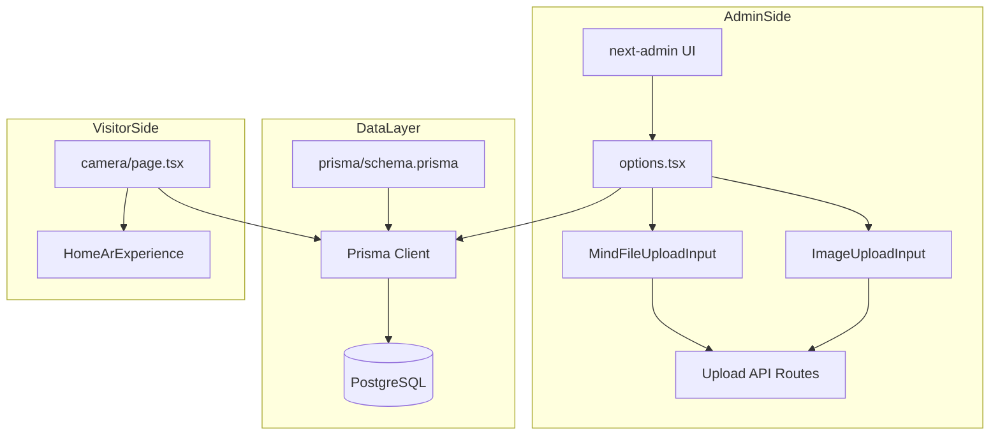
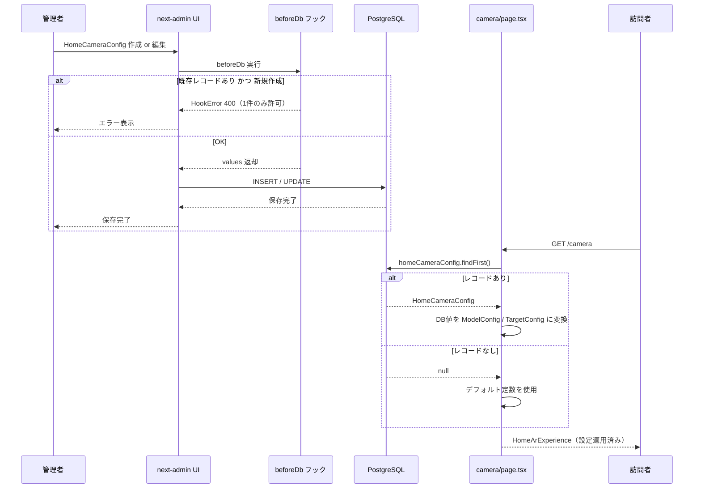
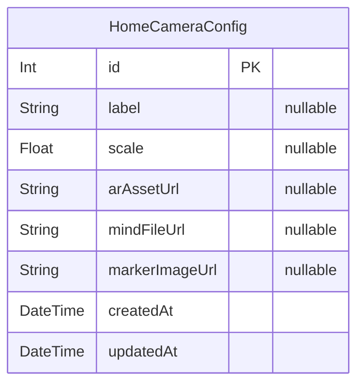

# 技術設計書: home-camera-admin

## 概要

本機能は、管理者がadmin画面から「自宅でひめっこ撮影」ページ（`/camera`）のARモデル設定をDB経由で変更できるようにする。既存の `home-camera` スペックで「将来スコープ」とされた Requirement 6 を実装する。

**ユーザー**: 管理者（WEESEEKメンバー・新庄村担当者）が対象。訪問者向けUIへの変更はない。

**影響**: `prisma/schema.prisma` に `HomeCameraConfig` モデルを追加し、`src/app/admin/options.tsx` に設定エントリを追加、`src/app/camera/page.tsx` をDB参照に切り替える。変更ファイルは3つのみ（＋スキーマ）。

### Goals
- 管理者がGLBファイル・ラベル・スケール・.mindファイル・マーカー画像をデプロイなしで変更できる
- 未設定時はデフォルト定数にフォールバックし、既存訪問者体験に影響しない
- 既存のアップロードコンポーネント・APIを変更なしで再利用する

### Non-Goals
- `HomeArExperience` / `ArScene` / `ArLanding` / `PhotoPreview` コンポーネントの改修
- スポット撮影ページ（`/spots/[slug]/camera`）への影響
- アップロードAPIルートの変更
- `targetIndex` のadmin公開（常に `0` 固定）
- ステータス管理（DRAFT/PUBLISHED等）— 設定エンティティのため不要

---

## Boundary Commitments

### This Spec Owns
- `HomeCameraConfig` Prisma モデルの定義とスキーマ管理
- next-admin options の `HomeCameraConfig` エントリ（サイドバー・フィールド設定・1件制限フック）
- `src/app/camera/page.tsx` の DB参照ロジックとデフォルトフォールバック

### Out of Boundary
- `HomeArExperience` / `ArScene` / `ArLanding` / `PhotoPreview` — home-camera スペックが所有、変更しない
- アップロードAPIルート（`/api/admin/upload`, `/api/admin/upload-mind`）— 変更なし再利用
- `ImageUploadInput` / `MindFileUploadInput` コンポーネント — 変更なし再利用
- スポット撮影フロー（`/spots/[slug]/camera`）— 影響しない
- `lib/ar/types`, `lib/ar/state`, `lib/ar/utils` — 変更しない

### Allowed Dependencies
- `prisma/schema.prisma` — モデル追加のみ
- `src/lib/prisma` — Prisma Clientシングルトン
- `src/lib/ar/types` — `ModelConfig`, `TargetConfig` 型参照
- `src/app/admin/_components/image-upload-input.tsx` — 変更なし再利用
- `src/app/admin/_components/mind-file-upload-input.tsx` — 変更なし再利用
- `src/app/camera/_components/HomeArExperience` — propsを渡すのみ（コンポーネント変更なし）

### Revalidation Triggers
- `ModelConfig` / `TargetConfig` 型の shape 変更 → `camera/page.tsx` の props 再確認が必要
- `HomeArExperience` の props インターフェース変更 → `camera/page.tsx` の呼び出し側再確認が必要
- next-admin のメジャーバージョンアップ → `options.tsx` のカスタム input API 互換性確認が必要

---

## Architecture

### 既存アーキテクチャとの整合

本機能はプロジェクト内の既存パターンを直接踏襲する:
- **Spotカメラページ（DB参照）**: `prisma.spot.findUnique()` → `TargetConfig` 生成 → フォールバックつきで `SpotArExperience` に渡す
- **next-admin Spot設定**: `ImageUploadInput` / `MindFileUploadInput` を `edit.fields` に登録、`beforeDb` フックでバリデーション

`HomeCameraConfig` は「設定エンティティ」として、Spot の複数レコード管理とは異なり **シングルトン** として運用する。シングルトン保証は `beforeDb` フックで実装する。

### Architecture Pattern & Boundary Map



**凡例**:
- 太実線 = 本スペックが変更する接続
- 既存コンポーネント（ImgInput / MindInput / UploadAPI / HomeArExp）は変更なし

### Technology Stack

| Layer | 技術 / バージョン | 役割 |
|-------|-----------------|------|
| Data | Prisma 7 + PostgreSQL | `HomeCameraConfig` モデル定義・永続化 |
| Backend | Next.js 15 App Router Server Component | `camera/page.tsx` でのDB参照 |
| Admin UI | next-admin (`@premieroctet/next-admin`) | `HomeCameraConfig` のCRUD UI自動生成 |
| File Storage | Cloudflare R2（既存） | GLB / .mind / 画像ファイルのホスティング |

---

## File Structure Plan

### 変更ファイル一覧

```
prisma/
└── schema.prisma              # [変更] HomeCameraConfig モデル追加

src/app/
├── admin/
│   └── options.tsx            # [変更] HomeCameraConfig エントリ追加（サイドバー・フィールド定義・1件制限フック）
└── camera/
    └── page.tsx               # [変更] 非同期Server Component化、prisma.homeCameraConfig.findFirst() + フォールバック
```

**新規作成ファイル: なし**  
既存のアップロードコンポーネント・APIは変更なしで再利用する。

---

## System Flows

管理者が設定を保存してから訪問者に反映されるまでのフロー:



---

## Requirements Traceability

| 要件 | 概要 | コンポーネント | インターフェース |
|------|------|--------------|----------------|
| 1.1 | サイドバーに「自宅でひめっこ撮影」表示 | options.tsx | sidebar.groups |
| 1.2 | 管理画面で現在の設定を表示 | options.tsx | next-admin list view（自動生成） |
| 1.3 | 設定を1件のみ管理 | options.tsx | `beforeDb` フック |
| 1.4 | ラベル設定 | options.tsx | `HomeCameraConfig.edit.fields.label` |
| 1.5 | スケール設定 | options.tsx | `HomeCameraConfig.edit.fields.scale` |
| 2.1 | GLBファイルURL設定 | options.tsx | `HomeCameraConfig.edit.fields.arAssetUrl` |
| 2.2 | GLB未設定時のフォールバック | camera/page.tsx | `config?.arAssetUrl ?? "/assets/himekko.glb"` |
| 3.1 | .mindファイルURL設定 | options.tsx | `HomeCameraConfig.edit.fields.mindFileUrl` + MindFileUploadInput |
| 3.2 | マーカー画像URL設定（任意） | options.tsx | `HomeCameraConfig.edit.fields.markerImageUrl` + ImageUploadInput |
| 3.3 | .mind未設定時のフォールバック | camera/page.tsx | `config?.mindFileUrl ?? "/assets/targets/demo.mind"` |
| 4.1 | .mindファイルアップロード | MindFileUploadInput（既存）| `/api/admin/upload-mind` |
| 4.2 | マーカー画像アップロード | ImageUploadInput（既存） | `/api/admin/upload` |
| 5.1 | 訪問者へのGLBモデル反映 | camera/page.tsx | `prisma.homeCameraConfig.findFirst()` → ModelConfig props |
| 5.2 | 訪問者への.mindファイル反映 | camera/page.tsx | `prisma.homeCameraConfig.findFirst()` → TargetConfig props |
| 5.3 | 未設定時のデフォルト動作 | camera/page.tsx | null チェック + フォールバック定数 |
| 5.4 | デプロイなしで反映 | camera/page.tsx | 動的Server Component（Prismaはリクエスト毎に実行） |

---

## Components and Interfaces

| コンポーネント | Domain/Layer | Intent | 要件カバレッジ | 主要依存（優先度） |
|--------------|-------------|--------|--------------|-----------------|
| `HomeCameraConfig` Prisma Model | Data | AR設定の永続化 | 1.3, 2.1, 3.1, 3.2 | Prisma Client (P0) |
| `HomeCameraConfig` Admin Entry | Admin UI | next-adminによるCRUD | 1.1〜1.5, 2.1, 3.1, 3.2 | options.tsx, ImageUploadInput, MindFileUploadInput (P0) |
| `camera/page.tsx` (変更後) | Visitor Page | DB参照 + フォールバック + props渡し | 5.1〜5.4, 2.2, 3.3 | Prisma Client (P0), HomeArExperience (P0) |

### Data Layer

#### HomeCameraConfig Prisma Model

| Field | Detail |
|-------|--------|
| Intent | 自宅撮影ARの設定値を保持するシングルトンエンティティ |
| Requirements | 1.3, 1.4, 1.5, 2.1, 3.1, 3.2 |

**Responsibilities & Constraints**
- 全フィールドは `Optional` — 未設定時はページ側でフォールバック
- レコードは最大1件（アプリケーションレベルでの制約、`beforeDb` フック）
- `targetIndex` は常に `0` のためDBカラムとして持たない

**Contracts**: State [x]

##### State Management
- State model: シングルトン設定（0件または1件）
- Persistence: `prisma db push` でスキーマ反映（マイグレーションファイル不使用）
- Concurrency: next-admin のフォーム送信は逐次的、同時更新の考慮不要

**Prisma スキーマ定義**:
```prisma
model HomeCameraConfig {
  id             Int      @id @default(autoincrement())
  label          String?
  scale          Float?
  arAssetUrl     String?
  mindFileUrl    String?
  markerImageUrl String?
  createdAt      DateTime @default(now())
  updatedAt      DateTime @updatedAt

  @@map("home_camera_configs")
}
```

**Implementation Notes**
- `scale` は `Float?`（Prisma）→ TypeScript `number | null`。フォールバック: `config?.scale ?? 0.5`
- `label` 未設定時フォールバック: `"ヒメッコ"`
- `arAssetUrl` 未設定時フォールバック: `"/assets/himekko.glb"`
- `mindFileUrl` 未設定時フォールバック: `"/assets/targets/demo.mind"`
- `markerImageUrl` 未設定時フォールバック: `"/assets/targets/demo-marker.png"`

### Admin Layer

#### HomeCameraConfig Admin Entry（options.tsx）

| Field | Detail |
|-------|--------|
| Intent | next-admin に HomeCameraConfig のCRUD UIを登録し、サイドバー表示・フィールド定義・1件制限を行う |
| Requirements | 1.1, 1.2, 1.3, 1.4, 1.5, 2.1, 3.1, 3.2 |

**Responsibilities & Constraints**
- `sidebar.groups` の「コンテンツ管理」に `"HomeCameraConfig"` を追加（要件1.1）
- `edit.display` / `edit.fields` でフィールドを定義（Spot の ARフィールドと同一パターン）
- `beforeDb` フックで新規作成時に既存レコードの有無を確認し、1件を超える場合は `HookError` を返す（要件1.3）

**beforeDb フック ロジック**:
```typescript
beforeDb: async (values, mode) => {
  if (mode === "create") {
    const existing = await prisma.homeCameraConfig.findFirst();
    if (existing) {
      throw new HookError(400, {
        error: "自宅撮影設定はすでに登録されています。既存の設定を編集してください。",
      });
    }
  }
  // scale の範囲検証（ARレンダリング破綻を防ぐ）
  if (values.scale !== null && values.scale !== undefined) {
    const s = values.scale as number;
    if (s <= 0 || s > 10) {
      throw new HookError(400, { error: "スケールは 0 より大きく 10 以下の値を入力してください" });
    }
  }
  // 空文字列をnullに正規化（camera/page.tsx の || フォールバックと整合）
  for (const key of ["arAssetUrl", "mindFileUrl", "markerImageUrl", "label"] as const) {
    if (values[key] === "") values[key] = null;
  }
  return values;
}
```

**edit.display 構成**（Spot ARフィールドと同一パターン）:
```
セクション「基本情報」: label, scale
セクション「ARモデル（GLBファイル）」: arAssetUrl
セクション「ARマーカー｜.mind ファイル（必須）」: mindFileUrl
セクション「ARマーカー｜参照用の元画像（任意）」: markerImageUrl
```

**edit.fields 設定**:
- `arAssetUrl`: テキスト入力、helperText="AR用GLBファイルのURL"
- `mindFileUrl`: `input: <MindFileUploadInput />`, helperText="AR認識用の.mindファイル"
- `markerImageUrl`: `input: <ImageUploadInput />`, helperText="任意：マーカーの元画像（管理画面での確認用）"

**Implementation Notes**
- `toString` は `(config) => "自宅でひめっこ撮影設定"` — リスト表示用
- `icon`: `"HomeIcon"` または `"CameraIcon"` （next-admin のHeroIconsから選択）
- `aliases` で日本語ラベルを設定（Spot と同パターン）

### Visitor Page Layer

#### camera/page.tsx（変更後）

| Field | Detail |
|-------|--------|
| Intent | DB から HomeCameraConfig を取得し、ModelConfig / TargetConfig を構築して HomeArExperience に渡す |
| Requirements | 2.2, 3.3, 5.1, 5.2, 5.3, 5.4 |

**Responsibilities & Constraints**
- `async` Server Component として `prisma.homeCameraConfig.findFirst()` を実行
- 各フィールドが `null` の場合はデフォルト定数にフォールバック
- `HomeArExperience` コンポーネントへの props 形式は変更しない（コンポーネント側は無変更）

**型安全な変換ロジック**（実装参考、設計レベルのイメージ）:
```typescript
// 文字列フィールドは || を使い、空文字列("")も無効値としてフォールバック
// 数値フィールド（scale）は ?? を使い、null/undefined のみフォールバック
const config = await prisma.homeCameraConfig.findFirst({ orderBy: { updatedAt: "desc" } });
const model: ModelConfig = {
  url: config?.arAssetUrl || DEFAULT_MODEL.url,
  label: config?.label || DEFAULT_MODEL.label,
  scale: config?.scale ?? DEFAULT_MODEL.scale,
};
const target: TargetConfig = {
  mindFileUrl: config?.mindFileUrl || DEFAULT_TARGET.mindFileUrl,
  targetIndex: 0,
};
const markerImageUrl = config?.markerImageUrl || DEFAULT_MARKER_IMAGE_URL;
```

**Implementation Notes**
- 文字列フィールドのフォールバックは `||`（論理OR）を使用すること。`??`（nullish coalescing）では空文字列 `""` がDBに保存された場合にフォールバックされず、ARが壊れる。`scale` のみ数値のため `??` を使用。
- `findFirst` には `orderBy: { updatedAt: "desc" }` を指定し、万一複数レコードが存在した場合でも最新設定を取得する（シングルトンが崩れた場合の安全策）。
- Prisma 直接呼び出し（`fetch` 経由でない）のためNext.jsのHTTPキャッシュは介在せず、リクエスト毎に最新値を取得する（要件5.4を自然に満たす）
- `DEFAULT_MODEL` / `DEFAULT_TARGET` / `DEFAULT_MARKER_IMAGE_URL` は既存定数を維持し、フォールバック用として使用する
- DB接続エラー時はNext.jsのエラーバウンダリが500レスポンスを返す（設計上の制御不要）

---

## Data Models

### Domain Model

`HomeCameraConfig` は単一のAR設定を表す値オブジェクト的なエンティティ。複数レコードの関連やリレーションはない。



### Logical Data Model

- レコード数: 0 または 1（アプリケーションレベルのシングルトン制約）
- 全ARフィールドはNullable — 未設定時はアプリ側でフォールバック
- 外部キー制約なし
- インデックス: `@id` のみ（検索・フィルタなし）

---

## Error Handling

### Error Strategy

| シナリオ | ハンドリング |
|---------|------------|
| 管理者が2件目のレコードを作成しようとする | `beforeDb` フックが `HookError(400)` を返す → next-admin がエラーメッセージを表示 |
| DB未接続時に `camera/page.tsx` がアクセスされる | Prisma 例外 → Next.js 500ページ（既存の振る舞い、設計上の追加制御なし） |
| `arAssetUrl` などが空文字列で保存される | `beforeDb` フックで `null` に正規化 → `camera/page.tsx` の `\|\|` フォールバックで確実にデフォルト値を使用 |
| `scale` に 0・負数・10超の値が入力される | `beforeDb` フックが `HookError(400)` を返す → next-admin がエラーメッセージを表示 |

---

## Testing Strategy

### 統合テスト（動作確認の観点）

1. `HomeCameraConfig` レコードなし → `/camera` アクセス → デフォルト値 (`/assets/himekko.glb`, `demo.mind`) が `HomeArExperience` に渡されること（要件5.3）
2. `HomeCameraConfig` レコードあり（全フィールド設定済み） → `/camera` アクセス → DB値が `HomeArExperience` に渡されること（要件5.1, 5.2）
3. `HomeCameraConfig` レコードあり（`arAssetUrl` のみ null）→ `/camera` アクセス → `arAssetUrl` のみデフォルト、他はDB値（要件2.2, 3.3の個別フォールバック）

### admin UI 手動確認

4. admin サイドバーの「コンテンツ管理」に「自宅でひめっこ撮影」が表示されること（要件1.1）
5. 1件作成後に2件目の作成を試みると「すでに登録されています」エラーが表示されること（要件1.3）
6. `.mind` ファイルアップロードUI・マーカー画像アップロードUIが表示され、ファイル選択後にURLが自動入力されること（要件4.1, 4.2）
