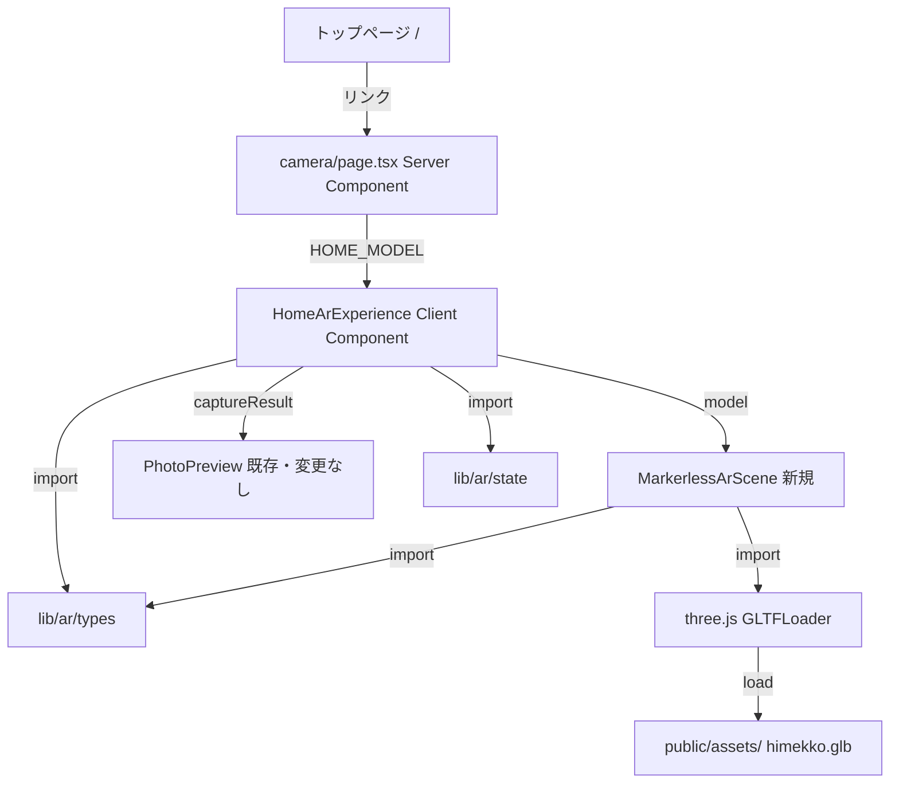
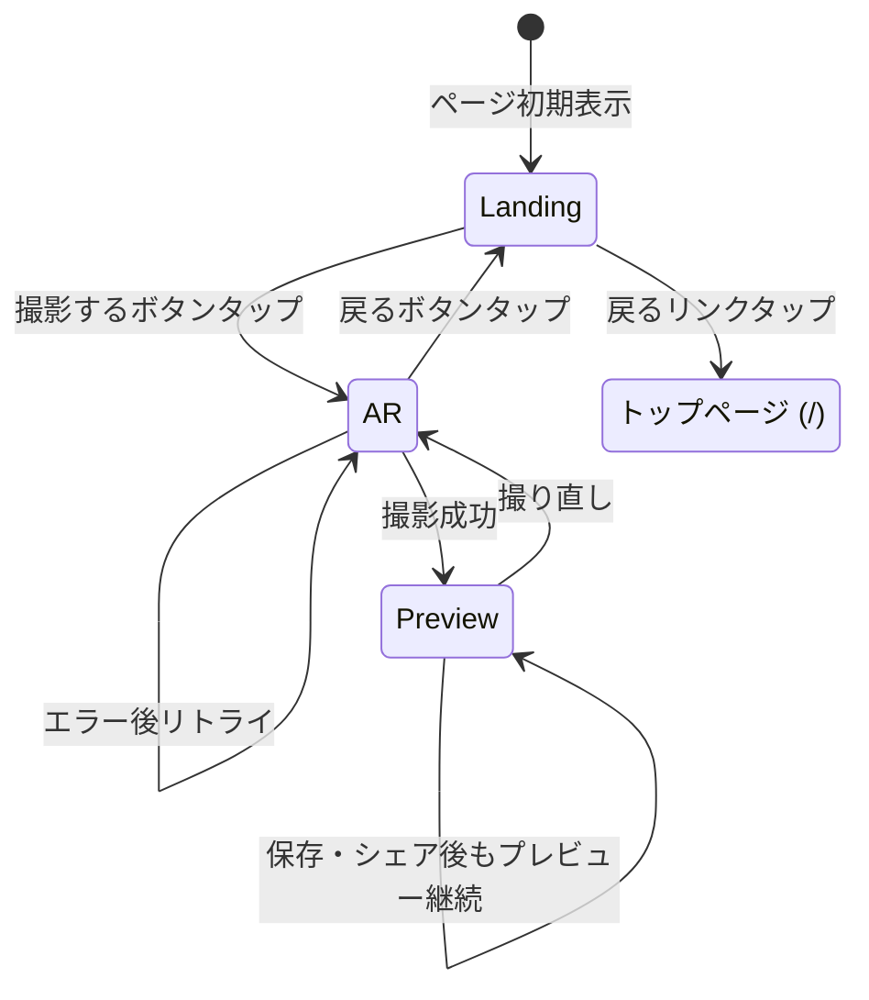
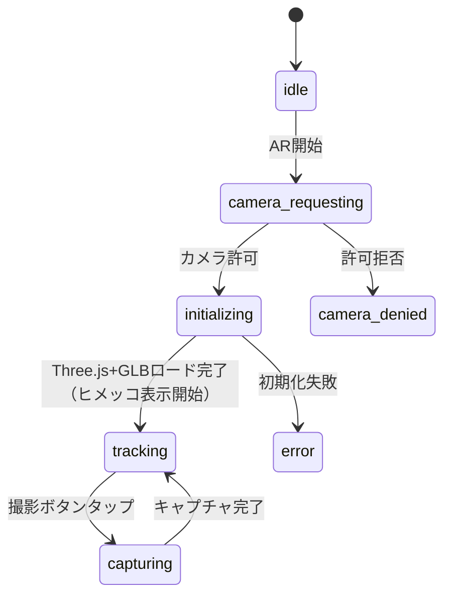

# 技術設計書: home-camera

## 概要

自宅撮影ページは、QRコードやスポット訪問を必要とせず、トップページから直接アクセスできるスタンドアロンなAR撮影体験を訪問者に提供する。**マーカー不要**で動作し、カメラを向けるだけでヒメッコが画面に現れる。既存のスポットAR撮影（`/spots/[slug]/camera`）と同一のUI構成を踏襲しつつ、マーカーレスAR専用の `MarkerlessArScene` コンポーネントを新設する。

**ユーザー**: 新庄村訪問者（認証不要）および、村を離れた後に自宅で撮影したいユーザー。
**影響**: 既存のスポットAR撮影コンポーネントへの変更は一切行わない。新規ファイルのみで完結する。

### Goals
- スポット・QRコード・マーカー不要で `/camera` からAR撮影体験を提供する
- 自宅用ヒメッコモデルをスポット設定と独立して管理する
- 既存ARコンポーネント（`PhotoPreview`）を変更なしで再利用する
- α版: デフォルトモデル固定

### Non-Goals
- admin画面からの自宅用ヒメッコ設定（Requirement 6 — 将来スコープ）
- `SpotArExperience` / `ArLanding` / `ArScene` / `PhotoPreview` の改修
- マーカーベースAR（本設計ではマーカーレスThree.jsを使用）
- 新規npm依存の追加（Three.jsは既存依存）

---

## Boundary Commitments

### This Spec Owns
- `/camera` ルートのページコンポーネント（`src/app/camera/page.tsx`）
- 自宅撮影体験のオーケストレーション（`HomeArExperience`）
- マーカーレスARシーン（`MarkerlessArScene`）
- 自宅用デフォルトモデル定数（`HOME_MODEL`）
- バックナビゲーション先（トップページ `/`）

### Out of Boundary
- `ArScene`・`PhotoPreview`・`ArLanding`・`SpotArExperience` — 変更しない
- `lib/ar/*` の型・ユーティリティ — 変更しない（そのまま import して使用）
- スポット撮影フロー（`/spots/[slug]/camera`）— 影響しない
- admin設定・Prismaモデル変更 — 将来スコープ (Req 6)
- `public/assets/` 内の既存アセット — 変更しない（流用のみ）

### Allowed Dependencies
- `src/lib/ar/types` — `ModelConfig`, `CaptureResult`, `ArSceneState`
- `src/lib/ar/state` — `checkBrowserCompatibility`, `getStatusMessage`, `getStatusVariant`
- `src/app/spots/[slug]/camera/_components/PhotoPreview` — プレビュー（変更なし再利用）
- `three` — 既存依存、GLTFLoader含む
- `next/navigation` (useRouter), `next/dynamic`

---

## Architecture

### Existing Architecture Analysis
スポットカメラは `SpotArExperience`（オーケストレーター）→ `ArLanding` / `ArScene` / `PhotoPreview` の3ビュー構成。`ArScene` はMindAR（マーカーベース）を使用するため自宅撮影には不適。`PhotoPreview`はスポット非依存で再利用可能。

### Architecture Pattern & Boundary Map



### Technology Stack

| Layer | 技術 / バージョン | 本機能での役割 |
|-------|-----------------|--------------|
| Frontend | Next.js 15 App Router | `/camera` ページルーティング |
| UI | React 19, TypeScript 5 | `HomeArExperience` Client Component |
| AR Engine | Three.js（既存）+ getUserMedia | マーカーレス3Dオーバーレイ |
| Styling | Tailwind CSS + CSS変数 | 既存パターンに準拠 |
| Data | Prisma `HomeCameraConfig` | DB経由でモデル設定取得 |

---

## File Structure Plan

### Directory Structure

```
src/app/camera/
├── page.tsx                        # Server Component、HOME_MODEL定数・HomeArExperienceレンダー
└── _components/
    ├── HomeArExperience.tsx        # Client Component、ビュー管理・ランディング・AR・プレビュー統括
    └── MarkerlessArScene.tsx       # 新規: マーカーレスAR（getUserMedia + Three.js固定位置オーバーレイ）
```

### Modified Files
- `src/app/camera/page.tsx` — target・markerImageUrl props を除去
- `src/app/camera/_components/HomeArExperience.tsx` — マーカー関連UI削除、MarkerlessArScene使用
- `src/app/admin/options.tsx` — HomeCameraConfigからmindFileUrl・markerImageUrl除去

### Reused Files (変更なし参照)
- `src/app/spots/[slug]/camera/_components/PhotoPreview.tsx`
- `src/lib/ar/types.ts`
- `src/lib/ar/state.ts`
- `public/assets/himekko.glb`

---

## System Flows

### ビュー状態遷移



### MarkerlessArSceneフェーズ遷移



---

## Components and Interfaces

### Component Summary

| コンポーネント | Layer | Intent | Req Coverage | Key Dependencies |
|---|---|---|---|---|
| `camera/page.tsx` | Page (Server) | ルート定義・HOME_MODEL定義・HomeArExperienceのレンダー | 1.1, 3.3, 5.1, 5.2 | `HomeArExperience` (P0) |
| `HomeArExperience` | Feature (Client) | ビュー状態管理・ランディング・ARエラー表示・ナビゲーション | 1.2, 2.1–2.6, 3.2, 3.7, 3.8, 4.4 | `MarkerlessArScene` (P0), `PhotoPreview` (P0), `lib/ar/*` (P0) |
| `MarkerlessArScene` | Feature (Client) | マーカーレスAR・カメラ制御・撮影 | 3.1, 3.2, 3.3, 3.5, 3.6, 3.8 | Three.js (P0), `lib/ar/types` (P0) |
| `PhotoPreview` | Shared AR (Client) | 撮影結果プレビュー・保存・シェア | 4.1, 4.2, 4.3 | 既存（変更なし） |

---

### MarkerlessArScene

| Field | Detail |
|-------|--------|
| Intent | マーカー不要でヒメッコをカメラ映像に重畳し、撮影する |
| Requirements | 3.1, 3.2, 3.3, 3.5, 3.6, 3.8 |

**Props Interface**
```typescript
interface MarkerlessArSceneProps {
  model: ModelConfig;
  onCapture: (result: CaptureResult) => void;
  onStateChange?: (state: ArSceneState) => void;
}
```

**実装詳細**
- `getUserMedia({ video: { facingMode: "environment" } })` でカメラ映像取得
- `<video>` 要素に映像を流し全画面表示（object-fit: cover）
- Three.js `WebGLRenderer`（alpha: true, preserveDrawingBuffer: true）をオーバーレイ
- GLTFLoaderで `model.url` の GLBモデルをロード、`position.y = -2` に固定配置
- Y軸回転アニメーション（0.005 rad/frame）でヒメッコを演出
- 撮影: video + renderer.domElement をオフスクリーン Canvasで合成

**フェーズマッピング（ArSceneState）**
- `camera-requesting` → getUserMedia 中
- `initializing` → Three.js + GLBロード中
- `tracking` → ヒメッコ表示中（撮影可能）
- `capturing` → 撮影処理中
- `camera-denied` / `error` → エラー

### HomeArExperience

**Props Interface**
```typescript
interface HomeArExperienceProps {
  model: ModelConfig;
  backHref?: string; // デフォルト: "/"
}
```

**ランディングセクション表示要素（Req 2.1, 2.2, 2.3, 2.5, 2.6）:**
- カメラアイコン
- タイトル: 「自宅でヒメッコと撮影しよう」
- 説明: 「「撮影する」をタップするとヒメッコが現れます。一緒に記念撮影しましょう！」
- ブラウザ互換エラー（あれば）
- 撮影するボタン（互換性エラー時はdisabled）
- カメラ許可の注意書き
- トップページへ戻るリンク
- ※ マーカー参照画像は表示しない（Req 2.6）

---

## Error Handling

| エラー | 検出タイミング | UI対応 | Req |
|---|---|---|---|
| WebGL / getUserMedia 未対応 | ランディング表示時（useEffect） | エラーメッセージ表示 + 撮影ボタン無効化 | 2.3 |
| カメラアクセス拒否 | MarkerlessArScene起動後 | カメラ許可ガイドダイアログ表示 | 3.2 |
| Three.js / GLBロード失敗 | モデルロード中 | エラーメッセージ + リトライボタン | 3.8 |
