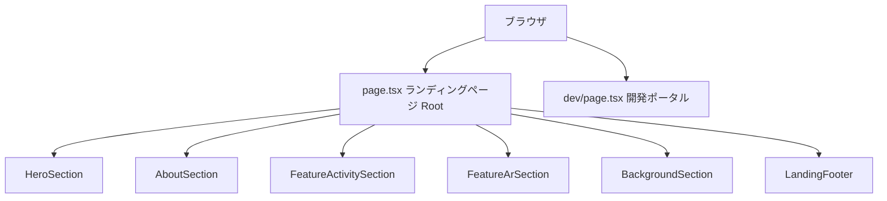

# Design Document: landing-page

## Overview

ランディングページは「よっとこ！新庄村」サービスへの最初の接点となる静的なエントリーページ。
訪問者がサービスの価値（体験・手伝い参加、AR フォト撮影）を直感的に理解し、
各機能ページへの動線を提供することを目的とする。

**Purpose**: サービス概要の伝達と各機能への訪問者誘導  
**Users**: 新庄村を訪れた・訪問予定の一般利用者（年齢層広く、スマートフォン利用を前提）  
**Impact**: 現行の `/` ルート（開発ポータル）を置き換え。開発ポータルは `/dev` に移管する。

### Goals
- PC（≥1024px）とスマートフォン（<1024px）で最適化されたレイアウトを提供する
- 全 6 セクション + フッターを含む完全なランディングページを静的 Server Component として実装する
- 開発ポータルを `/dev` に移管し、本番環境での誤表示を解消する

### Non-Goals
- `/activities`, `/spots`, `/camera` 各機能ページの実装・変更
- 画像素材の撮影・作成（スマホモックアップ画像・チーム写真は別途用意が必要）
- アニメーション・インタラクティブ演出（スクロールアニメーションなど）
- 多言語対応・国際化

## Boundary Commitments

### This Spec Owns
- `src/app/page.tsx` — ランディングページのルートコンポーネント（新規作成）
- `src/app/_components/landing/` — 各セクションコンポーネント（6 個 + フッター）
- `src/app/dev/page.tsx` — 移管先の開発ポータルページ（移動）
- `public/assets/` への必要画像アセットの追加（モックアップ・チーム写真のプレースホルダーまたは実画像）

### Out of Boundary
- `/activities`, `/spots`, `/camera` 等の機能ページ
- `src/app/layout.tsx` の変更
- グローバル CSS（`globals.css`）の変更
- 管理画面・API Routes の変更

### Allowed Dependencies
- Next.js App Router（Image、Link コンポーネント）
- `JoinButton`（`src/app/_components/join-button.tsx` — CTA ボタン再利用）
- TailwindCSS v3（既存の CSS カスタムプロパティトークンを使用）
- `public/assets/` 内の既存アセット（`logo.png`, `hyottoko.png`, `hyottoko_2.png`）
- Google Fonts（Zen Maru Gothic — `layout.tsx` 経由で提供済み）

### Revalidation Triggers
- `/activities`, `/spots`, `/camera` のルートパスが変更された場合はリンク URL を更新
- `public/assets/logo.png` のファイル名・パスが変更された場合は全セクションを確認
- 新しい色トークンが `globals.css` に追加された場合はセクション背景色を確認

## Architecture

### Architecture Pattern & Boundary Map



- **Selected pattern**: 純静的 Server Component（DB アクセスなし）。全コンポーネントは `async` 不要。
- **Existing patterns preserved**: `src/app/_components/` 配下のコンポーネント配置規約を継承
- **New components rationale**: セクション単位でコンポーネント分割することで、各セクションの独立した保守・修正を可能にする

### Technology Stack

| Layer | Choice / Version | Role | Notes |
|-------|-----------------|------|-------|
| Frontend | Next.js 15 App Router | ページルーティング・Server Component | 既存 |
| UI | React 19 | コンポーネントレンダリング | 既存 |
| Styling | TailwindCSS v3 + CSS Custom Properties | レスポンシブレイアウト・デザイントークン | 既存 |
| Font | Zen Maru Gothic（Google Fonts） | 日本語テキスト | layout.tsx 経由で提供済み |
| Image | Next.js Image コンポーネント | 最適化された画像配信 | 既存 |

## File Structure Plan

### Directory Structure

```
src/
└── app/
    ├── page.tsx                                   # NEW: ランディングページ Root（現 page.tsx を置き換え）
    ├── dev/
    │   └── page.tsx                               # MOVED: 開発ポータル（現 page.tsx の内容を移動）
    └── _components/
        └── landing/
            ├── hero-section.tsx                   # NEW: ヒーローセクション
            ├── about-section.tsx                  # NEW: ABOUT セクション
            ├── feature-activity-section.tsx        # NEW: 機能その1 体験・手伝い
            ├── feature-ar-section.tsx             # NEW: 機能その2 AR フォト
            ├── background-section.tsx             # NEW: BACKGROUND セクション
            └── landing-footer.tsx                 # NEW: ランディングフッター
```

### Modified Files
- `src/app/page.tsx` — 現開発ポータルのコードを削除し、新ランディングページに置き換え
- （既存の開発ポータルコードは `src/app/dev/page.tsx` に移動）

### Image Assets Required

以下の実画像アセットを使用する（すべて差し替え済み）：

| ファイル名 | 用途 |
|-----------|------|
| `character/siro-egao.png` / `character/kuro-egao.png` | ヒーローの白猫・黒猫マスコット（笑顔） |
| `landing/device-mock.png` | ヒーローのスマホモックアップ |
| `landing/activity-card-1.png` / `landing/activity-card-2.png` | 機能その1の体験カード画像 |
| `landing/ar-photo-image.png` | 機能その2 AR フォトのモック画像（スマホ枠＋AR写真） |
| `landing/appear-himekko.svg` | 機能その2「ひめっ子が出現！」吹き出し |
| `landing/hackathon-2026.png` | BACKGROUND セクションのチーム写真 |

## Components and Interfaces

### コンポーネント一覧

| Component | Domain/Layer | Intent | Req Coverage | Key Dependencies |
|-----------|--------------|--------|--------------|-----------------|
| LandingPage（page.tsx） | Page Root | 全セクションの組み合わせ・ページメタデータ | 1.1, 1.2, 1.3 | 全セクションコンポーネント |
| HeroSection | UI Section | キャッチコピー・CTA・ビジュアル表示 | 2.1–2.8, 8.1–8.3 | next/image, next/link |
| AboutSection | UI Section | サービス概要・登録不要バナー | 3.1–3.4, 8.1–8.3 | — |
| FeatureActivitySection | UI Section | 機能その1 体験・手伝い説明 | 4.1–4.5, 8.1–8.3 | next/link, next/image |
| FeatureArSection | UI Section | 機能その2 ARフォト説明 | 5.1–5.6, 8.1–8.3 | next/link, next/image |
| BackgroundSection | UI Section | サービス背景・チーム写真 | 6.1–6.4, 8.1–8.3 | next/image |
| LandingFooter | UI Footer | ロゴ・提供者・連絡先 | 7.1–7.3 | next/image |
| DevPortal（dev/page.tsx） | Page（移管） | 開発者向けページ一覧・体験フロー | 1.3 | next/link, next/image, prisma |

### Page Root

#### LandingPage（src/app/page.tsx）

| Field | Detail |
|-------|--------|
| Intent | ランディングページの Root。全セクションコンポーネントを順番に配置し、ページメタデータを管理する |
| Requirements | 1.1, 1.2, 1.3 |

**Responsibilities & Constraints**
- Server Component（`async` 不要）— DB アクセスなし
- 本番・ステージング・開発環境いずれでも表示する（環境分岐・リダイレクトなし）
- ページ全体の `<main>` ラッパーと背景色を定義する

**Contracts**: State [✓]

##### State Management
- State model: 静的コンテンツのみ。クライアント状態なし。
- Persistence & Consistency: なし。
- Concurrency strategy: なし。

### 共通スタイル方針（デザイン調整で確定）

全セクション共通で以下を適用する（municipal 向けの可読性・一貫性のため）:

- **見出し（h2）**: 本 LP では全セクションの h2 を `text-[2rem]`（32px）に固定する。レスポンシブによるサイズ拡大（`sm:`/`lg:` のフォントサイズ変更）は行わない。配置はデフォルト左揃え（タブレット以下での中央揃えは行わない）。
- **縦方向の余白**: コンテナの `gap-*` ではなく、各子要素の `mt-*` で構成する。横並び要素（CTA ボタン群・アイコン付き注記など）内の `gap` は維持する。
- **横パディング**: モバイル `px-4` → タブレット（`sm:`〜`lg` 未満）`sm:px-12`（48px）→ PC は各セクションの 2 カラム構成に応じて中央側 64px・外側 32px を個別指定。
- **フォント指定**: Zen Maru Gothic はアプリ全体の既定として `body`（globals.css）で適用済み。セクション・layout いずれでも `font-[family-name:...]` の個別／冗長指定は行わない。

### UI Sections

#### HeroSection（src/app/_components/landing/hero-section.tsx）

| Field | Detail |
|-------|--------|
| Intent | ヒーローセクション。PC では左テキスト・右ビジュアルの2カラム、スマホでは上ビジュアル・下テキストのシングルカラム |
| Requirements | 2.1, 2.2, 2.3, 2.4, 2.5, 2.6, 2.7, 2.8 |

**Responsibilities & Constraints**
- 背景色: `--color-secondary-50`（薄い若葉グリーン）
- プライマリ CTA: `JoinButton variant="solid" href="/activities"` を再利用（`className` で幅調整）
- セカンダリリンク: `JoinButton variant="outline" href="/spots"` を再利用
- キャラクター画像: `character/siro-egao.png`（白猫・笑顔）・`character/kuro-egao.png`（黒猫・笑顔）
- スマホモックアップ: `landing/device-mock.png`
- PC（lg:）: Grid 2カラム
- スマホ: ビジュアルを上、テキストを下（DOM順で制御）
- ビジュアルは白猫・スマホ・黒猫を1ブロックで構成し、出し分けなしで `lg:` により対応（モバイル/タブレット: 中央クラスター `max-w-sm`〜`md:max-w-lg`、スマホは `absolute` で下部クリップ、猫は `h-28`→`md:h-40`／PC: 横並び・底揃え、猫 `lg:h-[200px]`）

**Implementation Notes**
- Integration: `next/image` で `landing/device-mock.png`, `character/siro-egao.png`, `character/kuro-egao.png` を使用
- Validation: 画像 alt テキスト必須（アクセシビリティ Req 9.3）

#### AboutSection（src/app/_components/landing/about-section.tsx）

| Field | Detail |
|-------|--------|
| Intent | サービス概要（ABOUT）セクション。白背景で中央配置 |
| Requirements | 3.1, 3.2, 3.3, 3.4 |

**Responsibilities & Constraints**
- 背景色: `--color-neutral-0`（白）
- 「登録不要。」バナー: `--color-warning-bg` 背景 + `--color-warning` テキストまたは独立したスタイル
- 見出しはロゴ画像（`logo.svg`）＋「とは？」。ロゴは右側に余白（`mr-3`／`lg:mr-4`）を確保し、改行はモバイルのみ（タブレット以上は改行なし）
- PC（lg:）: セクションタイトルと説明文を中央寄せで横並び（`lg:flex-row lg:justify-center`）。均等2分割 grid は使用しない（中央に余白が空くため）

#### FeatureActivitySection（src/app/_components/landing/feature-activity-section.tsx）

| Field | Detail |
|-------|--------|
| Intent | 機能その1（体験・手伝い参加）セクション。PC では左テキスト・右カードビジュアルの2カラム |
| Requirements | 4.1, 4.2, 4.3, 4.4, 4.5 |

**Responsibilities & Constraints**
- 右エリア背景: `--color-secondary-50`（薄い若葉グリーン）
- CTA: `/activities` への遷移ボタン。中央寄せ（`flex justify-center`）で配置
- カードビジュアル画像: `landing/activity-card-1.png` / `landing/activity-card-2.png`（体験カードのスクリーンショット2枚を横並び）
- PC（lg:）: 左テキスト・右カードビジュアルの2カラム
- スマホ: カードエリア（上）→ テキストエリア（下）の縦積み（`order-first` で制御）。縦積み時はテキストエリアの下パディングを +24px（`max-lg:pb-[72px]`）して次セクションとの間隔を確保
- 見出し・本文・注記・CTA は左揃え（タブレット以下での中央揃えは行わない）

#### FeatureArSection（src/app/_components/landing/feature-ar-section.tsx）

| Field | Detail |
|-------|--------|
| Intent | 機能その2（AR フォト）セクション。PC では左モックアップ・右テキストの2カラム（体験セクションと左右反転） |
| Requirements | 5.1, 5.2, 5.3, 5.4, 5.5, 5.6 |

**Responsibilities & Constraints**
- セクション全体背景: `--color-neutral-50`（旧: 左ペーチ／右白のグラデーション指定から単色ベタに変更）
- 左ビジュアルエリア背景: `--color-accent-peach`（`#fff3ec`、`globals.css` に追加済み）
- 右テキストエリア背景: `--color-neutral-50`（旧: 白）
- CTA ボタン群: タブレット以下は内包する最大幅ボタンに揃えて縦積み・中央寄せ（`w-fit mx-auto`）、PC（lg:）は横並び・下端揃え（`lg:flex-row lg:items-end`）
- スポット一覧 CTA: `JoinButton variant="outline" href="/spots"` を再利用
- AR カメラ CTA: `JoinButton variant="solid" href="/camera"` を再利用
- AR モック画像: `landing/ar-photo-image.png`（スマホ枠＋AR写真の合成）＋ `landing/appear-himekko.svg`（「ひめっ子が出現！」吹き出し）
- ビジュアルは出し分けなしの1ブロック。スマホ画像に対し吹き出しを % 指定で重ね、注記「画面はイメージです」を右下に配置
- モバイル: スマホ下2割を底辺でクリップ（`aspect-[422/688]` + `overflow-hidden`）、やや左寄せ（タブレット `md:` 以上で中央）
- PC（lg:）: 左ビジュアル・右テキストの2カラム、スマホは全体表示・縦中央

#### BackgroundSection（src/app/_components/landing/background-section.tsx）

| Field | Detail |
|-------|--------|
| Intent | BACKGROUND セクション。ダークグリーン背景にテキスト・チーム写真の2カラム |
| Requirements | 6.1, 6.2, 6.3, 6.4 |

**Responsibilities & Constraints**
- 背景色: `--color-arcana-green`（`#397754`。旧 `--color-secondary-500` から変更。白文字とのコントラスト比は約 5:1 で WCAG AA 準拠）
- テキスト色: `--color-neutral-0`（白）
- チーム写真: `landing/hackathon-2026.png`（2026年3月開催ハッカソンの集合写真）
- PC（lg:）: 左テキスト・右チーム写真の 6:4 2カラム（`lg:grid-cols-[3fr_2fr]`）。写真列は `lg:min-w-0` でトラックを比率どおりに保ち、写真はビューポート右端までブリード。写真は `lg:max-w-[960px]`（≒1600px 幅時の 60vw 相当）で上限
- タブレット（`sm:`〜`lg` 未満）: 写真は `sm:w-[65vw]` で右寄せ・縮小（モバイルの全幅より小さく）
- モバイル: 写真の左端を本文と揃え、右端は画面端まで（`w-full`）。左角のみ `rounded-l-[80px]`
- タブレット以下のセクション上下パディングは 64px（上: テキスト `pt-16`／下: 写真 `pb-16`）

#### LandingFooter（src/app/_components/landing/landing-footer.tsx）

| Field | Detail |
|-------|--------|
| Intent | ランディングページ専用フッター。ロゴ・提供者情報・問い合わせ先 |
| Requirements | 7.1, 7.2, 7.3 |

**Responsibilities & Constraints**
- 背景色: `--color-secondary-500`（Background セクションと連続するダークグリーン）
- ロゴ: `next/image` で `logo.png` を使用
- メールリンク: `mailto:contact@example.com`

### 移管: DevPortal（src/app/dev/page.tsx）

| Field | Detail |
|-------|--------|
| Intent | 現行 `src/app/page.tsx` の開発ポータルをそのまま `/dev` に移動する |
| Requirements | 1.3 |

**Responsibilities & Constraints**
- 現行 `page.tsx` のコード全体（`getSampleActivity`, `getSampleSpot` 含む）を `src/app/dev/page.tsx` にコピー
- DB アクセスあり（prisma 依存を維持）
- 環境チェックロジック（本番時リダイレクト）は `/dev` では不要のため削除可
- `src/app/page.tsx` からは `/dev` へのリンクは提供しない（ランディングページはエンドユーザー向け）

## Requirements Traceability

| Requirement | Summary | Components |
|-------------|---------|------------|
| 1.1 | ルート `/` でランディングページ表示 | LandingPage |
| 1.2 | 環境問わず表示（リダイレクトなし） | LandingPage |
| 1.3 | 開発ポータルを別パスへ移管 | DevPortal（dev/page.tsx） |
| 2.1 | サービス名・所在地表示 | HeroSection |
| 2.2 | キャッチコピー強調表示 | HeroSection |
| 2.3 | サービス説明文 | HeroSection |
| 2.4 | プライマリ CTA ボタン | HeroSection |
| 2.5 | セカンダリリンク | HeroSection |
| 2.6 | スマホモックアップ画像 | HeroSection |
| 2.7 | PC: 2カラムレイアウト | HeroSection |
| 2.8 | スマホ: ビジュアル上・テキスト下 | HeroSection |
| 3.1 | ABOUT 見出し表示 | AboutSection |
| 3.2 | サービス概要説明文 | AboutSection |
| 3.3 | 登録不要バナー | AboutSection |
| 3.4 | PC: 左右分割レイアウト | AboutSection |
| 4.1 | 機能その1 見出し | FeatureActivitySection |
| 4.2 | 機能その1 説明文・記念品注記 | FeatureActivitySection |
| 4.3 | 機能その1 CTA | FeatureActivitySection |
| 4.4 | カードモックアップ | FeatureActivitySection |
| 4.5 | PC: 2カラムレイアウト | FeatureActivitySection |
| 5.1 | 機能その2 見出し・ひめっ子ラベル | FeatureArSection |
| 5.2 | 機能その2 説明文 | FeatureArSection |
| 5.3 | スポット一覧 CTA | FeatureArSection |
| 5.4 | AR カメラ CTA | FeatureArSection |
| 5.5 | AR モックアップ画像 | FeatureArSection |
| 5.6 | PC: 反転2カラムレイアウト | FeatureArSection |
| 6.1 | BACKGROUND 見出し | BackgroundSection |
| 6.2 | 背景説明テキスト | BackgroundSection |
| 6.3 | チーム写真 | BackgroundSection |
| 6.4 | PC: 2カラムレイアウト | BackgroundSection |
| 7.1 | フッターロゴ | LandingFooter |
| 7.2 | 提供者情報 | LandingFooter |
| 7.3 | 問い合わせメール | LandingFooter |
| 8.1 | PC/スマホで異なるレイアウト | 全セクション（lg: Tailwind クラス） |
| 8.2 | スマホ: シングルカラム | 全セクション |
| 8.3 | PC: 2カラム | 全セクション |
| 8.4 | 横スクロールなし | LandingPage（overflow-x-hidden） |
| 9.1 | WCAG AA コントラスト | 全セクション（デザイントークン準拠） |
| 9.2 | 最小 14px・行間 1.5 | 全セクション |
| 9.3 | 画像 alt テキスト | HeroSection, FeatureActivitySection, FeatureArSection, BackgroundSection, LandingFooter |
| 9.4 | キーボード操作可能 | HeroSection, FeatureActivitySection, FeatureArSection（Link コンポーネント） |
| 9.5 | 見出し階層 | 全セクション（h1: ヒーロー、h2: 各セクション見出し） |

## System Flows

（ページナビゲーションのみのため省略。静的レンダリングでフロー分岐なし）

## Testing Strategy

### Unit Tests（コンポーネントレンダリング確認）
1. LandingPage が環境変数 `APP_ENV=production` でもリダイレクトせずレンダリングされること
2. HeroSection に CTA リンク `/activities` と `/spots` が含まれること
3. FeatureActivitySection に CTA リンク `/activities` が含まれること
4. FeatureArSection に CTA リンク `/spots` と `/camera` が含まれること
5. LandingFooter に `mailto:contact@example.com` リンクが含まれること

### アクセシビリティ確認
1. ページ全体で `h1` が1つだけ存在し、`h2` で各セクションが構造化されていること
2. 全画像に non-empty `alt` 属性が設定されていること
3. CTA ボタン・リンクが `Tab` キーでフォーカス可能であること
4. テキスト要素のコントラスト比が 4.5:1 以上であること（デザイントークン使用で保証）

### レスポンシブ確認
1. スマートフォン幅（375px）で横スクロールが発生しないこと
2. PC 幅（1440px）で2カラムレイアウトが正しく表示されること
3. タブレット幅（768px）でレイアウト崩れがないこと

## Error Handling

### Error Strategy
静的ページのため、実行時エラーは発生しない。

画像プレースホルダーの現状:
- AR セクション: `landing/ar-photo-image.png` ＋ `landing/appear-himekko.svg` に差し替え済み（旧 `phone-mockup.png` プレースホルダーは不使用）。
- 機能その1カード: `landing/activity-card-1.png` / `landing/activity-card-2.png` に差し替え済み（旧 `feat1_card*.png` は削除済み。`feature-activity-mockup.png` は未使用のまま残置）。
- BACKGROUND セクション: `landing/hackathon-2026.png` に差し替え済み（旧 `team-photo.png` / `team-photo.jpg` は不使用）。

## Migration Strategy

開発ポータル移管（`/` → `/dev`）は以下の手順で行う:
1. `src/app/dev/` ディレクトリを作成
2. 現行 `src/app/page.tsx` の内容を `src/app/dev/page.tsx` にコピー
3. 環境チェックによる本番リダイレクト処理を `dev/page.tsx` から削除
4. `src/app/page.tsx` を新ランディングページに置き換え

ロールバック: `dev/page.tsx` の内容を `page.tsx` に戻すだけで復元可能。
