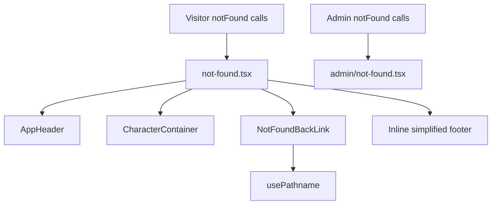

# Design Document

## Overview

**Purpose**: 訪問者向け公開サイトで発生する404（存在しないURL・削除済みコンテンツへのアクセス）を、アプリ共通のブランド（ヘッダー・お辞儀猫イラスト）とデザイントークン（フォント・色・コントラスト）に準拠した専用画面に置き換える。

**Users**: お年寄りを含む幅広い年齢層の村民・観光客が、存在しないURLにアクセスした際、または閲覧しようとした個別コンテンツ（アクティビティ・スポット等）が削除済みだった際にこの画面を見る。

**Impact**: 現状 Next.js 標準の無地404（`src/app/not-found.tsx` 未作成のため既定UI）が表示される状態を、ブランド一貫性のあるカスタム画面に置き換える。既存の7箇所の `notFound()` 呼び出し（`activities/[id]`、`activities/[id]/apply`、`spots/(chrome)/[slug]`、`spots/[slug]/camera`、`entries/[cancelToken]/complete`、`admin/(protected)/emails`）はいずれもネストした `not-found.tsx` を持たないため、ルート直下に1つ追加するだけで全経路をカバーする。

### Goals
- ヘッダー・お辞儀猫イラスト（siro-ojigi / kuro-ojigi）・簡略フッターを備えた404画面を1ページ追加する
- 404が発生したパスに応じて「戻る」リンクの遷移先・文言を出し分ける（`/activities` 配下 → `/activities`、`/spots` 配下 → `/spots`、それ以外 → `/`）
- デザインシステムのフォント・色・コントラスト規約に準拠する

### Non-Goals
- 管理画面（`/admin`）向けにブランド化された404表示を作り込むこと（デザインの作り込みは対象外。ただし後述の通り、訪問者向け404が管理画面に漏れ出さないための最小限のガードは本specで用意する）
- 500番台等その他HTTPエラーページのカスタマイズ
- 多言語対応
- 404発生の監視・アクセスログ収集
- 既存 `AppFooter` コンポーネント自体の変更、またはサイト全体のフッター配色の是正（後述 Open Questions 参照）

## Boundary Commitments

### This Spec Owns
- `src/app/not-found.tsx`（グローバル404ページ本体）の内容・レイアウト
- 404発生パスに応じた戻り先リンクの出し分けロジック（新規コンポーネント）
- 本ページ専用の簡略フッターのマークアップ（`AppFooter` は流用しない）
- 訪問者向け404が管理画面（`/admin` 配下）に漏れ出さないようにする最小限のガード（`src/app/admin/not-found.tsx`）。中身のデザインは作り込まず、Next.js既定に近い簡易表示に留める

### Out of Boundary
- `AppHeader` / `CharacterContainer` コンポーネント自体の実装（そのままの契約で利用するのみ）
- `AppFooter` コンポーネントおよびそれを使う既存ページの見た目（変更しない）
- 管理画面向けにブランド化・デザインされた404表示を作り込むこと、500系エラーページ、404発生の監視
- サイト全体で `text-arcana-orange-secondary` がリンクに使われている既存の配色（後述 Open Questions で継続課題として記録）

### Allowed Dependencies
- `src/app/_components/AppHeader.tsx`（既存、無変更で利用）
- `src/app/_components/CharacterContainer.tsx`（既存、無変更で利用）
- `public/assets/character/siro-ojigi.png` / `kuro-ojigi.png`（既存アセット）
- Next.js App Router の `not-found.tsx` 規約、`next/navigation` の `usePathname`
- 既存 Tailwind デザイントークン（`arcana-primary-green`, `arcana-orange-secondary`, `neutral-*` 等）

### Revalidation Triggers
- `AppHeader` / `CharacterContainer` の props 契約が変更された場合
- 訪問者向けに新しい一覧系セクション（例: 将来の `/events` 等）が追加され、そこでの404にも専用の戻り先を設けたくなった場合（`NotFoundBackLink` の判定テーブルに追記が必要）
- ルートレイアウト（`src/app/layout.tsx`）がヘッダー/フッターを全ページ共通で描画するようになった場合（本ページの `AppHeader` 呼び出しが二重になる）

## Architecture

### Existing Architecture Analysis
- ルートレイアウト（`src/app/layout.tsx`）は `<html>/<body>` とフォント設定のみで、ヘッダー・フッターを含まない。各セクション（`activities/layout.tsx` 等）が個別に `AppHeader`/`AppFooter` をラップしている。
- Next.js の仕様上、`notFound()` によって描画される `not-found.tsx` 境界は「その境界より上位のレイアウトのみ」が適用され、境界の解決はURLのセグメントではなくファイルシステム上のセグメントツリー（ルートグループ `(group)` を含む）を辿って行われる。既存の `notFound()` 呼び出し箇所（訪問者向け6箇所）にはネストした `not-found.tsx` が存在しないため、ルート直下の `not-found.tsx` にフォールバックする。したがって本ページはセクションレイアウトの恩恵を受けられず、`AppHeader` を自前で呼び出す必要がある。
- **既知の注意点**: `admin/(protected)/emails/page.tsx` も同じ理由でネストした `not-found.tsx` を持たないため、ルート直下の `not-found.tsx` に巡ってしまう。これは要件のBoundary Context（「管理画面を除く」）に反するため、`src/app/admin/not-found.tsx` を追加してこの階層で止める（ルートグループ `(protected)` は階層としては `admin` の子であるため、`admin/not-found.tsx` 1つで `(protected)` 配下の `notFound()` も含めて捕捉できる）。
- `middleware.ts` は `/admin` 系のみを matcher 対象としており、訪問者向けページの404には影響しない。

### Architecture Integration
- **選定パターン**: Next.js App Router の `not-found.tsx` 規約をそのまま利用する、単一ページ追加（新規レイアウトや新規ルートグループは作らない）。
- **ドメイン境界**: 「404画面の組み立て」（Server Component）と「戻り先の出し分け」（Client Component）を分離する。パス判定にはブラウザ側のURLが必要（`usePathname`）なため、この部分のみクライアント境界を持つ。
- **既存パターンの踏襲**: `entries/[cancelToken]/cancel/complete/page.tsx` の「イラスト＋見出しメッセージ＋戻るリンク」構成、および `design-system.md` の「18px以上＋太字で大きな文字の3:1基準を満たす」という既存の運用（ボタンラベルで採用済み）を流用する。
- **新規コンポーネントの理由**: `NotFoundBackLink` は「現在のパスに応じて表示内容が変わる」という、ページ本体とは異なるライフサイクル（クライアント側でのURL判定）を持つため、独立したコンポーネントとして切り出す。
- **ステアリング準拠**: フォントスケールは Tailwind標準クラスのみ、太字は `font-bold` のみ、色はトークン参照のみ。



**Key Decisions**:
- `not-found.tsx` は Server Component のまま維持し、パス依存の部分だけ `NotFoundBackLink`（Client Component）に閉じ込める。これによりページ全体を `"use client"` 化する必要がない。
- フッターは共通 `AppFooter` を流用せず、本ページ専用の簡略マークアップ（お問い合わせ＋著作権のみ）として直接記述する（過剰な抽象化を避け、単一箇所でしか使わないため共有コンポーネント化はしない）。

### Technology Stack

| Layer | Choice / Version | Role in Feature | Notes |
|-------|------------------|------------------|-------|
| Frontend | Next.js 15 App Router（既存） | `not-found.tsx` 規約による404ハンドリング | 新規ファイル追加のみ、ルーティング設定変更なし |
| Frontend | React 19 Server Component + 1箇所の Client Component（既存パターン） | パス依存の戻り先リンクのみ `usePathname` でクライアント判定 | 既存コードベースに前例あり（他ページは全てServer Component） |

## File Structure Plan

### Directory Structure
```
src/app/
├── not-found.tsx                 # 新規: グローバル404ページ（Server Component）
├── admin/
│   └── not-found.tsx             # 新規: 訪問者向け404が管理画面に漏れ出さないための最小限のガード
└── _components/
    └── NotFoundBackLink.tsx      # 新規: 戻り先リンクをパスに応じて出し分けるClient Component
```

### Modified Files
なし（既存ファイルの変更は発生しない。`AppHeader`・`CharacterContainer`・既存 `notFound()` 呼び出し箇所はすべて無変更で本ページの恩恵を受ける）

> **命名規約について**: `structure.md` は「ファイル: kebab-case」と定めているが、`src/app/_components/` 配下の既存ファイル（`AppHeader.tsx`, `AppFooter.tsx`, `CharacterContainer.tsx`）は実際にはPascalCaseで統一されている。`NotFoundBackLink.tsx` はこの `_components/` ディレクトリの実際のprecedentに倣いPascalCaseとする（`not-found.tsx`, `admin/not-found.tsx` はNext.jsのファイル規約上ケバブケース固定のため対象外）。

## Components and Interfaces

| Component | Domain/Layer | Intent | Req Coverage | Key Dependencies | Contracts |
|-----------|--------------|--------|---------------|-------------------|-----------|
| NotFoundPage (`not-found.tsx`) | UI / Routing | 404画面全体の組み立てとレイアウト | 1.1, 1.2, 1.3, 1.4, 2.1, 2.2, 2.3, 2.4, 4.1, 4.2, 4.3, 4.4 | AppHeader (P1), CharacterContainer (P1), NotFoundBackLink (P0) | State |
| NotFoundBackLink | UI | 現在のパスに応じた戻り先リンクの出し分け | 3.1, 3.2, 3.3, 3.4, 3.5, 3.6 | `next/navigation` usePathname (P0) | State |
| AdminNotFound (`admin/not-found.tsx`) | UI / Routing | 訪問者向け404が管理画面に漏れ出さないためのガード（Boundary Context: 管理画面を除く） | — (Boundary Context) | なし | なし |

### UI / Routing

#### NotFoundPage (`src/app/not-found.tsx`)

| Field | Detail |
|-------|--------|
| Intent | 404発生時に表示する、ヘッダー・イラスト・見出し・戻り先リンク・簡略フッターを含む画面全体を組み立てる |
| Requirements | 1.1, 1.2, 1.3, 1.4, 2.1, 2.2, 2.3, 2.4, 4.1, 4.2, 4.3, 4.4 |

**Responsibilities & Constraints**
- Next.js の `not-found.tsx` 規約に従い、存在しないURLへのアクセス時、および配下のいずれかのページで `notFound()` が呼ばれた際に描画される（Requirement 1.1, 1.2）。Next.js の規約により自動的に HTTP 404 を返す（Requirement 1.4）。
- `metadata` export でページタイトルを設定する（例: `ページが見つかりません | よっとこ！新庄村`、`terms/page.tsx` 等の既存パターンに準拠）。
- ヘッダーは `<AppHeader />` をデフォルト props（`homeHref="/"`）でそのまま呼び出す（Requirement 2.1）。
- イラストは `<CharacterContainer leftSrc="/assets/character/siro-ojigi.png" rightSrc="/assets/character/kuro-ojigi.png" gapClassName="gap-8" />` を呼び出す。`gapClassName` を明示しないと `CharacterContainer` の既定値 `gap-20` になり、モックアップより猫同士の間隔が広くなりすぎるため、`cancel/complete/page.tsx` と同じ `gap-8` を指定する。alt文言は `CharacterContainer` 側で自動生成される既存ロジックをそのまま利用する（Requirement 2.3, 2.4）。
- 見出し・説明文は次のサイズ・色で構成する（Requirement 1.3, 4.1, 4.2, 4.3, 4.4）:
  - `<h1>`: `404` — `text-4xl font-bold leading-[1.5] text-arcana-green`（36px、太字、行間1.5。Tailwindの`text-4xl`既定行間（約1.11）はRequirement 4.2の1.5未満基準を満たさないため明示指定する）
  - 説明文: `お探しのページは見つかりませんでした` — `text-base font-bold leading-[1.5] text-arcana-green`（16px、太字）
  - 色は `text-arcana-green`（`#397754`）を使用する。白／`neutral-50`背景でのコントラスト比は約5.0〜5.3:1であり、文字サイズ・太さによらず通常文字の4.5:1基準を単独で満たす（`arcana-primary-green`（約4.0:1）と異なり「大きな文字」の3:1基準に頼る必要がない）。
- 戻り先リンクは `<NotFoundBackLink />` を配置するのみで、パス判定ロジックは持たない（Requirement 3.1〜3.6、詳細は下記コンポーネント参照）。
- フッターは本ページ専用の簡略マークアップとして直接記述する（`AppFooter` は流用しない）:
  - 「お問い合わせ」mailto リンク: `text-sm text-arcana-orange-secondary underline` ＋ `focus-visible:outline focus-visible:outline-2 focus-visible:outline-offset-2 focus-visible:outline-arcana-orange-secondary`（既存 `AppFooter` と同一クラス構成、Requirement 2.2）
  - 著作権表示: `text-sm text-arcana-orange-secondary`（リンクではない装飾テキストのため、CLAUDE.md のオレンジ例外条件を満たす）

**Dependencies**
- Inbound: なし（ルーティング規約により Next.js フレームワークから直接呼び出される）
- Outbound: `AppHeader`（P1）, `CharacterContainer`（P1）, `NotFoundBackLink`（P0）

**Contracts**: State [x]

##### State Management
- State model: 状態を持たない純粋な Server Component。props も持たない。
- Persistence & consistency: 該当なし。
- Concurrency strategy: 該当なし。

**Implementation Notes**
- Integration: 既存の `notFound()` 呼び出し7箇所（`activities/[id]/page.tsx` 等）はコード変更不要。ルート直下に本ファイルを追加するだけで自動的にフォールバック先になる。
- Validation: 実装後に `/frontend-design`・`/baseline-ui`・`/fixing-accessibility` を適用し、`pnpm lint` / `pnpm build` で静的検証する（Testing Strategy 参照）。
- Risks: ルートレイアウトが将来ヘッダー/フッター共通化された場合、本ページの `AppHeader` 呼び出しが重複しうる（Revalidation Triggers に記録済み）。

#### NotFoundBackLink (`src/app/_components/NotFoundBackLink.tsx`)

| Field | Detail |
|-------|--------|
| Intent | 現在アクセスされているパスの先頭セグメントに応じて、戻り先リンクの遷移先とラベルを出し分ける |
| Requirements | 3.1, 3.2, 3.3, 3.4, 3.5, 3.6 |

**Responsibilities & Constraints**
- `"use client"` コンポーネントとして `next/navigation` の `usePathname()` を呼び出し、現在のパスを取得する。
- パスが `/activities` から始まる場合 → `href="/activities"`, ラベル「一覧に戻る」（Requirement 3.2）
- パスが `/spots` から始まる場合 → `href="/spots"`, ラベル「一覧に戻る」（Requirement 3.3。ラベル文言は`/activities`と共通の汎用表記とし、遷移先（href）のみで内容を区別する。ユーザー確認済みの意図的な決定）
- 上記いずれにも一致しない場合 → `href="/"`, ラベル「トップページに戻る」（Requirement 3.4）
- リンクは `next/link` の `Link` で描画し、`‹ ` プレフィックス＋ラベルを表示する（Requirement 3.1, 3.5）。
- スタイルは `text-lg font-bold text-arcana-primary-green`（18px・太字）とし、`focus-visible:outline` 系クラスでキーボード操作時のフォーカスを可視化する（Requirement 3.6, 4.3, 4.4 — 18px+太字により「大きな文字」の3:1基準を満たす。design-system.md のボタンラベルと同じ運用根拠）。

**Dependencies**
- Inbound: `NotFoundPage`（P0）
- Outbound: `next/navigation`（`usePathname`, 標準ライブラリ）
- External: なし

**Contracts**: State [x]

##### State Management
- State model: `usePathname()` の戻り値のみから `{ href, label }` を導出する純粋な派生状態。内部 state は持たない。
- Persistence & consistency: 永続化なし。レンダリングのたびに現在のパスから再計算される。
- Concurrency strategy: 該当なし（副作用のない純粋な導出ロジック）。

```typescript
interface BackLinkRule {
  prefix: string;
  href: string;
  label: string;
}

const BACK_LINK_RULES: readonly BackLinkRule[] = [
  { prefix: "/activities", href: "/activities", label: "一覧に戻る" },
  { prefix: "/spots", href: "/spots", label: "一覧に戻る" },
];

const DEFAULT_BACK_LINK: Omit<BackLinkRule, "prefix"> = {
  href: "/",
  label: "トップページに戻る",
};
```

**Implementation Notes**
- Integration: `NotFoundPage` から props なしで呼び出されるのみ。他コンポーネントからの再利用は想定しない。
- Validation: 3パターン（`/activities/xxx`、`/spots/xxx`、無関係なURL）を実ブラウザで手動確認する（Testing Strategy 参照）。
- Risks: `usePathname()` は非オフラインの通常ナビゲーションでは実際にアクセスされたURLをそのまま返す（`notFound()` 発火時もリダイレクトが発生しないため、URLは変化しない）。将来 Next.js の内部仕様が変わった場合は再検証が必要（Revalidation Triggers参照は不要なほど安定したAPIだが、念のため記録）。

#### AdminNotFound (`src/app/admin/not-found.tsx`)

| Field | Detail |
|-------|--------|
| Intent | 管理画面（`/admin` 配下）で `notFound()` が呼ばれた際、訪問者向けブランド404ではなくこの階層で処理を止める |
| Requirements | — （Boundary Context: 管理画面を除く） |

**Responsibilities & Constraints**
- デザインの作り込みは行わない（Non-Goals）。テキストのみの簡易表示で「ページが見つかりません」を示せれば十分。
- `admin/not-found.tsx` は `admin/(protected)/emails/page.tsx` を含む `/admin` 配下すべての `notFound()` 呼び出しに対する境界として機能する（ルートグループはファイルシステム上のセグメント階層に含まれるため）。

**Implementation Notes**
- Integration: 新規ファイル1つの追加のみ。既存の `admin/(protected)/emails/page.tsx` の `notFound()` 呼び出しはコード変更不要。
- Validation: `/admin/emails`（または該当するadminルート）配下で存在しないレコードにアクセスし、訪問者向け404（猫イラスト・AppHeader等）が表示されないことを手動確認する。
- Risks: なし（既存コードへの影響なし、新規ファイル追加のみ）。

## Testing Strategy

このプロジェクトには自動テストランナー（unit/e2e）が未導入のため（`tech.md`: 「テスト戦略は仕様策定フェーズで決定予定」）、静的検証と手動確認を組み合わせる。

### Static Checks
- `pnpm lint`（Biome）でコードスタイル・型の問題がないことを確認する
- `pnpm build`（Next.js ビルド、TypeScript strict コンパイルを含む）でビルドエラーがないことを確認する

### Manual Verification（実ブラウザ）
- 存在しないURL（例: `/no-such-page`）に直接アクセスし、404画面・ヘッダー・お辞儀猫イラスト・簡略フッターが表示されることを確認する（Requirement 1.1, 2.1〜2.4）
- 存在しないアクティビティID（例: `/activities/999999`）にアクセスし、404画面と「交流コンテンツ一覧に戻る」リンク（`/activities` へ遷移）を確認する（Requirement 1.2, 3.2）
- 存在しないスポットslug（例: `/spots/xxxxx`）にアクセスし、404画面と「スポット一覧に戻る」リンク（`/spots` へ遷移）を確認する（Requirement 1.2, 3.3）
- 上記いずれにも該当しないURLで「トップページに戻る」リンク（`/` へ遷移）を確認する（Requirement 3.4）
- キーボードのみ（Tabキー）で戻り先リンクにフォーカスが移動し、Enterで遷移できることを確認する（Requirement 3.6）
- ブラウザDevToolsのコントラストチェッカーで、`text-arcana-primary-green` を用いた見出し・説明文・戻り先リンクが「大きな文字」の3:1基準を満たすこと、フォントサイズが14px以上・行間1.5以上であることを確認する（Requirement 4.1〜4.4）
- 管理画面配下（例: 存在しない管理者向けメールレコードのURL）にアクセスし、訪問者向けブランド404（猫イラスト・AppHeader等）が表示されないことを確認する（Boundary Context: 管理画面を除く）

### Post-Implementation Skills（CLAUDE.md 必須）
- `/frontend-design` ガイドラインの適用（実装中）
- `/baseline-ui` によるチェック（実装後）
- `/fixing-accessibility` によるチェック（実装後）
- アニメーションは扱わないため `/fixing-motion-performance` は対象外

## Open Questions / Risks

- **既存フッターのリンク色に関する継続課題**: CLAUDE.md のブランドカラー例外規定は「オレンジ色の4.5:1未達はリンクには適用しない」と定めているが、既存の共通 `AppFooter`（全ページで使用中）は「お問い合わせ」等のリンクに `text-arcana-orange-secondary`（約2.57:1）を使用しており、この規定と矛盾した状態が既に本番コードに存在する。本spec ではユーザー確認の上、**サイト全体との視覚的一貫性を優先し、404ページの「お問い合わせ」リンクも既存と同じオレンジ色を踏襲する**ことに決定した。この既存の矛盾自体の是正（`AppFooter` を含むサイト全体の配色見直し）は本specのスコープ外であり、別タスクとして扱う。
