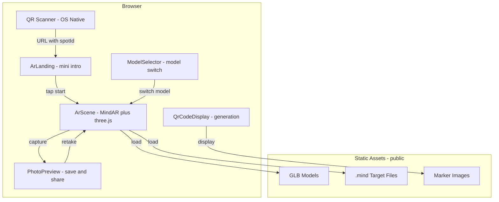
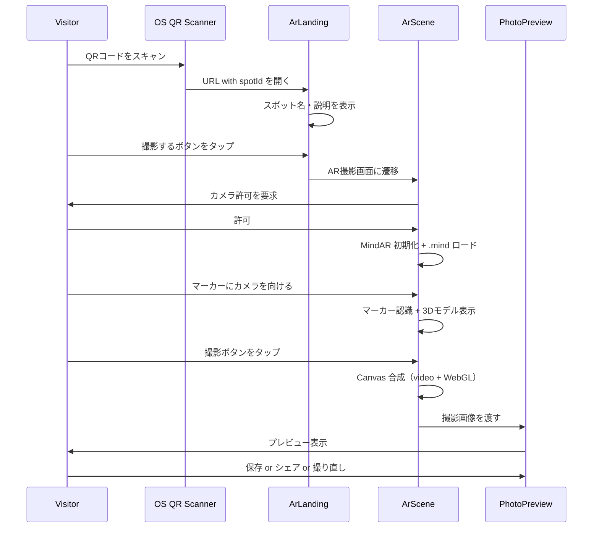
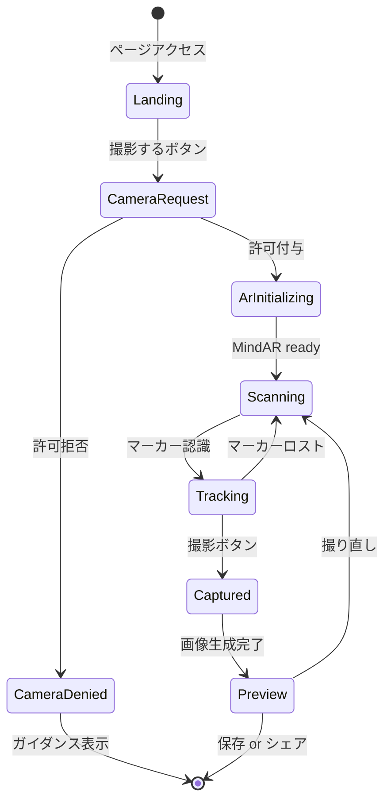

# Design Document

## Overview

**Purpose**: QRコード＋マーカーベースARによる記念撮影体験の技術検証。MindAR（画像トラッキング）+ three.js で3Dモデル「ヒメッコ」を現実世界に重畳表示し、撮影・保存・共有できる検証ページを提供する。

**Users**: 開発チーム（検証）、訪問者（将来のプロダクション利用）

**Impact**: Arcana に AR 記念撮影機能を追加するための技術基盤を確立する。

### Goals
- MindAR による画像トラッキングが iOS Safari / Android Chrome で動作することを検証する
- QRコードを含む複合マーカーでAR表示が可能であることを確認する
- 撮影 → 保存 → 共有 の一連のフローを実装・検証する
- 複数の3Dモデル（himekko.glb, rubber-ducky.glb）の切り替えを検証する

### Non-Goals
- スポット管理画面・スポットページの実装
- 管理画面からのQRコード生成
- `.mind` ファイルの自動コンパイルパイプライン
- GLBファイルの最適化・圧縮
- 本番向けのパフォーマンスチューニング

## Architecture

### Existing Architecture Analysis

既存コードベースには以下が存在する:
- Prisma `Spot` モデル（slug, name, description, imageUrl, arAssetUrl）
- `/spots/[slug]/camera` プレースホルダーページ
- Server Component + Client Component のパターン
- CSS変数ベースのスタイリング

検証ページは既存の Spot データに依存せず、ダミーデータで独立して動作する設計とする。AR コンポーネントは将来的に `/spots/[slug]/camera` に統合可能な形で設計する。

### Architecture Pattern & Boundary Map



**Architecture Integration**:
- **Selected pattern**: コンポーネント分割型 SPA（Single Page Application）within Next.js App Router
- **Domain boundaries**: AR 撮影ドメイン（ArScene, PhotoPreview）とユーティリティドメイン（QrCodeDisplay, ModelSelector）を分離
- **Existing patterns preserved**: Client Component + `"use client"` パターン、CSS変数スタイリング
- **New components rationale**: AR 機能はブラウザ API（カメラ、WebGL）に強く依存するため、すべて Client Component として設計。SSR を回避するため `next/dynamic` で遅延読み込み
- **Steering compliance**: TypeScript strict モード、Biome によるフォーマット統一

### Technology Stack

| Layer | Choice / Version | Role | Notes |
|-------|------------------|------|-------|
| Frontend | Next.js 15 (App Router) + React 19 | ページルーティング・コンポーネント管理 | 既存スタック |
| AR Engine | MindAR v1.2.5 | 画像トラッキング | MIT, `mind-ar` npm パッケージ |
| 3D Rendering | three.js (MindAR peer dep) | GLB モデル読み込み・レンダリング | GLTFLoader 使用 |
| QR Generation | qrcode.react v4.2.0 | QRコード表示 | 軽量 React コンポーネント |
| Photo Capture | Canvas API (native) | カメラ映像 + AR 合成 | `toDataURL()` でエクスポート |
| Share | Web Share API (native) | OS シェア機能呼び出し | フォールバック: ダウンロードのみ |
| Static Assets | public/assets/ | GLB モデル, .mind ファイル, マーカー画像 | ローカル配置（将来 S3 移行） |

## System Flows

### QR スキャン → AR 撮影 → 保存/共有 フロー



### AR シーン状態遷移



## Requirements Traceability

| Requirement | Summary | Components | Interfaces | Flows |
|-------------|---------|------------|------------|-------|
| 1.1 | MindAR 画像トラッキング AR | ArScene | ArSceneProps | AR撮影フロー |
| 1.2 | マーカー位置に3Dモデル重畳 | ArScene | ArSceneProps | AR撮影フロー |
| 1.3 | オリジナル画像マーカー対応 | ArScene | ArSceneProps, TargetConfig | AR撮影フロー |
| 1.4 | QRコードマーカーフォールバック | ArScene, QrCodeDisplay | TargetConfig | AR撮影フロー |
| 1.5 | iOS Safari + Android Chrome 対応 | ArScene | — | — |
| 1.6 | カメラアクセス許可要求 | ArScene | ArSceneProps | 状態遷移 |
| 1.7 | カメラ拒否時ガイダンス | ArScene | ArSceneProps | 状態遷移 |
| 2.1 | QRコードにURL + spotIdエンコード | QrCodeDisplay | QrCodeDisplayProps | QRスキャンフロー |
| 2.2 | ミニ導線画面表示 | ArLanding | ArLandingProps | QRスキャンフロー |
| 2.3 | AR撮影画面への遷移 | ArLanding | ArLandingProps | QRスキャンフロー |
| 2.4 | 認証なしアクセス | ArDemoPage | — | — |
| 2.5 | 事前文脈提示 | ArLanding | ArLandingProps | QRスキャンフロー |
| 3.1 | カメラ + AR合成写真生成 | ArScene | CaptureResult | AR撮影フロー |
| 3.2 | 撮影写真プレビュー | PhotoPreview | PhotoPreviewProps | AR撮影フロー |
| 3.3 | 端末ダウンロード保存 | PhotoPreview | PhotoPreviewProps | — |
| 3.4 | Web Share API シェア | PhotoPreview | PhotoPreviewProps | — |
| 3.5 | シェア非対応時フォールバック | PhotoPreview | PhotoPreviewProps | — |
| 3.6 | 撮り直し | PhotoPreview | PhotoPreviewProps | 状態遷移 |
| 4.1 | 検証用単一ページ | ArDemoPage | — | 全フロー |
| 4.2 | QRコード表示・ダウンロード | QrCodeDisplay | QrCodeDisplayProps | — |
| 4.3 | 一連のフロー実行 | 全コンポーネント | — | 全フロー |
| 4.4 | 複数モデル切り替え | ModelSelector, ArScene | ModelSelectorProps, ModelConfig | AR撮影フロー |
| 4.5 | ダミーデータ動作 | ArDemoPage | DemoSpotData | — |
| 4.6 | 動作確認の視覚的判断 | ArScene | ArSceneState | 状態遷移 |

## Components and Interfaces

| Component | Domain/Layer | Intent | Req Coverage | Key Dependencies | Contracts |
|-----------|-------------|--------|--------------|------------------|-----------|
| ArDemoPage | Page | 検証ページのエントリポイント | 4.1, 4.5 | Next.js (P0) | State |
| ArLanding | UI | ミニ導線画面 | 2.2, 2.3, 2.5 | — | — |
| ArScene | AR Engine | MindAR + three.js AR シーン | 1.1-1.7, 3.1 | MindAR (P0), three.js (P0) | Service, State |
| PhotoPreview | UI | 撮影写真プレビュー・保存・共有 | 3.2-3.6 | Web Share API (P1) | — |
| QrCodeDisplay | Utility | QRコード生成・表示 | 2.1, 4.2 | qrcode.react (P0) | — |
| ModelSelector | UI | 3Dモデル切り替え | 4.4 | — | — |

### AR Engine

#### ArScene

| Field | Detail |
|-------|--------|
| Intent | MindAR による画像トラッキングと three.js による3Dモデル表示を統合した AR シーン管理 |
| Requirements | 1.1, 1.2, 1.3, 1.4, 1.5, 1.6, 1.7, 3.1 |

**Responsibilities & Constraints**
- MindAR の初期化・破棄のライフサイクル管理
- カメラストリームの取得と許可状態のハンドリング
- `.mind` ターゲットファイルのロードとマーカー認識
- three.js による GLB モデルのロードとマーカー位置へのアタッチ
- Canvas 合成による写真撮影（video + WebGL overlay）
- コンポーネントのアンマウント時にカメラストリームと MindAR を確実に停止

**Dependencies**
- External: `mind-ar` — 画像トラッキングエンジン (P0)
- External: `three` — 3Dレンダリング + GLTFLoader (P0)
- Inbound: ArDemoPage — 設定データ（モデルURL, ターゲットURL）の受け渡し (P0)
- Outbound: PhotoPreview — 撮影画像データの送出 (P0)

**Contracts**: Service [x] / State [x]

##### Service Interface
```typescript
interface TargetConfig {
  /** .mind ファイルの URL */
  mindFileUrl: string;
  /** ターゲット画像内でのターゲットインデックス（デフォルト: 0） */
  targetIndex?: number;
}

interface ModelConfig {
  /** GLB ファイルの URL */
  url: string;
  /** 表示名 */
  label: string;
  /** モデルのスケール（デフォルト: 1） */
  scale?: number;
  /** モデルの回転オフセット（ラジアン） */
  rotation?: { x?: number; y?: number; z?: number };
}

interface CaptureResult {
  /** 撮影画像の data URL (image/png) */
  dataUrl: string;
  /** 撮影日時 */
  capturedAt: Date;
}

type ArSceneState =
  | { phase: "idle" }
  | { phase: "camera-requesting" }
  | { phase: "camera-denied" }
  | { phase: "initializing" }
  | { phase: "scanning" }
  | { phase: "tracking" }
  | { phase: "capturing" }
  | { phase: "error"; message: string };

interface ArSceneProps {
  /** ターゲット設定 */
  target: TargetConfig;
  /** 表示する3Dモデル */
  model: ModelConfig;
  /** 撮影完了コールバック */
  onCapture: (result: CaptureResult) => void;
  /** 状態変化コールバック */
  onStateChange?: (state: ArSceneState) => void;
  /** カメラ許可拒否時コールバック */
  onCameraDenied?: () => void;
}
```
- Preconditions: `target.mindFileUrl` と `model.url` が有効なURLであること
- Postconditions: `onCapture` で渡される `dataUrl` は有効な PNG data URL
- Invariants: MindAR インスタンスはコンポーネントのライフサイクルに紐づく。アンマウント時に必ず停止・破棄

##### State Management
- State model: `ArSceneState` discriminated union で管理。`phase` フィールドで現在の状態を判別
- Persistence: React useState。永続化不要
- Concurrency: MindAR の start/stop は非同期。二重起動を防ぐガード処理が必要

**Implementation Notes**
- Integration: `next/dynamic` で `ssr: false` 指定が必須。MindAR はブラウザ API（getUserMedia, WebGL, Canvas）に依存
- Validation: `.mind` ファイルと GLB ファイルのロード失敗をハンドリングし `error` 状態に遷移
- Risks: MindAR の初期化に数秒かかる可能性あり。ローディング表示が必要。`preserveDrawingBuffer: true` によるパフォーマンス影響を検証要

### Page

#### ArDemoPage

| Field | Detail |
|-------|--------|
| Intent | 検証ページの全体レイアウトと状態管理。ダミーデータの定義 |
| Requirements | 4.1, 4.5 |

**Responsibilities & Constraints**
- ダミースポットデータの定義と提供
- ArLanding → ArScene → PhotoPreview の画面遷移管理
- モデル選択状態の管理

**Dependencies**
- Outbound: ArLanding, ArScene, PhotoPreview, QrCodeDisplay, ModelSelector — 子コンポーネント (P0)

**Contracts**: State [x]

##### State Management
```typescript
interface DemoSpotData {
  id: string;
  name: string;
  description: string;
}

type PageView =
  | { kind: "landing" }
  | { kind: "ar" }
  | { kind: "preview"; captureResult: CaptureResult };

interface DemoPageState {
  currentView: PageView;
  selectedModel: ModelConfig;
  spot: DemoSpotData;
}
```
- State model: `PageView` discriminated union で画面遷移を管理
- Persistence: React useState。ブラウザリロードでリセット

**Implementation Notes**
- Integration: ルートは `/ar/demo`。`src/app/ar/demo/page.tsx` に配置。`"use client"` を指定。ArScene は `next/dynamic` で遅延読み込み
- Risks: 大きな GLB ファイル（33MB）のロード時間。ローディングインジケーター必須

### UI

#### ArLanding

| Field | Detail |
|-------|--------|
| Intent | AR撮影前のミニ導線画面。スポット情報表示と撮影開始ボタン |
| Requirements | 2.2, 2.3, 2.5 |

**Implementation Notes**: スポット名・説明を表示し、「撮影する」ボタンで `onStart` コールバックを呼び出す。カメラ許可前にユーザーに文脈を提供する役割。

```typescript
interface ArLandingProps {
  spot: DemoSpotData;
  onStart: () => void;
}
```

#### PhotoPreview

| Field | Detail |
|-------|--------|
| Intent | 撮影写真のプレビュー表示と保存・シェア・撮り直し操作 |
| Requirements | 3.2, 3.3, 3.4, 3.5, 3.6 |

**Implementation Notes**: 
- 保存: `<a download>` を利用して data URL からダウンロード
- シェア: `navigator.share()` で Web Share API を呼び出し。`navigator.canShare()` でサポート判定。非対応時はシェアボタンを非表示にしダウンロードのみ提供
- 撮り直し: `onRetake` コールバックで AR シーンに戻る

```typescript
interface PhotoPreviewProps {
  captureResult: CaptureResult;
  onRetake: () => void;
}
```

#### ModelSelector

| Field | Detail |
|-------|--------|
| Intent | 検証用の3Dモデル切り替えUI |
| Requirements | 4.4 |

**Implementation Notes**: 利用可能なモデル一覧からボタンまたはドロップダウンで選択。選択変更は ArScene のモデル再ロードをトリガーする。

```typescript
interface ModelSelectorProps {
  models: ModelConfig[];
  selected: ModelConfig;
  onSelect: (model: ModelConfig) => void;
}
```

#### QrCodeDisplay

| Field | Detail |
|-------|--------|
| Intent | QRコード（スポットURL）の生成・表示・ダウンロード |
| Requirements | 2.1, 4.2 |

**Implementation Notes**: `qrcode.react` の `QRCodeCanvas` コンポーネントで QR を描画。Canvas から `toDataURL()` でダウンロード用画像を生成。将来的には複合マーカー画像（QR + 装飾）の生成機能を追加。

```typescript
interface QrCodeDisplayProps {
  /** QRコードにエンコードするURL */
  url: string;
  /** QRコードのサイズ（px） */
  size?: number;
}
```

## Data Models

### Domain Model

検証ページはデータベースを使用しない。ダミーデータをコード内に定義する。

**静的アセット構成**:
- `public/assets/himekko.glb` — ヒメッコ 3D モデル（33MB）
- `public/assets/rubber-ducky.glb` — ラバーダック 3D モデル（2.1MB）
- `public/assets/targets/demo.mind` — 検証用マーカーのコンパイル済みターゲットファイル（要生成）
- `public/assets/targets/demo-marker.png` — 検証用マーカー画像（要作成）

**ダミーデータ定義**:
```typescript
const DEMO_SPOT: DemoSpotData = {
  id: "demo",
  name: "検証スポット",
  description: "AR記念撮影の動作検証用スポットです",
};

const DEMO_MODELS: ModelConfig[] = [
  {
    url: "/assets/himekko.glb",
    label: "ヒメッコ",
    scale: 0.1,
  },
  {
    url: "/assets/rubber-ducky.glb",
    label: "ラバーダック",
    scale: 0.5,
  },
];

const DEMO_TARGET: TargetConfig = {
  mindFileUrl: "/assets/targets/demo.mind",
  targetIndex: 0,
};
```

## Error Handling

### Error Categories and Responses

**User Errors**:
- カメラ許可拒否 → `camera-denied` 状態に遷移、設定変更手順のガイダンスを表示
- マーカーが見つからない → `scanning` 状態を維持、「マーカーにカメラを向けてください」の案内表示

**System Errors**:
- MindAR 初期化失敗 → `error` 状態に遷移、リトライボタン表示
- GLB ロード失敗 → `error` 状態に遷移、モデルURL確認メッセージ
- `.mind` ファイルロード失敗 → `error` 状態に遷移、ターゲットファイル確認メッセージ
- Canvas 合成失敗 → エラー通知、撮り直しを促す

**Browser Compatibility**:
- WebGL 未対応 → AR 利用不可メッセージ
- getUserMedia 未対応 → カメラ利用不可メッセージ
- Web Share API 未対応 → シェアボタン非表示（ダウンロードのみ）

## Testing Strategy

### Unit Tests
- `ArSceneState` の状態遷移ロジック
- `CaptureResult` の data URL 生成
- QRコード URL エンコーディング
- Web Share API のサポート判定ロジック

### Integration Tests
- MindAR 初期化 → マーカー認識 → モデル表示 の一連のフロー（実機テスト）
- Canvas 合成 → 画像エクスポート → ダウンロード
- モデル切り替え時の ArScene 再初期化

### E2E Tests（実機）
- QRコードスキャン → ランディング → AR撮影 → 保存 の全フロー
- iOS Safari での動作確認
- Android Chrome での動作確認
- カメラ許可拒否 → ガイダンス表示 → 再許可 のフロー

### Performance
- GLB ロード時間（33MB himekko.glb）の計測
- MindAR 初期化時間の計測
- AR トラッキング中のフレームレート（目標: 30fps 以上）
- Canvas 合成による撮影のレイテンシ

## Performance & Scalability

**検証段階での目標**:
- AR シーン初期化: 5秒以内（初回ロード含む）
- マーカー認識: 2秒以内
- 撮影（Canvas 合成）: 1秒以内
- GLB ロード: ローディングインジケーター表示により体感待ち時間を緩和

**最適化方針（将来）**:
- GLB ファイルの Draco 圧縮（33MB → 推定 5MB 以下）
- `.mind` ファイルの CDN 配信
- three.js の tree-shaking（使用モジュールのみバンドル）
- MindAR の Web Worker 活用（TensorFlow.js 処理のオフロード）
