# 技術設計書: sns-share

## 概要

本機能は、ARで撮影したヒメッコとの記念写真をSNSでシェアする際に、定型テキストメッセージとURLを写真と共に共有できるよう既存のシェア機能を拡充する。あわせて `canShare` ユーティリティを改善し、ファイル共有非対応環境でシェアボタンが表示されないよう修正する。また開発環境でAR撮影を経ずに撮影後プレビュー画面を確認できる専用ページを追加する。

**目的**: 訪問者が新庄村への想いを友人に伝えやすくし、村への来訪促進につなげる。  
**対象ユーザー**: 新庄村を訪れた訪問者（スマートフォン利用者）、および開発者。  
**影響範囲**: `utils.ts`（canShare改善）、`PhotoPreview.tsx`（シェア内容更新）、新規dev用ページ2ファイル。

### Goals

- シェアシートに「新庄村に遊びにきたよ！あなたも自宅でひめっ子と撮影してみよう」と URL `https://example.com/` を含める
- シェアテキスト・URLを定数ファイルで一元管理し、将来の文言変更を容易にする
- ファイル共有非対応ブラウザでシェアボタンを確実に非表示にする（`canShare` 改善）
- 開発環境でARカメラを使わずにプレビュー画面・シェアボタンを確認できるdev用ページを提供する

### Non-Goals

- シェア機構の変更（Web Share API の採用継続）
- `handleSave`（保存ボタン）のシェア内容への変更
- 画像のサーバー永続化・URLパラメータによる画像共有
- SNS個別プラットフォームへのOAuth連携・直接投稿
- dev用プレビューページの本番環境への公開

---

## Boundary Commitments

### This Spec Owns

- `src/lib/ar/share-config.ts` — シェアテキスト・URL定数の定義と公開
- `src/lib/ar/utils.ts` の `canShare` — ファイル共有サポート判定ロジックの改善
- `PhotoPreview.tsx` の `handleShare` — シェアテキスト・URL内容の更新
- `src/app/dev/preview/page.tsx` — dev環境専用のプレビュー確認ページ
- `src/app/page.tsx` の軸①セクション — dev用プレビューへのリンク追加

### Out of Boundary

- `handleSave`（保存ボタン）のロジック・内容（変更しない）
- `handleShare` のエラーハンドリング・try/catch（変更しない）
- `SpotArExperience.tsx` のビュー制御・デフォルト状態（変更しない）
- dev用ページの本番公開・アクセス制御（`page.tsx` と同様に `APP_ENV !== "production"` でのみリンク表示）

### Allowed Dependencies

```
Types        → Config → UI Component
utils.ts            ↑
share-config.ts → PhotoPreview.tsx
DevPreviewPage → PhotoPreview.tsx（直接インポート）
page.tsx → DevPreviewPage（リンクのみ）
```

- `src/lib/ar/share-config.ts` → `PhotoPreview.tsx`
- `src/lib/ar/utils.ts`（canShare）→ `PhotoPreview.tsx`
- `PhotoPreview.tsx` → `src/app/dev/preview/page.tsx`（コンポーネントとして使用）
- `env.ts`（APP_ENV）→ `src/app/page.tsx`（既存依存、変更なし）

### Revalidation Triggers

- `SHARE_TEXT` または `SHARE_URL` の変更 → `PhotoPreview.tsx` の `handleShare` 動作に影響
- `canShare` の返り値シグネチャ変更 → `PhotoPreview.tsx` の `shareSupported` state に影響
- Web Share API 仕様変更（将来のブラウザ変更） → `canShare` 再検証が必要

---

## Architecture

### 既存アーキテクチャとの関係

```
src/lib/ar/
├── types.ts          (変更なし)
├── utils.ts          (変更: canShare にファイル共有サポート確認を追加)
└── share-config.ts   (新規: SHARE_TEXT・SHARE_URL定数)

src/app/spots/[slug]/camera/_components/
└── PhotoPreview.tsx  (変更: share-config インポート + canShare改善の恩恵を受ける)

src/app/dev/preview/
└── page.tsx          (新規: dev環境専用プレビュー確認ページ)

src/app/
└── page.tsx          (変更: 軸①セクションにdev用プレビューリンク追加)
```

### 依存関係の方向

```
Types → Config/Utils → UI Components → Pages
```

各層は左側の層のみに依存する。`dev/preview/page.tsx` は `PhotoPreview` をインポートするが、`SpotArExperience` には依存しない。

### Technology Stack

| Layer | 技術 / バージョン | 本機能での役割 |
|-------|-----------------|---------------|
| Frontend | React 19 / Next.js 15 | PhotoPreview・DevPreviewPage（既存フレームワーク） |
| Browser API | Web Share API (`navigator.share`, `navigator.canShare`) | ファイル・テキスト・URLの共有（既存） |
| 言語 | TypeScript 5 (strict) | 定数モジュール・型安全なユーティリティ改善 |

---

## File Structure Plan

### 新規作成ファイル

```
src/lib/ar/
└── share-config.ts      # SNSシェア用テキスト・URL定数

src/app/dev/preview/
└── page.tsx             # dev環境専用プレビュー確認ページ（Client Component）
```

### 変更ファイル

- `src/lib/ar/utils.ts` — `canShare` をファイル共有サポート確認対応に改善
- `src/app/spots/[slug]/camera/_components/PhotoPreview.tsx` — `handleShare` で `share-config` の定数を使用
- `src/app/page.tsx` — 軸①セクションに「シェア機能テスト（dev用）」リンクを追加

### 変更なしファイル

- `src/app/spots/[slug]/camera/_components/SpotArExperience.tsx`
- `src/app/spots/[slug]/camera/_components/ArScene.tsx`
- `src/lib/ar/types.ts`

---

## System Flows

```mermaid
sequenceDiagram
    participant Dev as 開発者
    participant DevPage as dev/preview/page.tsx
    participant Preview as PhotoPreview
    participant Browser as ブラウザ Web Share API

    Dev->>DevPage: localhost:3005 → 軸①「シェア機能テスト」リンク
    DevPage->>Preview: サンプル画像 + onRetake={noop} を渡す
    Preview->>Browser: canShare({ files }) 確認
    Browser-->>Preview: サポート可否
    Preview-->>Dev: シェアボタン表示（対応時のみ）
    Dev->>Preview: シェアボタンタップ
    Preview->>Browser: navigator.share({ files, text: SHARE_TEXT, url: SHARE_URL })
    Browser-->>Dev: ネイティブシェアシート表示
```



---

## Requirements Traceability

| 要件 | 概要 | コンポーネント | 実装ファイル |
|------|------|--------------|-------------|
| 1.1 | シェアシートに画像・テキスト・URLを含む | PhotoPreview | `PhotoPreview.tsx` (handleShare) |
| 1.2 | シェアテキスト固定値 | ShareConfig | `share-config.ts` (SHARE_TEXT) |
| 1.3 | シェアURL固定値 | ShareConfig | `share-config.ts` (SHARE_URL) |
| 1.4 | 非対応ブラウザでボタン非表示 | canShare utility | `utils.ts` (ファイル共有サポート確認を追加) |
| 1.5 | キャンセル・失敗時エラーなし | PhotoPreview | 既存 try/catch（変更なし） |
| 2.1 | 開発用ポータルからプレビューへのリンク | DevPortal | `page.tsx`（軸①リンク追加） |
| 2.2 | サンプル画像でプレビュー表示 | DevPreviewPage | `dev/preview/page.tsx`（新規） |

---

## Components and Interfaces

| Component | Layer | Intent | Req Coverage | Key Dependencies |
|-----------|-------|--------|--------------|-----------------|
| ShareConfig | lib/config | シェアテキスト・URL定数の公開 | 1.2, 1.3 | なし |
| canShare (utils) | lib/utils | Web Share API + ファイル共有サポート判定 | 1.4 | Browser API |
| PhotoPreview | UI | 撮影後プレビュー・シェアUI | 1.1, 1.4, 1.5 | ShareConfig (P1), canShare (P0) |
| DevPreviewPage | dev/page | サンプル画像でプレビューUIを確認 | 2.1, 2.2 | PhotoPreview (P0) |

---

### lib/config

#### ShareConfig

**Contracts**: なし（純粋な定数モジュール）

```typescript
// src/lib/ar/share-config.ts
export const SHARE_TEXT =
  "新庄村に遊びにきたよ！あなたも自宅でひめっ子と撮影してみよう";

export const SHARE_URL = "https://example.com/";
```

**Implementation Notes**
- 将来URLを本番ドメインへ変更する場合はこのファイルのみ修正する
- `text` は `navigator.share()` の `text` フィールドにそのまま渡される

---

### lib/utils

#### canShare（改善）

| Field | Detail |
|-------|--------|
| Intent | Web Share API がファイル共有をサポートするか判定する |
| Requirements | 1.4 |

**変更前**:
```typescript
export function canShare(nav: { share?: unknown }): boolean {
  return typeof nav.share === "function";
}
```

**変更後**:
```typescript
export function canShare(nav: Pick<Navigator, "share" | "canShare">): boolean {
  if (typeof nav.share !== "function") return false;
  if (typeof nav.canShare !== "function") return false;
  try {
    const testFile = new File([""], "test.png", { type: "image/png" });
    return nav.canShare({ files: [testFile] });
  } catch {
    return false;
  }
}
```

**Implementation Notes**
- `useEffect` 内で `canShare(navigator)` を呼ぶ既存コードはそのまま動作する（シグネチャは後方互換）
- `navigator.canShare` の型制約のため、呼び出し元では `canShare(navigator)` と渡す（`navigator` は `Navigator` 型で `Pick<Navigator, "share" | "canShare">` の上位互換）
- `handleSave` は独自に `navigator.canShare({ files })` を確認済みのため影響なし

---

### UI

#### PhotoPreview（変更箇所のみ）

| Field | Detail |
|-------|--------|
| Intent | 撮影後プレビュー表示・シェア・保存・撮り直し操作を提供する |
| Requirements | 1.1, 1.4, 1.5 |

**変更箇所**: `handleShare` 内のインライン文字列を定数インポートに置き換える。

```typescript
import { SHARE_TEXT, SHARE_URL } from "@/lib/ar/share-config";

// handleShare 内（変更箇所のみ）
await navigator.share({
  title: "AR記念撮影 - Arcana",
  files: [file],
  text: SHARE_TEXT,
  url: SHARE_URL,
});
```

**Implementation Notes**
- `shareSupported` は `canShare(navigator)` で設定済み。`canShare` 改善により、ファイル共有非対応環境でシェアボタンが自動的に非表示になる
- `handleSave`・`onRetake`・try/catch は変更なし

---

### dev/page

#### DevPreviewPage

| Field | Detail |
|-------|--------|
| Intent | 開発環境でARカメラを使わずにPhotoPreviewコンポーネントを動作確認する |
| Requirements | 2.1, 2.2 |

**Contracts**: なし（開発専用ページ）

```typescript
// src/app/dev/preview/page.tsx
"use client";

import PhotoPreview from "@/app/spots/[slug]/camera/_components/PhotoPreview";

// 1×1 透過PNG (dev確認用サンプル画像)
const SAMPLE_DATA_URL =
  "data:image/png;base64,iVBORw0KGgoAAAANSUhEUgAAAAEAAAABCAYAAAAfFcSJAAAADUlEQVR42mNkYPhfDwAChwGA60e6kgAAAABJRU5ErkJggg==";

export default function DevPreviewPage() {
  return (
    <PhotoPreview
      captureResult={{ dataUrl: SAMPLE_DATA_URL, capturedAt: new Date() }}
      onRetake={() => {}}
    />
  );
}
```

**Implementation Notes**
- `page.tsx`（軸①）からのリンクは `APP_ENV !== "production"` の分岐内に配置することでアクセス制御は既存のdev portal の仕組みに委ねる
- `/dev/preview` ルートへの直接アクセスは本番環境でも技術的には可能。より厳密なアクセス制御が必要な場合は別スペックで対応（本スペックのスコープ外）
- `page.tsx` で追加するリンクの推奨配置: 軸①の `FlowSection` 内またはページ下部の「ページ一覧」セクション

---

## Error Handling

既存の `handleShare` の try/catch が全エラーケース（ユーザーキャンセル・失敗）をカバーしており要件 1.5 を満たす。`canShare` 改善により `navigator.canShare` が投げた場合も `try/catch` で `false` を返すため安全。

---

## Testing Strategy

### 手動テスト（主要パス）

1. **シェアコンテンツ確認（要件 1.1, 1.2, 1.3）**  
   iOS Safari または Android Chrome で `/spots/[slug]/camera` を開いてAR撮影 → シェアボタンをタップ → シェアシートに「新庄村に遊びにきたよ！あなたも自宅でひめっ子と撮影してみよう」と `https://example.com/` が表示されること

2. **非対応環境でのボタン非表示（要件 1.4）**  
   デスクトップChromeで `/spots/[slug]/camera` → プレビュー画面 → シェアボタンが非表示であること

3. **キャンセル動作（要件 1.5）**  
   シェアシートを開いてキャンセル → エラー表示なくプレビュー画面に留まること

4. **dev用プレビューアクセス（要件 2.1, 2.2）**  
   `localhost:3005`（開発環境）の軸①セクションのdev用リンクをクリック → `/dev/preview` が開き、サンプル画像とシェアボタンが表示されること

### ユニットテスト

1. **定数値検証**: `share-config.ts` の `SHARE_TEXT`・`SHARE_URL` が期待値と一致すること
2. **canShare 改善検証**: `canShare` に `canShare` メソッドを持たない navigator-like オブジェクトを渡すと `false` を返すこと
