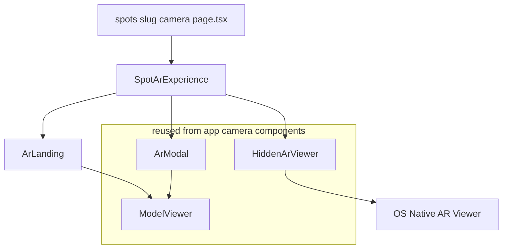
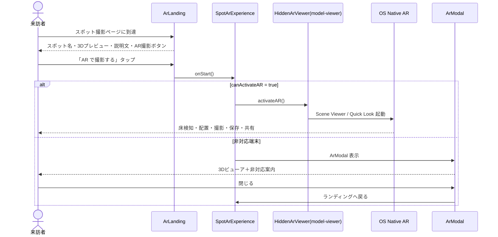
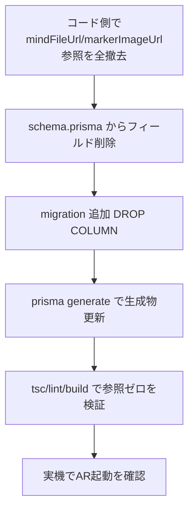

# 技術設計書

## Overview

**Purpose**: スポット限定AR撮影（`/spots/[slug]/camera`）を、MindAR によるマーカー認識方式から、自宅撮影（`/camera`）と同一の model-viewer ネイティブAR（床検知・マーカーレス）方式へ置き換える。

**Users**: 来訪者はマーカーを用意せずスポット固有のひめっこと記念撮影でき、管理者は `.mind` ファイルやマーカー画像を用意する必要がなくなる。

**Impact**: 現行の「ランディング → 自作ARシーン（MindAR合成）→ 自作プレビュー/シェア」フローを、「ランディング → OS標準ARビューア起動（非対応時は3Dビューア）」へ変更する。撮影・端末保存・共有は OS標準ARビューアに委譲する。Spot テーブルから `mindFileUrl`・`markerImageUrl` を削除し、管理画面のマーカー関連UI・`.mind` アップロードAPIを撤去する。`mind-ar` / `three` 依存を除去する。

### Goals
- Spot撮影を自宅撮影（`HiddenArViewer` / `ModelViewer` / `ArModal`）と同一方式に統一する。
- マーカー方式の専用コード・依存・DBフィールド・管理UIを完全撤去する。
- ランディング画面（スポット名・3Dモデルプレビュー・`himekkoDescription`）を維持する。
- WCAG 2.1 AA（14px以上・行間1.5以上・コントラスト4.5:1以上）を維持する。

### Non-Goals
- 自宅撮影（`/camera`）側の挙動変更（既に床検知方式で稼働中）。
- スポットの3Dモデル（`arAssetUrl`）の設定・アップロードフローの変更。
- 写真のサーバ保存やスタンプラリー等の新規機能。

## Boundary Commitments

### This Spec Owns
- `src/app/spots/[slug]/camera/` 配下の撮影体験（ランディング＋AR起動導線）。
- Spot データモデルからの `mindFileUrl`・`markerImageUrl` 削除と DB マイグレーション。
- 管理画面（`admin/options.tsx`）の Spot に対するマーカー関連UIの撤去と、`.mind` アップロードAPI（`/api/admin/upload-mind`）の撤去。
- マーカー・自作キャプチャ専用コード／依存（`mind-ar`, `three`, `@types/three`）の削除。

### Out of Boundary
- 自宅撮影（`/camera`）の機能・UI（本仕様は挙動を変えない。既存コンポーネントを import 再利用するのみ）。
- `arAssetUrl` / `himekkoDescription` のデータ設定方法（維持）。
- `HomeCameraConfig` モデル（対象外）。

### Allowed Dependencies
- `@/app/camera/_components/HiddenArViewer`・`ModelViewer`・`ArModal`（再利用）。
- `@/lib/ar/types` の `ModelConfig`（共有型として存続）。
- `@/lib/prisma`（Spot 取得）。

### Revalidation Triggers
- `@/app/camera/_components/*` の props 契約変更（Spot が再利用しているため）。
- `ModelConfig` 型の変更。
- `spots` テーブルのカラム構成変更（本仕様で削除するフィールドを他機能が参照していないこと）。

## Architecture

### Existing Architecture Analysis
- 自宅撮影は「非表示 `<model-viewer ar>` を保持し、ボタン押下で `canActivateAR` を判定 → 真なら `activateAR()`、偽なら `ArModal` フォールバック」という確立パターン（`HomeArExperience.tsx`）。
- Spot撮影は現状「`SpotArExperience`（`landing|ar|preview` の状態機械）＋ `ArScene`（MindAR＋three＋canvas合成）＋ `PhotoPreview`（自作保存/シェア）」で、自宅撮影とは別系統。
- `ArLanding.tsx` は既に `@/app/camera/_components/ModelViewer` を用いてGLBプレビューを表示しており、ランディングUIは方式変更後もそのまま活かせる。

### Architecture Pattern & Boundary Map



**Architecture Integration**:
- Selected pattern: 自宅撮影と同一の「非表示 model-viewer ＋ activateAR ＋ 非対応フォールバック」パターン。
- Domain/feature boundaries: Spot は `spots/[slug]/camera` 配下のオーケストレーションのみを所有し、AR起動・3D表示の実体は `app/camera/_components` を再利用。
- Existing patterns preserved: `ArLanding` のランディングUI、`ModelConfig` 型、admin の GLB/説明文設定。
- New components rationale: 新規コンポーネントは追加しない（再利用と削除が中心）。
- Steering compliance: WCAG AA / 14px / コントラスト4.5:1（`frontend-design`・`baseline-ui`）。

### Technology Stack

| Layer | Choice / Version | Role in Feature | Notes |
|-------|------------------|-----------------|-------|
| Frontend | `@google/model-viewer` 4.0.0（CDN） | ネイティブAR起動・3D表示 | 既存 `HiddenArViewer`/`ModelViewer` 経由。CDNスクリプト読込は現行踏襲 |
| Data / Storage | Prisma + PostgreSQL | `spots` テーブルから2カラム削除 | 先例 `drop_home_camera_marker_fields` に倣う |
| 撤去 | `mind-ar` ^1.2.5, `three` ^0.183.2, `@types/three` ^0.183.1 | — | 参照撤去後に依存削除 |

## File Structure Plan

### Modified Files
- `src/app/spots/[slug]/camera/page.tsx` — `TargetConfig`/`DEFAULT_TARGET`/`mindFileUrl` 参照を削除。`SpotArExperience` へは `spot` と `model`（`ModelConfig`）のみ渡す。
- `src/app/spots/[slug]/camera/_components/SpotArExperience.tsx` — 状態機械（`landing|ar|preview`）を廃止し、HomeArExperience 同型に書き換え。`HiddenArViewer` を保持、`ArLanding` の `onStart` を `activateAR()`（非対応時 `ArModal`）に接続。`lib/ar/state` 依存を除去。
- `src/app/spots/[slug]/camera/_components/ArLanding.tsx` — `compatError` ベースのゲートを撤去し、`onStart` を常時活性なAR起動ボタンに接続（互換判定は model-viewer の `canActivateAR` に委譲）。マーカー非表示は現状維持。
- `src/lib/ar/types.ts` — `ModelConfig` のみ残し、`TargetConfig`・`CaptureResult`・`ArSceneState`・`PageView` を削除。
- `src/lib/storage.ts` — `validateMindFile`・`uploadMind`・`MIND_MAX_SIZE` を削除。
- `src/app/admin/options.tsx` — `Spot` から `mindFileUrl`・`markerImageUrl` の aliases / edit.display / fields を削除。`MindFileUploadInput` の import を削除。`arAssetUrl`・`himekkoDescription` は維持。
- `src/app/dev/preview/_components/DevPreviewClient.tsx` — `PhotoPreview` の import と使用箇所を除去。
- `src/app/globals.css` — MindAR 用のvideo/canvas左寄せ補正CSS（`.mindar-*` 系）を削除。
- `prisma/schema.prisma` — `Spot` から `mindFileUrl`・`markerImageUrl` を削除。
- `package.json` — `mind-ar`・`three`・`@types/three` を削除。

### Deleted Files
- `src/app/spots/[slug]/camera/_components/ArScene.tsx`（MindAR＋three＋canvas合成）
- `src/app/spots/[slug]/camera/_components/PhotoPreview.tsx`（自作プレビュー/保存/シェア）
- `src/lib/ar/state.ts`（`checkBrowserCompatibility` 等、Spot専用）
- `src/lib/ar/three-shim.ts`（MindAR用 three shim）
- `src/types/mind-ar.d.ts`（MindAR型定義）
- `src/app/api/admin/upload-mind/route.ts`（`.mind` アップロードAPI）
- `src/app/admin/_components/mind-file-upload-input.tsx`（`.mind` アップロードUI）

### Generated / Added
- `prisma/migrations/<timestamp>_drop_spot_marker_fields/migration.sql` — `ALTER TABLE "spots" DROP COLUMN ...`（新規）
- `src/generated/prisma/**` — `prisma generate` で再生成（`mindFileUrl`/`markerImageUrl` を含まない状態へ）

### Asset Cleanup（確認のうえ実施）
- `public/assets/targets/demo.mind` など、削除後に参照ゼロになるマーカーアセットは撤去する。

## System Flows



- 撮影・保存・共有は OS標準ARビューアが担い、本アプリは起動導線までを所有する（Requirement 4）。
- 互換判定は WebGL/getUserMedia の事前チェックではなく model-viewer の `canActivateAR` に一元化する。

## Requirements Traceability

| Requirement | Summary | Components | Interfaces | Flows |
|-------------|---------|------------|------------|-------|
| 1.1, 1.2, 1.3 | マーカーレスAR起動・モデル提供 | SpotArExperience, HiddenArViewer | `activateAR()`, `HiddenArViewerProps` | 起動シーケンス |
| 1.4 | arAssetUrl 未登録時は既定モデル | page.tsx (FALLBACK_MODEL) | `ModelConfig` | — |
| 2.1, 2.2, 2.3, 2.4 | ランディング維持・マーカー非表示 | ArLanding, ModelViewer | `ArLandingProps` | ランディング表示 |
| 3.1, 3.2, 3.3 | 非対応端末フォールバック | SpotArExperience, ArModal | `ArModalProps` | else 分岐 |
| 4.1, 4.2 | 撮影/保存/共有のOS委譲・自作機能撤去 | （PhotoPreview/ArScene 削除） | — | OS AR |
| 5.1–5.4 | マーカー資産撤去・自宅撮影不変 | 削除ファイル群, package.json | — | — |
| 6.1, 6.2, 6.3 | スキーマ削除・migration | schema.prisma, migration.sql | Prisma Client | — |
| 7.1, 7.2, 7.3 | 管理UI・API撤去 | options.tsx（upload-mind route 削除） | next-admin options | — |
| 8.1–8.4 | アクセシビリティ | ArLanding, ArModal | — | — |

## Components and Interfaces

| Component | Domain/Layer | Intent | Req Coverage | Key Dependencies | Contracts |
|-----------|--------------|--------|--------------|------------------|-----------|
| SpotArExperience | UI (spot camera) | ランディング表示とネイティブAR起動のオーケストレーション | 1, 3, 4 | HiddenArViewer (P0), ArLanding (P0), ArModal (P1) | State |
| ArLanding | UI (spot camera) | スポット名・3Dプレビュー・説明文・AR起動ボタン表示 | 2, 8 | ModelViewer (P1) | State/Props |
| page.tsx | Server (spot camera) | Spot取得と `ModelConfig` 組み立て | 1.4 | prisma (P0) | — |
| HiddenArViewer（再利用） | UI (camera) | 非表示 model-viewer 保持・`activateAR` 提供 | 1 | model-viewer (P0) | Props |
| ArModal / ModelViewer（再利用） | UI (camera) | 非対応時3D表示 | 3 | model-viewer (P0) | Props |

### spot camera

#### SpotArExperience

| Field | Detail |
|-------|--------|
| Intent | ランディング表示とネイティブAR起動導線の統括（自作AR/プレビューは廃止） |
| Requirements | 1.1, 1.2, 1.4, 3.1, 3.2, 3.3, 4.1, 4.2 |

**Responsibilities & Constraints**
- `ArLanding` を描画し、非表示 `HiddenArViewer` を保持する。
- 「AR で撮影する」押下時、`model-viewer` の `canActivateAR` を判定し、真なら `activateAR()`、偽なら `ArModal` を表示する。
- 状態機械（`landing|ar|preview`）・自作キャプチャ・`lib/ar/state` への依存を持たない。

**Dependencies**
- Outbound: `ArLanding` — ランディングUI（P0）
- Outbound: `HiddenArViewer`（`@/app/camera/_components`）— AR起動（P0）
- Outbound: `ArModal`（`@/app/camera/_components`）— 非対応フォールバック（P1）

**Contracts**: State [x]

##### State Management
```typescript
interface SpotArExperienceProps {
  spot: {
    slug: string;
    name: string;
    description: string;
    himekkoDescription: string | null;
    arAssetUrl: string | null;
  };
  model: ModelConfig; // { url; label; scale? }
}
```
- State model: `showArModal: boolean` と AR要素の `ref`（`HomeArExperience` と同型）。
- 遷移: ボタン押下 → `activateAR()` 可否分岐。撮影後の状態はOSが保持（アプリ側状態なし）。

**Implementation Notes**
- Integration: `@/app/camera/_components` の `HiddenArViewer`/`ArModal` を `dynamic(ssr:false)` で読み込む（`HomeArExperience` 準拠）。
- Validation: `arAssetUrl` 未設定時は `page.tsx` の `FALLBACK_MODEL` により既定モデルを使用（Req 1.4）。
- Risks: iOS Quick Look の GLB→USDZ 変換は自宅撮影で稼働実績のある構成に依存。実機確認をテスト項目に含める。

#### ArLanding（変更）

| Field | Detail |
|-------|--------|
| Intent | スポット固有ランディング（名前・3Dプレビュー・説明文・AR起動ボタン） |
| Requirements | 2.1, 2.2, 2.3, 2.4, 8.1, 8.2, 8.3, 8.4 |

**Responsibilities & Constraints**
- スポット名・`ModelViewer` プレビュー・`himekkoDescription`・戻る導線を表示（現行踏襲）。
- AR起動ボタンは `onStart` を呼ぶ。従来の `compatError` による無効化ロジックは撤去（互換判定は `canActivateAR` に委譲）。
- マーカー画像を表示しない（現行踏襲）。

**Contracts**: State [x]
```typescript
interface ArLandingProps {
  spot: { name: string; himekkoDescription?: string | null; arAssetUrl?: string | null };
  onStart: () => void;
}
```

**Implementation Notes**
- Integration: `@/app/camera/_components/ModelViewer` を継続使用。
- Validation: フォント14px以上・行間1.5以上・コントラスト4.5:1以上を維持（既存スタイル準拠）。

## Data Models

### Logical Data Model
`Spot` から以下2フィールドを削除する。

| Field | 変更 |
|-------|------|
| `mindFileUrl String?` | 削除 |
| `markerImageUrl String?` | 削除 |

維持: `arAssetUrl String?`（3Dモデル）、`himekkoDescription String?`（説明文）、その他既存フィールド。

### Physical Data Model
```sql
-- prisma/migrations/<timestamp>_drop_spot_marker_fields/migration.sql
ALTER TABLE "spots"
  DROP COLUMN "mindFileUrl",
  DROP COLUMN "markerImageUrl";
```
- 先例 `20260522000000_drop_home_camera_marker_fields` と同型。
- `prisma generate` で `src/generated/prisma` を再生成し、型から両フィールドを除去する。

## Migration Strategy


- Rollback trigger: ビルド/型チェックで未撤去参照が検出された場合は該当参照を先に除去してから再実行。
- マーカー資産（登録済み `.mind`/画像URL）はマーカーレス方式では不要のためデータ損失を許容する。

## Error Handling

### Error Strategy
- **AR非対応端末**（User相当）: `activateAR` 不可 → `ArModal` で3D表示＋案内（Req 3）。エラーではなくフォールバックとして扱う。
- **モデル未登録**: `arAssetUrl` 未設定 → `FALLBACK_MODEL`（既定ひめっこ）で継続（Req 1.4）。
- **model-viewer スクリプト読込失敗**: `ModelViewer`/`HiddenArViewer` のローディング表示で待機（現行踏襲）。

### Monitoring
- 追加のログ/監視は導入しない（既存の自宅撮影と同等の可観測性を踏襲）。

## Testing Strategy

### Unit / Component Tests
- `SpotArExperience`: `canActivateAR=true` で `activateAR()` が呼ばれ、`false` で `ArModal` が表示されること。
- `ArLanding`: `himekkoDescription` 設定時のみ説明文が表示されること／マーカー画像を描画しないこと。
- `page.tsx`: `arAssetUrl` 未登録スポットで `FALLBACK_MODEL` が `model` に反映されること。

### Integration Tests
- `admin/options.tsx`: Spot 編集フォームに `.mind`/マーカー画像入力が存在せず、`arAssetUrl`/`himekkoDescription` が存続すること。
- `/api/admin/upload-mind` が存在しない（404）こと。
- Prisma Client 型に `mindFileUrl`/`markerImageUrl` が存在しないこと（`tsc` で担保）。

### E2E / 手動確認（実機）
- Android（Scene Viewer）: スポットページ → 「AR で撮影する」→ 床検知 → 撮影 → 端末保存/共有。
- iOS（Quick Look）: 同上（GLB→USDZ 変換の起動確認）。
- 非対応端末: `ArModal` の3D表示と案内、閉じてランディング復帰。

### 回帰
- 自宅撮影（`/camera`）が本変更の前後で同一挙動であること（再利用コンポーネントの props 契約不変）。

## Security Considerations
- `.mind` アップロードAPI（`/api/admin/upload-mind`）撤去により、管理者専用アップロード面が1つ減る。`arAssetUrl`（GLB）設定と画像アップロードの既存認可（`requireAdminSession`）は不変。

## Accessibility（steering準拠）
- 本文14px以上・行間1.5以上・コントラスト4.5:1以上を維持。
- AR起動ボタン・モーダル閉じるボタンにアクセシブルラベルとフォーカス表示を付与（`ArModal` は既に `role=dialog`/`aria-modal`/Escape対応）。
- 実装後に `/baseline-ui`・`/fixing-accessibility` を対象ファイルに適用する。
