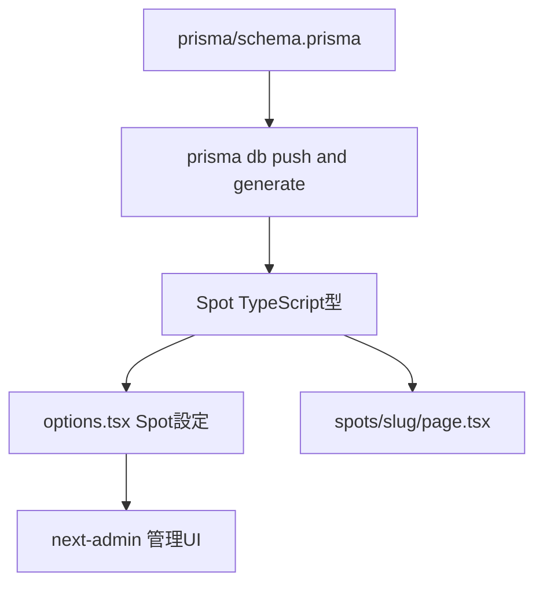

# Design Document — spot-detail-page

## Overview

スポット詳細ページをリデザインし、Spotモデルに `address`（住所）と `qrCodeLocation`（QRコードの場所）フィールドを追加する。

**Purpose**: 訪問者がQRコードでアクセスした際に、スポットの説明・QRコードの設置場所をグリーン系カードUIで明確に把握できる。管理者はスポット編集フォームで住所とQRコード設置場所を登録できる。
**Users**: 新庄村を訪れた訪問者（スマートフォン経由）。管理者はスポット情報を編集する。
**Impact**: Spotスキーマに `address String`・`qrCodeLocation String` の2フィールドを追加。既存 `description` データに影響なし。スポット詳細ページUIをグリーン系カードデザインに更新する。

### Goals
- `address` と `qrCodeLocation` を Spot モデルに必須フィールドとして追加する
- 管理画面フォームに2フィールドを必須入力として追加する
- スポット詳細ページを確定モックアップ（グリーン系カード・バッジ・セクション見出し）に実装する

### Non-Goals
- スポット一覧ページのデザイン変更
- AR撮影ページの変更
- 住所をGoogleマップへのリンクとして使う機能
- Spot モデルへの複数画像対応

## Boundary Commitments

### This Spec Owns
- `prisma/schema.prisma` の Spot モデルへのフィールド追加
- `src/app/admin/options.tsx` の Spot 設定更新（エイリアス・edit.display・edit.fields）
- `src/app/spots/(chrome)/[slug]/page.tsx` のUI全面更新

### Out of Boundary
- スポット一覧・AR撮影・その他スポット関連ページのUI
- Spot モデル以外のスキーマ変更
- 管理画面のスポット一覧表示ロジック

### Allowed Dependencies
- Prisma 7（スキーマ変更・型生成）
- next-admin（管理フォーム自動生成）
- TailwindCSS v3（`secondary-*`・`neutral-*` カラークラス利用可能）
- Next.js 15 App Router（Server Component）
- 既存コンポーネント: `TextareaInput`（`src/app/admin/_components/textarea-input.tsx`）

### Revalidation Triggers
- `Spot` Prisma型へのフィールド追加・削除は `[slug]/page.tsx` の型参照に影響する
- `options.tsx` の Spot 設定変更は管理画面フォームのレイアウトに影響する

## Architecture

### Existing Architecture Analysis

- スポット詳細ページはNext.js Server Componentとして実装済み（Prismaを直接呼び出す）
- 管理画面はnext-adminによる自動生成（`options.tsx`で設定制御）
- Activity詳細ページ（`src/app/activities/[id]/page.tsx`）に同等のカード型UIパターンが確立済み

### Architecture Pattern & Boundary Map



**Key Decisions**:
- パターン: Server Component + Prisma直接呼び出し（既存パターン踏襲、APIルート不要）
- スキーマ変更は `prisma db push` で反映し `pnpm prisma generate` で型再生成
- 「スポット」カテゴリバッジは専用コンポーネントを作らずページ内にインライン実装（再利用先が現時点で存在しないため）

### Technology Stack

| Layer | Choice / Version | Role | Notes |
|-------|-----------------|------|-------|
| Frontend | Next.js 15 App Router | Server Component SSR | 既存パターン踏襲 |
| ORM | Prisma 7 | スキーマ定義・型生成・クエリ | `prisma db push` のみ（マイグレーション不使用） |
| UI | TailwindCSS v3 + CSS変数 | スタイリング | `--color-secondary-*` (グリーン系) を使用 |
| Admin | next-admin | 管理フォーム自動生成 | `options.tsx` 設定のみ変更 |

## File Structure Plan

### Modified Files

- `prisma/schema.prisma` — Spot モデルに `address String` と `qrCodeLocation String` を追加
- `src/app/admin/options.tsx` — Spot の `aliases`・`edit.display`・`edit.fields` を更新
- `src/app/spots/(chrome)/[slug]/page.tsx` — UIを全面更新（カード型レイアウト）

### New Files
なし

## Requirements Traceability

| Requirement | Summary | Component |
|-------------|---------|-----------|
| 1.1 | address フィールドを詳細ページで参照 | SpotDetailPage, Prisma Schema |
| 1.2 | qrCodeLocation フィールドを詳細ページで参照 | SpotDetailPage, Prisma Schema |
| 1.3 | address を常時表示 | SpotDetailPage |
| 1.4 | qrCodeLocation を常時表示 | SpotDetailPage |
| 1.5 | description を常時表示 | SpotDetailPage |
| 2.1 | address 入力欄を管理画面に追加 | AdminOptions (Spot) |
| 2.2 | qrCodeLocation 入力欄を管理画面に追加 | AdminOptions (Spot) |
| 2.3 | 両フィールドを必須入力 | AdminOptions, Prisma Schema |
| 2.4 | 入力値をDBに保存 | Prisma Schema（next-adminが自動処理） |
| 3.1 | 「スポット」カテゴリバッジ表示 | SpotDetailPage |
| 3.2 | スポット名をタイトルとして表示 | SpotDetailPage |
| 3.3 | 住所をオレンジ・地図アイコン付きで表示 | SpotDetailPage |
| 3.4 | メイン画像をカード内に表示 | SpotDetailPage |
| 3.5 | 「スポットの説明」見出し＋本文 | SpotDetailPage |
| 3.6 | 「QRコードの場所」見出し＋本文 | SpotDetailPage |
| 3.7 | アクションボタン2つ | SpotDetailPage |
| 3.8 | グリーン系カードレイアウト | SpotDetailPage |
| 3.9 | パンくずナビゲーション | SpotDetailPage |
| 3.10 | WCAG AA 準拠 | SpotDetailPage |

## Components and Interfaces

### Data Layer

#### Prisma Schema — Spot モデル拡張

| Field | Detail |
|-------|--------|
| Intent | `address` と `qrCodeLocation` を必須フィールドとして Spot モデルに追加 |
| Requirements | 1.1, 1.2, 1.3, 1.4, 2.3, 2.4 |

**Responsibilities & Constraints**
- `address String`: スポットの物理的な住所（必須・NOT NULL）
- `qrCodeLocation String`: QRコードが設置されている場所の説明（必須・NOT NULL）
- 既存の `description String` は変更なし
- DB反映は `prisma db push`（マイグレーションファイル不使用）

**Contracts**: State [x]

**スキーマ差分**:
```prisma
model Spot {
  id             Int        @id @default(autoincrement())
  slug           String     @unique
  name           String
  description    String
  address        String                    // 追加: 住所（必須）
  qrCodeLocation String                    // 追加: QRコードの場所（必須）
  status         SpotStatus @default(DRAFT)
  imageUrl       String?
  arAssetUrl     String?
  markerImageUrl String?
  mindFileUrl    String?
  createdAt      DateTime   @default(now())
  updatedAt      DateTime   @updatedAt

  @@map("spots")
}
```

**自動生成される TypeScript 型（追加分）**:
```typescript
type Spot = {
  // ...既存フィールド...
  address: string        // 追加
  qrCodeLocation: string // 追加
}
```

**Implementation Notes**
- `prisma db push` 後に `pnpm prisma generate` で型を再生成する
- 既存 spots テーブルにデータがある場合、NOT NULL フィールド追加で失敗する。開発環境では `prisma db push --force-reset` またはテーブルを空にしてから実行する

---

### Admin Layer

#### AdminOptions — Spot 設定更新

| Field | Detail |
|-------|--------|
| Intent | Spot 管理フォームに `address` と `qrCodeLocation` を必須入力として追加 |
| Requirements | 2.1, 2.2, 2.3, 2.4 |

**Responsibilities & Constraints**
- `aliases` に日本語ラベルを追加
- `edit.display` で「基本情報」セクション内の `description` 直後に配置
- `edit.fields` で `required: true` と `helperText` を設定
- next-admin の CRUD 処理は変更不要

**Contracts**: State [x]

**変更箇所**:
```typescript
// aliases 追加
aliases: {
  // ...既存...
  address: "住所",
  qrCodeLocation: "QRコードの場所",
}

// edit.display — 基本情報セクション内に追加（description の後）
edit: {
  display: [
    { title: "基本情報", id: "basic-info", description: "スポットの基本情報を入力してください" },
    "name",
    "slug",
    "description",
    "address",           // 追加
    "qrCodeLocation",    // 追加
    "status",
    // ...以降は既存のまま
  ],
  fields: {
    // ...既存フィールド...
    address: {
      required: true,
      helperText: "スポットの住所（例: 岡山県真庭郡新庄村2190-1）",
    },
    qrCodeLocation: {
      required: true,
      input: <TextareaInput />,
      helperText: "QRコードが貼ってある場所の説明",
    },
  },
}
```

**Implementation Notes**
- `TextareaInput` は `src/app/admin/_components/textarea-input.tsx` を再利用（Activity の `detail` フィールドで実績あり）

---

### Presentation Layer

#### SpotDetailPage — UIリデザイン

| Field | Detail |
|-------|--------|
| Intent | スポット詳細ページをグリーン系カード型レイアウトに全面更新 |
| Requirements | 1.1–1.5, 3.1–3.10 |

**Responsibilities & Constraints**
- Server Component（Prisma直接呼び出し、既存パターン維持）
- カード構造: Activity詳細ページ（`rounded-3xl`・枠線なし・`shadow-yellow`）と同等
- グリーン系テーマ: `secondary-*` Tailwind クラスを使用（Activity詳細ページと同方式）
- WCAG AA: コントラスト比4.5:1以上、最小フォントサイズ14px
- フォント: Zen Maru Gothic（`body`〔globals.css〕でアプリ全体の既定として適用済み。コンポーネント個別での `font-[family-name:...]` 指定は不要）

**Contracts**: State [x]

**UIレイアウト構造**:

```
<article>
  ├── <nav> パンくず: ← スポット一覧に戻る
  └── <div> カードラッパー (relative)
       ├── スポットカテゴリバッジ (absolute, top center)
       │     green pill: [pin icon] スポット
       └── <div> カード本体 (rounded-3xl bg-white shadow-yellow・枠線なし)
            ├── <div> px-6 pt-10 text-center
            │     ├── <h1> スポット名 (text-secondary-500)
            │     └── <p> 住所 (text-arcana-orange-secondary, map icon)
            ├── <div> px-4 mt-5 — メイン画像 (rounded-2xl)
            └── <div> px-6 pb-8
                 ├── <section> スポットの説明 (pin icon + h2 + body)
                 ├── <section> QRコードの場所 (camera icon + h2 + body)
                 └── <div> アクションボタン (primary + outline)
```

**カラー対応表**:

| 用途 | Tailwindクラス | 色値 | コントラスト比(on white) |
|------|--------------|------|------|
| バッジ背景 | `bg-[var(--color-secondary-400)]` | `#4aa85a` | — (装飾) |
| カードボーダー | `border-[var(--color-secondary-300)]` | `#6bc278` | — (装飾) |
| タイトル・セクション見出し | `text-[var(--color-secondary-500)]` | `#357a40` | 7.1:1 ✅ |
| 住所テキスト | `text-arcana-orange-secondary` | `#f0863e` | 2.57:1 ⚠️（ブランド色優先で許容） |
| 本文テキスト | `text-[var(--color-neutral-600)]` | `#4d4840` | — |
| プライマリボタン | `bg-[var(--color-primary-400)]` | `#e95d7a`（既存踏襲） | — |

> **注意**: `secondary-*` は Tailwindカスタムユーティリティとして未定義のため、すべて `[var(--color-secondary-*)]` 形式で指定すること。

**アクセシビリティ（3.10）**:
- `<h1>`: スポット名（ページの主見出し）
- `<h2>`: 「スポットの説明」「QRコードの場所」（各セクション見出し）
- `aria-labelledby` でセクションと見出しを紐付け
- 全アイコンに `aria-hidden="true"`
- コントラスト比: `--color-secondary-500`(#357a40) on white = 約7.1:1 ✅。住所テキストは `text-arcana-orange-secondary`(#f0863e) on white = 約2.57:1 で WCAG AA 4.5:1 を満たさないが、ブランド色（`--color-arcana-orange-secondary`）を優先する方針で意図的に許容する

**Implementation Notes**
- `secondary-*` カラーはすべて Tailwindカスタムカラー未定義のため `[var(--color-secondary-*)]` 形式を使用する（`bg-[var(--color-secondary-400)]`、`border-[var(--color-secondary-300)]`、`text-[var(--color-secondary-500)]` の3つ）
- 住所テキストはブランド色 `text-arcana-orange-secondary`（`var(--color-arcana-orange-secondary)` = `#f0863e`）を使用する
- Prismaクエリ（`findUnique`）は変更不要（全フィールドを自動取得）
- アクションボタンのスタイルは既存実装を踏襲

## Data Models

### Physical Data Model

`prisma db push` 実行後、spotsテーブルに以下のカラムが追加される:

| カラム名 | 型 | NULL | 説明 |
|---------|-----|------|------|
| `address` | VARCHAR | NOT NULL | 住所 |
| `qrCodeLocation` | VARCHAR | NOT NULL | QRコードの場所 |

**デプロイ時の注意**:

| 環境 | 既存データなし | 既存データあり |
|------|--------------|--------------|
| 開発環境 | `prisma db push` で正常完了 | `prisma db push --force-reset` でリセット後に実行（データは失われる） |
| 本番環境 | `prisma db push` で正常完了 | ⚠ NOT NULL追加は失敗する。事前に既存レコードの有無を確認し、データがある場合は一時的に `DEFAULT ''` を付与してから push し、その後デフォルト値を除去すること |

本番環境への初回デプロイ前に `SELECT COUNT(*) FROM spots;` で既存レコード数を確認すること。

## Error Handling

### Error Strategy

- **404**: `slug` に一致するスポットが存在しないか `PUBLISHED` 以外の場合、`notFound()` を呼び出す（既存動作維持）
- **管理画面バリデーション**: `address`・`qrCodeLocation` は `required: true` で空送信を防ぐ。DBレベルでも NOT NULL 制約により保護

## Testing Strategy

### Manual Tests

1. **スキーマ変更確認**: `prisma db push` 後、Spot テーブルに `address`・`qrCodeLocation` カラムが NOT NULL で存在することを確認
2. **管理画面フォーム**: スポット編集画面に「住所」「QRコードの場所」入力欄が表示され、空のまま保存するとバリデーションエラーが出ることを確認
3. **スポット詳細ページ**: 公開済みスポットにアクセスし、カードUI・バッジ・住所・「スポットの説明」・「QRコードの場所」が正しく表示されることを確認
4. **アクセシビリティ**: コントラスト比チェッカーで `--color-secondary-500`（7.1:1）・本文テキストがWCAG AA基準（4.5:1以上）を満たすことを確認。住所テキストの `text-arcana-orange-secondary`（#f0863e, 約2.57:1）はブランド色優先で AA 未達を意図的に許容している
5. **画像なし状態**: `imageUrl` が null のスポットでプレースホルダーが表示されレイアウトが崩れないことを確認
