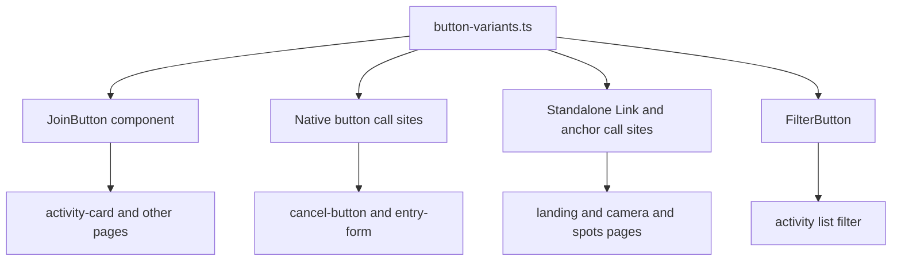

# Technical Design

## Overview

**Purpose**: 本機能は、Arcanaアプリの訪問者向け画面に散在するボタンの配色・文字サイズを、単一の共有スタイル定義から供給される3種類の視覚バリアント（プライマリ／標準／アウトライン）に統一する。
**Users**: 訪問者（高齢者を含む全年齢層）が各画面でボタンを見た際に、一貫した色・大きさで操作対象を認識できるようになる。開発者は今後ボタンを追加・変更する際、共有定義を参照するだけで済むようになる。
**Impact**: 既存の共有コンポーネント `JoinButton` と、個別実装されていた10箇所超のボタン（`<button>`／`<a>`／`<Link>`）が、新設する単一の変種定義（`button-variants.ts`）を参照する形に変わる。要件6で指定された対象外領域（管理画面、AR/カメラのピンク系ボタン、アイコン操作、テキストリンク）には触れない。

### Goals
- 3つの視覚バリアント（プライマリ＝緑・濃いボーダー、標準＝緑、アウトライン＝白）の色・文字サイズを単一の定義（Single Source of Truth）に集約する
- 要件1〜3・5で列挙した全ボタン呼び出し箇所を、その定義を参照する実装に置き換える
- ボタンラベルの文字サイズを18px・太字に統一し、要件4のコントラスト比条件を満たす
- `design-system.md`（steering）にボタンバリアントの定義を明文化し、将来の実装がこの定義を参照できるようにする

### Non-Goals
- AR/カメラ撮影フロー内の残りのピンク系ボタン（`HomeArFallbackExperience.tsx`の「再試行」「戻る」、`HomeArFallbackScene.tsx`のシャッター等）の配色変更（デザイナー確認待ち、別スペック）。ただし`OperationGuide.tsx`「はじめる」と`CapturedPhotoPreview.tsx`「保存」「シェア」「撮り直す」はユーザーが追加確認済みのため本specのスコープに含む。
- 管理画面（`/admin`）・社内devポータル（`/dev`）のボタンスタイル変更
- アイコンのみのナビ操作、枠を持たないテキストリンクのスタイル変更
- 絞り込みトグルの選択状態を色以外の手段（下線・アイコン等）で示す仕組みの新設
- `spot-action`／`arcana-primary-green` トークンの重複整理（本spec範囲外、影響なし。将来の整理タスク候補として記録のみ）

## Boundary Commitments

### This Spec Owns
- ボタンの見た目（背景色・ボーダー色・文字色・文字サイズ／太さ・hover/focus時の視覚変化）を、要件1〜3・5に列挙した呼び出し箇所について統一する責務
- 3バリアントの色・文字サイズ定義を集約した単一モジュール `src/app/_components/button-variants.ts`
- `JoinButton` の `variant` prop値を `"primary" | "standard" | "outline"` の3値に確定させる責務（呼び出し元の追従を含む）
- `design-system.md` へのボタンバリアント定義の反映
- `OperationGuide.tsx`「はじめる」、`CapturedPhotoPreview.tsx`「保存」「シェア」「撮り直す」の配色統一（インライン`style`からTailwind + `button-variants.ts`参照への置き換えを含む）

### Out of Boundary
- AR/カメラ撮影フロー内の残りのピンク系ボタン（`HomeArFallbackExperience.tsx`、`HomeArFallbackScene.tsx`）の配色 — デザイナー確認待ちのため触れない
- `/admin`、`/dev` 配下のボタン
- アイコンのみのナビ操作（カルーセル前後矢印、ARモーダルの閉じる・回転・シャッター）
- 枠・背景を持たないテキストリンク（例:「‹ 一覧に戻る」）
- `activity-filter-client.tsx` のフィルタリングロジック自体（表示件数の絞り込み処理）— 変更するのは配色のみ
- 絞り込みトグルの選択状態を伝える非色的手段（下線・aria属性等）の新設

### Allowed Dependencies
- 既存のTailwindカラートークン `arcana-primary-green`（#089400）・`arcana-green`（#397754）— `globals.css`／`tailwind.config.mjs` に定義済みのため新規追加不要
- `next/link`（既存依存、`JoinButton` が使用）
- 新規npm依存は追加しない

### Revalidation Triggers
- 3バリアントの色・文字サイズ値を変更する場合、`button-variants.ts` と `design-system.md` の両方を同時に更新すること
- `JoinButton` の `variant` prop名を変更する場合、File Structure Planに列挙した全呼び出し元を追従させること
- 将来、AR/カメラのピンク系ボタン（現在Out of Boundary）を本統一システムへ移行する場合、新しいトークンを追加せず `button-variants.ts` を再利用すること

## Architecture

### Existing Architecture Analysis
- 現状、ボタンは4系統の実装に分散している: (1) 共有コンポーネント `JoinButton`（`next/link` の `<Link>` をラップ、`variant: "outline"|"solid"` が `secondary-500/600` トークンに依存）、(2) native `<button>` の個別実装（`cancel-button.tsx`、`entry-form.tsx` の `SubmitButton`、`useFormStatus` でpending制御）、(3) `<a>`/`<Link>` の個別実装（ランディングページ、AR撮影画面、スポット一覧カード）、(4) インライン `style={{...}}` オブジェクトによる個別実装（`OperationGuide.tsx`「はじめる」、`CapturedPhotoPreview.tsx`「保存」「シェア」「撮り直す」— いずれも`primary-600`/`secondary-500`/`neutral`系の色をstyle属性で直接指定しており、Tailwindクラスへの置き換えとbutton-variants.ts参照化を要する。design-system.mdの「インラインstyleではなくTailwindユーティリティで記述する」方針にも反するため是正対象）。
- 色トークン自体（`arcana-primary-green`、`arcana-green`）は既に `globals.css`／`tailwind.config.mjs` に定義済みであり、新規トークン追加は不要。ただし一部箇所（`cancel-button.tsx` 等）は要件が指定する `arcana-green`（#397754）ではなく、Tailwind未登録の `arcana-green-dark`（#067300）をボーダー色に使用しており、統一対象に含める。
- `research.md` に記録した3つの実装アプローチ（Option A/B/C）のうち、本設計は **Option B（共通スタイル定義を新設し、`JoinButton` と native `<button>` 双方から参照）** を採用する。理由: ユーザーが要求する「スタイル継承・コンポーネント化」を最も直接的に満たし、色定義の単一情報源を作ることで将来の再発（今回のような複数トークン乱立）を防げるため。

### Architecture Pattern & Boundary Map



**Architecture Integration**:
- 選択パターン: 共有スタイル定義モジュール（Option B）。色・文字サイズなどの「バリアント固有スタイル」のみを一元化し、パディングや `min-height` などの「呼び出し元固有のレイアウト」は各コンポーネントに残す（過剰な共通化を避ける）。
- ドメイン境界: `button-variants.ts` はスタイル文字列のみを返す純粋な関数・定数であり、DOM要素の種類（`<button>`/`<a>`/`<Link>`）や状態管理（pending, disabled, active）には関与しない。要素選択と状態管理は呼び出し元の責務のまま。
- 既存パターンの維持: `JoinButton` は引き続き `next/link` の `<Link>` をラップする専用コンポーネントとして存続。native `<button>` 側は `useFormStatus` によるpending制御をそのまま維持。
- 新規コンポーネントの理由: `button-variants.ts` を新設することで、色・文字サイズの変更が1箇所で完結し、要件4（アクセシビリティ）の条件（18px以上で3:1、未満で4.5:1）を将来的にも一貫して守れる。
- Steeringとの整合: `design-system.md` の「新しい色・影・幅を足すときはトークンとして定義し、コンポーネントではトークン名で参照する」という方針に従い、`button-variants.ts` は既存Tailwindトークン（`arcana-primary-green`／`arcana-green`）のみを参照し、新規CSS変数は追加しない。

### Technology Stack

| Layer | Choice / Version | Role in Feature | Notes |
|-------|------------------|------------------|-------|
| Frontend | Next.js 15 (App Router) / React 19 / TypeScript 5 | 既存スタック内でのUIリファクタリング | 新規依存なし |
| スタイリング | TailwindCSS v3（既存トークン） | ボタンの背景・ボーダー・文字色・文字サイズ | `arcana-primary-green`／`arcana-green` は追加登録済みトークンを再利用 |

## File Structure Plan

### Directory Structure
```
src/app/
├── _components/
│   ├── button-variants.ts        # 新規: 3バリアントの色・文字サイズ定義とclassName生成関数（Single Source of Truth）
│   ├── join-button.tsx           # 変更: button-variants.ts を参照するよう書き換え、variant値を3値に確定
│   └── landing/
│       ├── hero-section.tsx              # 変更: 標準バリアントのCTAをbutton-variants.ts参照に置き換え
│       ├── landing-header.tsx            # 変更: 標準バリアントのCTAをbutton-variants.ts参照に置き換え（誤トークン修正）
│       ├── feature-activity-section.tsx  # 変更: アウトラインバリアントのCTAをbutton-variants.ts参照に置き換え
│       └── feature-ar-section.tsx        # 変更: JoinButtonのvariant値をoutline→standardへ修正
├── activities/
│   ├── _components/
│   │   ├── activity-card.tsx             # 変更: JoinButtonのvariant値を新3値へ更新
│   │   └── activity-filter-client.tsx    # 変更: FilterButtonのactive分岐色ロジックを撤去し、固定variant方式に変更
│   ├── [id]/
│   │   ├── page.tsx                      # 変更: JoinButtonのvariant値を新3値へ更新
│   │   └── apply/_components/entry-form.tsx  # 変更: SubmitButtonのclassNameをbutton-variants.ts参照に置き換え
├── entries/[cancelToken]/
│   ├── complete/page.tsx                 # 変更: メール共有ボタンをbutton-variants.ts参照に、JoinButtonのvariant値を更新
│   └── cancel/cancel-button.tsx          # 変更: CancelSubmitButtonのclassNameをbutton-variants.ts参照に置き換え
├── camera/_components/
│   ├── HomeArExperience.tsx              # 変更: 対象3ボタンをbutton-variants.ts参照に置き換え
│   ├── OperationGuide.tsx                # 変更: 「はじめる」のインラインstyleをbutton-variants.ts参照（primary）に置き換え
│   └── CapturedPhotoPreview.tsx          # 変更: 「保存」「シェア」（standard）「撮り直す」（outline）のインラインstyleをbutton-variants.ts参照に置き換え
└── spots/
    ├── (chrome)/_components/spot-card.tsx    # 変更: 詳しく見るボタンをbutton-variants.ts参照に置き換え
    └── [slug]/camera/_components/ArLanding.tsx # 変更: ARで撮影するボタンをbutton-variants.ts参照に置き換え

.kiro/steering/
└── design-system.md              # 変更: ボタン3バリアントの定義・参照元（button-variants.ts）を追記
```

### Modified Files（要点）
- 上記16ファイルは全て、対象ボタンのclassNameを `button-variants.ts` が提供する値に置き換える変更に限定する。レイアウト（padding, min-height, gap, アイコン配置等）や要素の種類（`<button>`/`<a>`/`<Link>`）、状態管理ロジック（`useFormStatus`、`useState` によるフィルタ状態）は変更しない。
- `activity-filter-client.tsx` のみ、`FilterButton` のprops形状変更（`active: boolean` → `variant: "standard" | "outline"`）を伴う。フィルタ処理自体（`filter === "all" ? ... : ...`）は変更しない。
- `OperationGuide.tsx`・`CapturedPhotoPreview.tsx` は、className置き換えに加えて `style={{...}}` オブジェクトそのものを撤去し、`className={buttonClassName(...)}` へ書き換える（この2ファイルのみインラインstyleが起点のため、他ファイルと異なり「style属性の削除」を伴う）。`aria-label` 等の既存アクセシビリティ属性・`onClick`ハンドラ・アイコン（`<Icon>`）表示は変更しない。

> 対象外（要件6）のファイル（`/admin`、`/dev`、AR/カメラのピンク系ボタン、アイコン操作、テキストリンク）は本spec配下のいずれのタスクでも変更しない。

## Requirements Traceability

| Requirement | Summary | Components | Interfaces | Flows |
|-------------|---------|------------|------------|-------|
| 1.1, 1.2, 1.3 | プライマリボタンの色・文字サイズ・hover/focus | button-variants.ts, JoinButton, CancelSubmitButton, SubmitButton, complete/page.tsx, OperationGuide（はじめる） | `buttonClassName("primary")` | - |
| 2.1, 2.2, 2.3 | 標準ボタンの色・文字サイズ・ボーダーなし | button-variants.ts, JoinButton, HomeArExperience, ArLanding, hero-section, landing-header, CapturedPhotoPreview（保存・シェア） | `buttonClassName("standard")` | - |
| 3.1, 3.2 | アウトラインボタンの色・文字サイズ | button-variants.ts, JoinButton, spot-card, feature-activity-section, HomeArExperience（今すぐひめっこと撮影する）, CapturedPhotoPreview（撮り直す） | `buttonClassName("outline")` | - |
| 4.1, 4.2, 4.3 | 文字サイズ18px・コントラスト比の担保 | button-variants.ts（`BUTTON_TEXT_CLASS`固定値） | `buttonClassName()` 内で文字サイズを常に付与 | - |
| 5.1, 5.2 | 絞り込みトグルの固定配色 | activity-filter-client.tsx（FilterButton） | `buttonClassName("standard" \| "outline")` | フィルタ選択フロー（下記） |
| 6.1, 6.2, 6.3, 6.4 | 対象外領域の非破壊 | File Structure Planに列挙されたファイルのみ変更 | — | — |

## Components and Interfaces

| Component | Domain/Layer | Intent | Req Coverage | Key Dependencies (P0/P1) | Contracts |
|-----------|--------------|--------|---------------|---------------------------|-----------|
| `button-variants.ts` | UI / Shared | 3バリアントの色・文字サイズ・hover/focusクラスを定義し、className文字列を生成する | 1.1-1.3, 2.1-2.3, 3.1-3.2, 4.1-4.3 | なし（Tailwindトークンのみ参照） | State |
| `JoinButton` | UI / Shared | `next/link` の `<Link>` をラップし、`button-variants.ts` を用いてバリアント別スタイルを適用する | 1.1-1.3, 2.1-2.3, 3.1-3.2 | button-variants.ts (P0), next/link (P0) | State |
| `FilterButton`（`activity-filter-client.tsx`内） | UI / Feature | 絞り込みボタンを固定バリアントで描画する | 5.1, 5.2 | button-variants.ts (P0) | State |
| 個別呼び出し箇所（native `<button>` / `<a>` / `<Link>`） | UI / Page | 各画面のボタンに `button-variants.ts` のクラスを適用する | 1.1-1.3, 2.1-2.3, 3.1-3.2 | button-variants.ts (P0) | — |

新しい責務境界を導入するのは `button-variants.ts` のみであるため、詳細ブロックはこのコンポーネントについてのみ記載する。他はUIの表示先を差し替えるのみで、新たな契約を持たない。

### UI / Shared

#### button-variants.ts

| Field | Detail |
|-------|--------|
| Intent | 3バリアント（primary/standard/outline）の背景・ボーダー・文字色・文字サイズ・hover/focus挙動を定義し、className文字列を返す |
| Requirements | 1.1, 1.2, 1.3, 2.1, 2.2, 2.3, 3.1, 3.2, 4.1, 4.2, 4.3 |

**Responsibilities & Constraints**
- 背景色・ボーダー色・文字色は `globals.css`/`tailwind.config.mjs` に既存のTailwindトークン（`arcana-primary-green`、`arcana-green`）のみを用いる。新規CSS変数は追加しない。
- 文字サイズは全バリアント共通で `text-lg`（18px）・`font-bold` を固定付与する（要件4.1）。Tailwind標準スケールを使用し、任意値（`text-[18px]`）は用いない（design-system.mdの既存方針に準拠）。
- hover時の視覚変化は3バリアント共通で `hover:opacity-90` を採用する。理由: 既存の `cancel-button.tsx`／`entry-form.tsx` が既にこのパターンを使用しており、新しい色トークンを追加せずに済む。
- focus時は `focus-visible:ring-2 focus-visible:ring-arcana-primary-green focus-visible:ring-offset-2` を共通付与する。
- パディング・`min-height`・`gap` 等のレイアウト値は含まない（呼び出し元が `className` 引数で追加する）。

**Dependencies**
- Outbound: なし
- External: Tailwind既存トークン `arcana-primary-green`、`arcana-green`（P0）

**Contracts**: State [x]

##### State Management
- State model: ステートレス。`ButtonVariant`（`"primary" | "standard" | "outline"`）を入力に取り、className文字列を返す純粋関数 `buttonClassName(variant, className?)` として実装する。
- 永続化・並行性: 対象外（純粋関数のため）。

```typescript
export type ButtonVariant = "primary" | "standard" | "outline";

export function buttonClassName(variant: ButtonVariant, className?: string): string;
```
- Preconditions: `variant` は3値のいずれか（TypeScriptの型で保証、実行時バリデーション不要）
- Postconditions: 返却されるclassNameは常に18px・太字のテキストスタイルと、指定バリアントの背景・ボーダー・文字色を含む
- Invariants: 3バリアントの色定義は本モジュール内にのみ存在し、他ファイルに同じ色をハードコードしない

**Implementation Notes**
- Integration: `JoinButton`、`FilterButton`、および個別呼び出し箇所（`cancel-button.tsx`、`entry-form.tsx`、`HomeArExperience.tsx` 等）は全て `buttonClassName()` の戻り値をレイアウト用classNameと連結して使用する。
- Validation: TypeScriptの `ButtonVariant` 型により、存在しないバリアント名の指定はコンパイル時に検出される。
- Risks: `JoinButton` の `variant` prop値を `"outline"|"solid"` から `"primary"|"standard"|"outline"` へ変更するため、既存の全呼び出し元（6箇所）を同時に更新する必要がある（File Structure Plan参照）。

## Testing Strategy

本プロジェクトには自動テストランナー（Jest/Vitest/Playwright等）が導入されていない（`package.json` 参照）。したがって検証は静的解析＋手動UI確認を組み合わせる。

- **静的解析**: `pnpm lint`（Biome）で全変更ファイルの構文・フォーマットを確認。`pnpm build` でTypeScriptの型エラー（`ButtonVariant` の不正な値の指定等）がないことを確認する。
- **手動UI確認（CLAUDE.mdのUI実装ルールに従い必須）**:
  - 交流コンテンツ一覧・詳細・申込フォーム・申込完了・申込キャンセル・AR撮影ガイドの各画面で、プライマリ（参加してみる／申し込む／キャンセルする／自分にメールで共有／はじめる）が緑・濃いボーダー・白文字・18px太字で表示されることを確認（要件1）
  - AR撮影画面・スポット一覧・トップページ・撮影後プレビューで、標準バリアント（AR で撮影する／スポット一覧を見る／体験・手伝いを見てみる／使ってみる／保存／シェア）が緑・ボーダーなしで表示されることを確認（要件2）
  - 詳しく見る・交流詳細に戻る・撮り直すが白背景・緑ボーダー・緑文字で表示されることを確認（要件3）
  - 全対象ボタンの文字サイズが18px相当であることをブラウザの開発者ツールで確認（要件4）
  - 交流コンテンツ一覧の絞り込みで、「すべて」が緑、「募集中のみ」が白で、選択状態に関わらず固定表示されることを確認（要件5）
  - 対象外画面（`/admin`、`/dev`、`HomeArFallbackExperience.tsx`/`HomeArFallbackScene.tsx`の残りのピンク系ボタン、カルーセル矢印等）が本変更前後で見た目が変化していないことを確認（要件6）
  - `/baseline-ui` と `/fixing-accessibility` を変更ファイルに対して実行し、AIスロップ・アクセシビリティ違反がないことを確認（CLAUDE.md必須ステップ）
